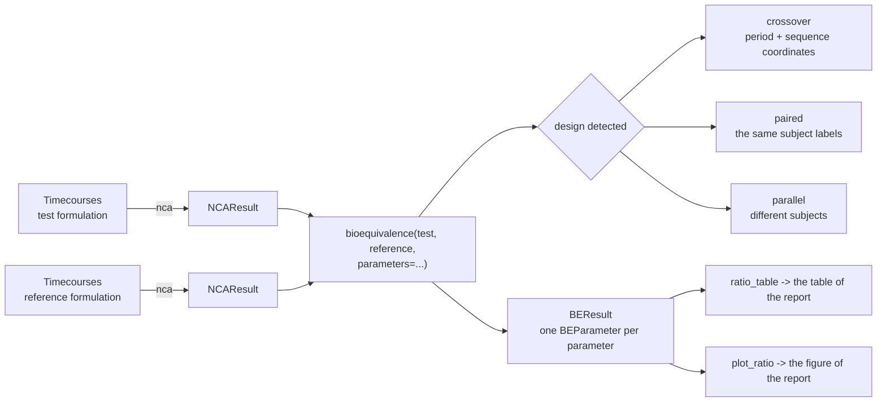

# Bioequivalence

Two formulations of the same drug are bioequivalent when they deliver the same exposure to the systemic circulation. The decision is a confidence interval: the 90 % interval of the geometric mean ratio of the test over the reference must lie within 80-125 % for every parameter of the comparison[^fda_be][^ema_be], the design and the analysis the FDA, the EMA and the harmonized ICH M13A guideline ask for[^ich_m13a]. `pkpdutils.stats.bioequivalence` makes that decision on the parameters of a non-compartmental analysis, in the design the study was run in, and writes the ratio table and the figure a report prints.

## Concepts



**Average bioequivalence.** What is compared are the population averages of the exposure, not the exposure of any one subject: the test formulation is accepted when the average of \(\ln\mathrm{AUC}\) and \(\ln C_\mathrm{max}\) differs from the reference by little enough that the 90 % interval of the difference, exponentiated into a ratio, stays inside the acceptance limits. The analysis runs on the logarithms because exposure parameters are positive and right skewed, and because a ratio is the quantity of interest: the difference of the logarithms is the logarithm of the geometric mean ratio. The limits 0.80 and 1.25 are that same choice again, \(1/1.25 = 0.80\), so that swapping test and reference gives the same decision[^fda_be][^ich_m13a].

**The parameters of the decision.** A single dose study reports the exposure and the peak: `auc_inf_obs` (or `auc_last`, the area to the last measured point, which the guidances usually make the primary one) and `cmax`[^ich_m13a]. `bioequivalence` tests `("auc_inf_obs", "cmax")` by default and any list of parameter names on request; a study is bioequivalent only when every parameter it lists is. \(t_\mathrm{max}\) is read from the sampling grid, is not log-normal and is not part of the acceptance decision; it is compared descriptively, with a rank test of [Statistics](statistics.md) when it matters.

**Designs.** A bioequivalence study is normally a 2x2 crossover: every subject takes both formulations, in two periods separated by a washout, in one of the two sequences RT and TR. Each subject is then their own control, which removes the between-subject variability from the comparison and is why a crossover needs far fewer subjects than parallel groups. `Design` names the three cases the package handles and `bioequivalence` detects them from the samples: `CROSSOVER` when both carry the coordinates `period` (1 or 2) and `sequence` along the individual dimension, `PAIRED` when the two results simply hold the same subject labels, and `PARALLEL` otherwise. The detection is overridden with `design=`, and a crossover which is asked for without the two coordinates is an error rather than a silent fallback.

**Two one-sided tests.** Bioequivalence is not the absence of a difference, it is a difference small enough to be irrelevant, so the null hypothesis is reversed: the two one-sided tests procedure rejects "the ratio is at or below 0.80" and "the ratio is at or above 1.25", each at \(\alpha = 0.05\)[^schuirmann]. Rejecting both is exactly the statement that the \(1 - 2\alpha = 90\) % interval lies inside the limits, which is why the interval and the p values in a `BEParameter` always agree.

**The within-subject CV.** The width of the interval of a crossover is driven by the within-subject variability of the exposure, which the analysis of the period differences estimates as `cv_intra`. It is the number a sample size calculation for the next study needs, it decides whether a drug counts as highly variable (a within-subject CV above 30 %), and it is reported next to the ratio in the table.

**Out of scope.** The package covers average bioequivalence of a single dose study in the three designs above. Reference-scaled average bioequivalence for highly variable drugs (the FDA scaled criterion, the EMA widening of the limits for \(C_\mathrm{max}\)) and the replicate designs it needs, steady state bioequivalence of a multiple dose study, individual and population bioequivalence, sample size and power calculations, and in vitro dissolution comparisons are not implemented. Tighter acceptance limits are, since they are only a different `limits` argument: a narrow therapeutic index drug is judged against 90.00-111.11 %[^ema_be] by passing `limits=(0.9, 1.1111)`.

## Math

**Geometric mean ratio.** With the paired log values \(x_i = \ln t_i\) and \(y_i = \ln r_i\) of \(n\) subjects, \(d_i = x_i - y_i\):

\[\ln\mathrm{GMR} = \bar d, \qquad \mathrm{se} = \frac{s_d}{\sqrt{n}}, \qquad \nu = n - 1,\]

and for parallel groups \(\ln\mathrm{GMR} = \bar x - \bar y\) with the Welch standard error and its degrees of freedom. The interval of the ratio is the exponentiated t interval,

\[\left(\exp\left(\ln\mathrm{GMR} - t_{1-\alpha,\nu}\,\mathrm{se}\right),\ \exp\left(\ln\mathrm{GMR} + t_{1-\alpha,\nu}\,\mathrm{se}\right)\right), \qquad \alpha = \frac{1 - \mathrm{ci\_level}}{2},\]

asymmetric around the ratio because it is symmetric around the log ratio.

**2x2 crossover.** The period-difference analysis of Chow & Liu[^chow] gives the same treatment effect as the analysis of variance with sequence, period and subject-within-sequence effects, from two group means. With the log values \(y_{i1}\), \(y_{i2}\) of subject \(i\) in the two periods, the half difference \(d_i = (y_{i2} - y_{i1})/2\) and the total \(u_i = y_{i1} + y_{i2}\), and with the sequences A (test in period 2) and B (test in period 1):

\[\hat F = \bar d_A - \bar d_B, \qquad \hat P = \bar d_A + \bar d_B, \qquad \hat C = \bar u_A - \bar u_B,\]

the treatment effect \(\hat F = \ln\mathrm{GMR}\), the period effect \(\hat P\) and the sequence (carryover) effect \(\hat C\). The first two share the variance \(\mathrm{var} = \sigma_d^2\,(1/n_A + 1/n_B)\) of the pooled within-sequence variance \(\sigma_d^2\) with \(\nu = n_A + n_B - 2\) degrees of freedom, the third uses the pooled variance of the totals. The residual variance of the analysis of variance is \(\sigma_e^2 = 2\sigma_d^2\), and the within-subject coefficient of variation follows from the log-normal relation

\[\mathrm{CV}_\mathrm{intra} = \sqrt{e^{\sigma_e^2} - 1}.\]

A paired design without periods has no period effect to estimate; its `cv_intra` comes from the variance of the within-subject differences, \(\sigma_e^2 = \mathrm{se}^2 n / 2\). A parallel design has none at all and reports `NaN`.

**Two one-sided tests.** For the limits \(\theta_L < 1 < \theta_U\),

\[t_L = \frac{\ln\mathrm{GMR} - \ln\theta_L}{\mathrm{se}}, \qquad t_U = \frac{\ln\theta_U - \ln\mathrm{GMR}}{\mathrm{se}},\]

each tested one-sided against \(t_{1-\alpha,\nu}\); `p_lower` and `p_upper` are their p values, `p_value` is the larger of the two, and `bioequivalent` is the interval inclusion \(\theta_L \le \mathrm{ci\_low}\) and \(\mathrm{ci\_high} \le \theta_U\), which is the same decision as \(\max(p_L, p_U) < \alpha\)[^schuirmann].

**Degenerate samples.** Without a standard error (a single subject, or two samples with no within-subject difference) the two tests are undefined: the p values and the interval come back as `NaN`, the ratio itself stays finite, and the parameter is not bioequivalent. Subjects are matched by label, so a subject who misses one period is dropped from that parameter and the others keep their pairing.

## Results

`bioequivalence` returns a `BEResult`, a `BEParameter` per parameter with the verdict over all of them; `tost` returns a single `BEParameter` for two samples.

| result | fields |
| --- | --- |
| `BEParameter` | `name`, `unit`, `gmr`, `ci_low`, `ci_high`, `ci_level`, `limits`, `bioequivalent`, `p_lower`, `p_upper`, `p_value`, `log_ratio`, `se_log`, `df`, `design`, `cv_intra`, `p_period`, `p_sequence`, `n_test`, `n_reference`, `to_dict()` |
| `BEResult` | `parameters` (name to `BEParameter`), `bioequivalent`, `limits`, `ci_level`, `result["cmax"]`, `to_dict()`, `to_dataframe()` |

`gmr` and its interval are ratios, test over reference; `ratio_table` writes them as the percentages the guidances use. `p_period` and `p_sequence` are the p values of the period and the carryover effect of a crossover and are `NaN` in the other designs: a significant period effect is common and harmless, since the crossover balances it, while a significant sequence effect points at an incomplete washout and casts doubt on the study itself.

## API

A 2x2 crossover from the simulated curves to the table and the figure of the report. The period and the sequence of every subject are coordinates of the batch, travel through the analysis, and are what makes the design a crossover:

```python
import numpy as np

from pkpdutils import Route, Timecourses, bioequivalence, nca
from pkpdutils.console import print_table
from pkpdutils.plot import plot_parameters, plot_ratio
from pkpdutils.stats import ratio_table

# a 2x2 crossover of twelve subjects: the sequence RT takes the reference in
# period 1 and the test in period 2, the sequence TR the other way round; the
# test formulation has a lower bioavailability (0.93) and a slower absorption
time = np.array([0.25, 0.5, 1, 1.5, 2, 3, 4, 6, 8, 12, 24])
subjects = [f"s{i:02d}" for i in range(12)]
sequence = np.array(["RT"] * 6 + ["TR"] * 6)
period_test = np.where(sequence == "RT", 2, 1)
rng = np.random.default_rng(12)
subject_scale = rng.lognormal(0, 0.25, 12)  # between-subject variability


def formulation(bioavailability: float, ka: float, period: np.ndarray) -> Timecourses:
    ke = 0.15
    scale = subject_scale * np.where(period == 2, 1.05, 1.0)  # period 2 runs 5 % higher
    values = np.stack(
        [
            s
            * bioavailability
            * 100
            * ka
            / (ka - ke)
            * (np.exp(-ke * time) - np.exp(-ka * time))
            / 30
            * rng.lognormal(0, 0.06, time.size)
            for s in scale
        ]
    )
    # `period` and `sequence` travel with the individuals through the analysis
    # and make the design of the comparison a 2x2 crossover
    return Timecourses.from_arrays(
        time,
        values,
        time_unit="hr",
        unit="mg/l",
        dims=("individual",),
        coords={
            "individual": subjects,
            "period": ("individual", period),
            "sequence": ("individual", sequence),
        },
        dose={"amount": np.full(12, 100.0), "unit": "mg"},
        route=Route.ORAL,
        substance="drug",
    )


reference = nca(formulation(1.0, 1.5, 3 - period_test))
test = nca(formulation(0.93, 0.9, period_test))

be = bioequivalence(test, reference, parameters=["auc_inf_obs", "auc_last", "cmax"])
table = ratio_table(be)  # the full table also carries the unit and the level
print_table(
    table.drop(columns=["unit", "n_reference", "ci_level"]),
    title="Average bioequivalence, 90 % intervals of the geometric mean ratio",
)

peak = be["cmax"]
print(f"design {peak.design}, {peak.n_test} subjects, {peak.df:.0f} df")
print(f"cv_intra {peak.cv_intra * 100:.2f} %, TOST p = {peak.p_value:.3f}")
print(f"p_period {peak.p_period:.3f}, p_sequence {peak.p_sequence:.3f}")
print("bioequivalent:", be.bioequivalent)

plot_ratio(be).savefig("bioequivalence.png", dpi=120)
plot_parameters(test, "cmax", "individual", by="sequence", log_y=True).savefig(
    "bioequivalence_parameters.png", dpi=120
)
```

```text
Average bioequivalence, 90 % intervals of the geometric mean ratio

  parameter     n_test   gmr      ci_low   ci_high   cv_intra   limits           bioequivalent
 ━━━━━━━━━━━━━━━━━━━━━━━━━━━━━━━━━━━━━━━━━━━━━━━━━━━━━━━━━━━━━━━━━━━━━━━━━━━━━━━━━━━━━━━━━━━━━━
  auc_inf_obs   12       93.2 %   92.2 %   94.2 %    1.46 %     80.0 - 125.0 %   True
  auc_last      12       93.0 %   91.9 %   94.1 %    1.62 %     80.0 - 125.0 %   True
  cmax          12       81.9 %   79.3 %   84.6 %    4.39 %     80.0 - 125.0 %   False

design crossover, 12 subjects, 10 df
cv_intra 4.39 %, TOST p = 0.112
p_period 0.021, p_sequence 0.357
bioequivalent: False
```

The exposure of the two formulations is equivalent, the peak is not: the slower absorption of the test formulation lowers \(C_\mathrm{max}\) to 81.9 % and pushes the lower bound of its interval below 80 %. A study is bioequivalent only when every parameter is, so `be.bioequivalent` is `False`. The period effect is the 5 % the simulation put into period 2 and is harmless, the sequence effect is not significant.

The figure of the report puts the three ratios on a logarithmic axis against the acceptance limits, with the numbers in a column beside them, and the individual values behind the peak ratio show where the failure comes from (both figures are the ones `examples/bioequivalence.py` writes from the same data):


`tost` runs the same decision on two samples directly, and `design=` reads the same data under another design. The comparison shows what the crossover buys: the ratio is the same number, the interval of the parallel analysis is more than five times as wide, because it carries the between-subject variability the crossover removed.

```python
from pkpdutils.stats import tost

# the same two samples read under the three designs: the crossover and the
# paired analysis remove the between-subject variability, the parallel one
# carries it into the interval
for design in ("crossover", "paired", "parallel"):
    p = tost(
        test.sample("cmax", "individual"),
        reference.sample("cmax", "individual"),
        design=design,
    )
    print(
        f"{p.design:<10} {p.gmr:.3f} [{p.ci_low:.3f}, {p.ci_high:.3f}] "
        f"df = {p.df:.0f}, bioequivalent {p.bioequivalent}"
    )
```

```text
crossover  0.819 [0.793, 0.846] df = 10, bioequivalent False
paired     0.819 [0.786, 0.853] df = 11, bioequivalent False
parallel   0.819 [0.688, 0.975] df = 22, bioequivalent False
```

Published numbers go through the same function without any individual value: a `ParameterSample` of the geometric mean and the geometric CV of each arm is a parallel design and goes straight into `tost`. A published crossover cannot be redone this way, because the summary statistics of its two arms carry the between-subject variability and not the within-subject variability the design removes.

```python
from pkpdutils.stats import ParameterSample

published = tost(
    ParameterSample(geomean=41.2, geocv=0.28, n=24, name="auc_inf_obs", unit="hr*mg/l"),
    ParameterSample(geomean=44.0, geocv=0.26, n=24, name="auc_inf_obs", unit="hr*mg/l"),
    design="parallel",
)
print(
    f"{published.gmr:.3f} [{published.ci_low:.3f}, {published.ci_high:.3f}], "
    f"p = {published.p_value:.3f}, bioequivalent {published.bioequivalent}"
)
```

```text
0.936 [0.823, 1.065], p = 0.023, bioequivalent True
```

Other acceptance limits, other parameters and the labels of a publication:

```python
# not executed
# a narrow therapeutic index drug against the tighter limits
bioequivalence(test, reference, limits=(0.9, 1.1111))
# any parameter of the results, and a study with a second sample dimension
bioequivalence(test, reference, parameters=["auc_last", "cmax", "thalf"], arm="fasted")
# the plain ratios instead of the percentages, and the names a paper prints
ratio_table(be, percent=False, digits=4)
plot_ratio(be, labels={"auc_inf_obs": "AUC(0-inf)", "cmax": "Cmax"})
```

The ratios, the tests and the samples behind them are on the [Statistics](statistics.md) page, the figures on [Plotting](plotting.md), the runnable study in the second walk-through of [Workflows](workflows.md) and in `examples/bioequivalence.py`. The reference of the module is in [API: stats.bioequivalence](api/stats.bioequivalence.md).

## Carryover

A subject whose pre-dose concentration in a period exceeds 5 % of its own \(C_\mathrm{max}\) of that period carries drug from the previous period. ICH M13A[^ich_m13a] (2.2.3.3), the FDA guidance for ANDAs[^fda_anda] and the EMA guideline[^ema_be] draw the same line and ask for the subject to be dropped from the evaluation of that period; M13A adds that a statistical test for carryover "is not considered relevant", so this comparison replaces it (the sequence effect `p_sequence` of the crossover analysis stays in the result as a diagnostic).

`carryover_table(batch, result)` reads the pre-dose value of every sample - the value at the dose time, or the last one before it - against the \(C_\mathrm{max}\) of the same sample, and `bioequivalence(..., carryover="flag" | "exclude", test_batch=..., reference_batch=...)` acts on it: `"flag"` names the subjects in `BEParameter.carryover` and leaves the analysis alone, `"exclude"` drops them from every parameter and names them there as well.

```python
import numpy as np

from pkpdutils import Route, Timecourses, bioequivalence, carryover_table, nca

# two periods of six subjects, one sample before the dose; the pre-dose sample
# of `s3` carries 6 % of its own maximum from the previous period
carry_time = np.array([0.0, 0.5, 1, 2, 4, 6, 8, 12, 24])
carry_subjects = [f"s{i + 1}" for i in range(6)]


def period(scale: float) -> Timecourses:
    ke, ka = 0.2, 1.2
    values = np.stack(
        [
            scale
            * (1 + 0.05 * i)
            * 10
            * (np.exp(-ke * carry_time) - np.exp(-ka * carry_time))
            for i in range(6)
        ]
    )
    values[2, 0] = 0.06 * values[2].max()
    return Timecourses.from_arrays(
        carry_time,
        values,
        time_unit="hr",
        unit="mg/l",
        dims=("individual",),
        coords={"individual": carry_subjects},
        dose={"amount": np.full(6, 100.0), "unit": "mg"},
        route=Route.ORAL,
        substance="drug",
    )


test_period, reference_period = period(0.95), period(1.0)
test_result, reference_result = nca(test_period), nca(reference_period)
print(carryover_table(test_period, test_result).to_string(index=False))

checked = bioequivalence(
    test_result,
    reference_result,
    parameters=["auc_inf_obs", "cmax"],
    carryover="exclude",
    test_batch=test_period,
    reference_batch=reference_period,
)
print("dropped:", checked["cmax"].carryover, "subjects left:", checked["cmax"].n_test)
```

```text
individual  predose     cmax  fraction  flagged
        s1 0.000000 5.506220      0.00    False
        s2 0.000000 5.781531      0.00    False
        s3 0.363411 6.056842      0.06     True
        s4 0.000000 6.332153      0.00    False
        s5 0.000000 6.607464      0.00    False
        s6 0.000000 6.882775      0.00    False
dropped: ('s3',) subjects left: 5
```

A subject the results themselves mark `excluded` (`NCAResult.exclude`, the acceptance criteria of [Non-compartmental analysis](nca.md#acceptance-criteria-and-exclusions)) is left out of every parameter as well, without any keyword; `bioequivalence(..., include_excluded=True)` analyses the whole study again.

## References

[^fda_be]: U.S. Food and Drug Administration. *Statistical Approaches to Establishing Bioequivalence.* 2026. See [References](references.md#regulatory-guidance).
[^schuirmann]: Schuirmann DJ. *J Pharmacokinet Biopharm.* 1987;15:657-680. See [References](references.md#statistics).
[^ema_be]: European Medicines Agency. *Guideline on the Investigation of Bioequivalence.* CPMP/EWP/QWP/1401/98 Rev. 1, 2010. See [References](references.md#regulatory-guidance).
[^ich_m13a]: International Council for Harmonisation. *Bioequivalence for Immediate-Release Solid Oral Dosage Forms M13A.* 2024. See [References](references.md#regulatory-guidance).
[^fda_anda]: U.S. Food and Drug Administration. *Bioequivalence Studies With Pharmacokinetic Endpoints for Drugs Submitted Under an ANDA.* 2026. See [References](references.md#regulatory-guidance).
[^chow]: Chow SC, Liu JP. *Design and Analysis of Bioavailability and Bioequivalence Studies.* 3rd ed. 2009, ch. 3. See [References](references.md#statistics).
