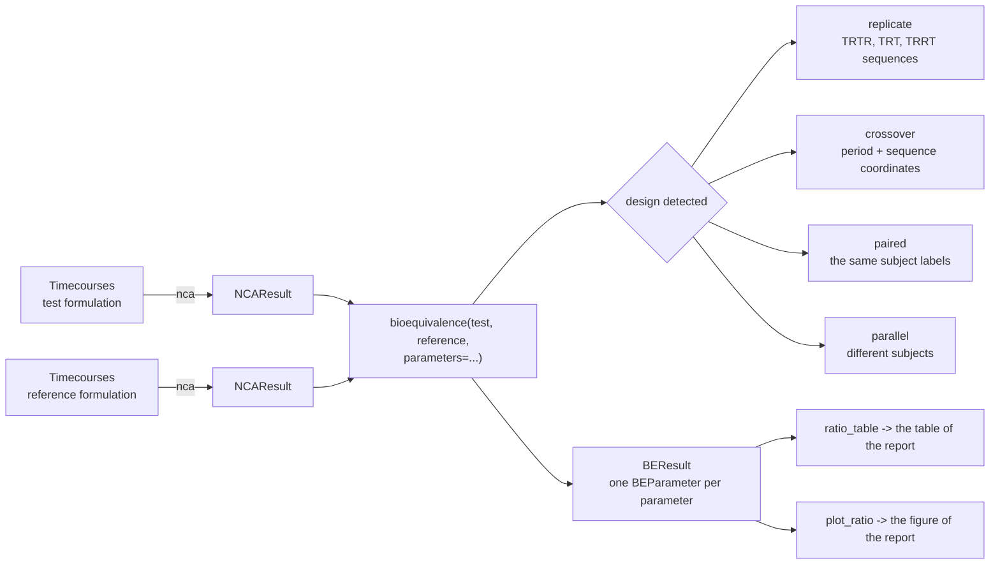
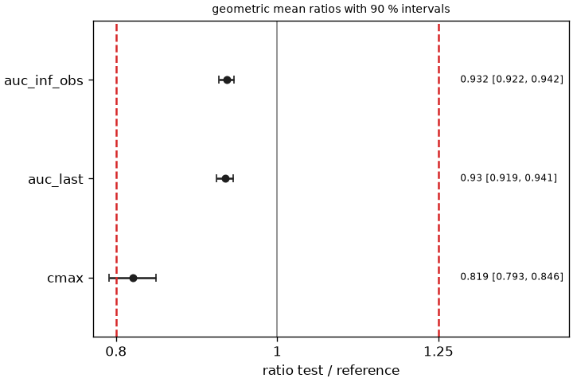
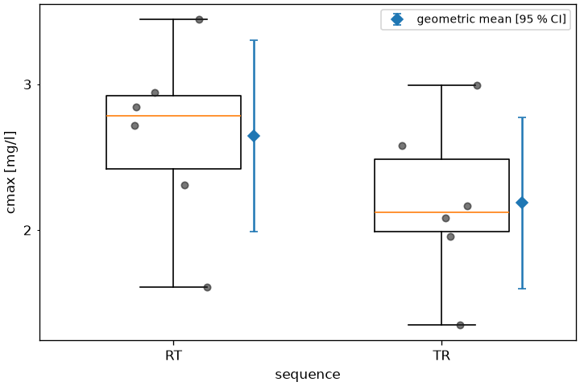

# Bioequivalence

Two formulations of the same drug are bioequivalent when they deliver the same exposure to the systemic circulation. The decision is a confidence interval: the 90 % interval of the geometric mean ratio of the test over the reference must lie within 80-125 % for every parameter of the comparison[^fda_be][^ema_be], the design and the analysis the FDA, the EMA and the harmonized ICH M13A guideline ask for[^ich_m13a]. `pkpdutils.stats.bioequivalence` makes that decision on the parameters of a non-compartmental analysis, in the design the study was run in, and writes the ratio table and the figure a report prints.

## Concepts



**Average bioequivalence.** What is compared are the population averages of the exposure, not the exposure of any one subject: the test formulation is accepted when the average of \(\ln\mathrm{AUC}\) and \(\ln C_\mathrm{max}\) differs from the reference by little enough that the 90 % interval of the difference, exponentiated into a ratio, stays inside the acceptance limits. The analysis runs on the logarithms because exposure parameters are positive and right skewed, and because a ratio is the quantity of interest: the difference of the logarithms is the logarithm of the geometric mean ratio. The limits 0.80 and 1.25 are that same choice again, \(1/1.25 = 0.80\), so that swapping test and reference gives the same decision[^fda_be][^ich_m13a].

**The parameters of the decision.** A single dose study reports the exposure and the peak: `auc_inf_obs` (or `auc_last`, the area to the last measured point, which the guidances usually make the primary one) and `cmax`[^ich_m13a]. `bioequivalence` tests `("auc_inf_obs", "cmax")` by default and any list of parameter names on request; a study is bioequivalent only when every parameter it lists is. \(t_\mathrm{max}\) is read from the sampling grid, is not log-normal and is not part of the acceptance decision; it is compared descriptively, with a rank test of [Statistics](statistics.md) when it matters.

**Designs.** A bioequivalence study is normally a 2x2 crossover: every subject takes both formulations, in two periods separated by a washout, in one of the two sequences RT and TR. Each subject is then their own control, which removes the between-subject variability from the comparison and is why a crossover needs far fewer subjects than parallel groups. `Design` names the four cases the package handles and `bioequivalence` detects them from the samples: `REPLICATE` when the `sequence` coordinate names one of the replicate designs, `CROSSOVER` when both carry the coordinates `period` (1 or 2) and `sequence` along the individual dimension, `PAIRED` when the two results simply hold the same subject labels, and `PARALLEL` otherwise. The detection is overridden with `design=`, and a crossover which is asked for without the two coordinates is an error rather than a silent fallback.

**Two one-sided tests.** Bioequivalence is not the absence of a difference, it is a difference small enough to be irrelevant, so the null hypothesis is reversed: the two one-sided tests procedure rejects "the ratio is at or below 0.80" and "the ratio is at or above 1.25", each at \(\alpha = 0.05\)[^schuirmann]. Rejecting both is exactly the statement that the \(1 - 2\alpha = 90\) % interval lies inside the limits, which is why the interval and the p values in a `BEParameter` always agree.

**The within-subject CV.** The width of the interval of a crossover is driven by the within-subject variability of the exposure, which the analysis of the period differences estimates as `cv_intra`. It is the number a sample size calculation for the next study needs, it decides whether a drug counts as highly variable (a within-subject CV above 30 %), and it is reported next to the ratio in the table.

**Replicate designs and reference scaling.** A highly variable drug (a within-subject CV of the reference above 30 %) needs a study which gives at least one formulation twice, so that the variability of the reference can be estimated on its own: `Design.REPLICATE` covers the sequences TRTR/RTRT, TRT/RTR and TRRT/RTTR and is analysed with the fixed effects analysis of variance of the log values (Method A of the EMA). On that estimate the guidances scale the acceptance rule, which `scaling=` selects: the expanding limits of the EMA (ABEL), the scaled criterion of the FDA (RSABE) and the two narrow therapeutic index rules. The mixed model (Method B of the EMA, the model of the FDA) is out of scope; it needs a restricted maximum likelihood fit which the dependencies of the package do not carry, and Method A is what the EMA asks for as the default analysis.

**Before the study.** `power_tost` and `sample_size_tost` answer the question the protocol asks: how many subjects a study needs to have a good chance of showing bioequivalence at an assumed ratio and an assumed variability. They are on this page under [Sample size](#sample-size).

**Out of scope.** The package covers average bioequivalence of a single dose study in the four designs above. Steady state bioequivalence of a multiple dose study, individual and population bioequivalence, higher order Williams designs, the multi-group model of ICH M13A (2.2.3.5) and in vitro dissolution comparisons are not implemented.

## Math

**Geometric mean ratio.** With the paired log values \(x_i = \ln t_i\) and \(y_i = \ln r_i\) of \(n\) subjects, \(d_i = x_i - y_i\):

\[\ln\mathrm{GMR} = \bar d, \qquad \mathrm{se} = \frac{s_d}{\sqrt{n}}, \qquad \nu = n - 1,\]

and for parallel groups \(\ln\mathrm{GMR} = \bar x - \bar y\) with the Welch standard error and its degrees of freedom. The interval of the ratio is the exponentiated t interval,

\[\left(\exp\left(\ln\mathrm{GMR} - t_{1-\alpha,\nu}\,\mathrm{se}\right),\ \exp\left(\ln\mathrm{GMR} + t_{1-\alpha,\nu}\,\mathrm{se}\right)\right), \qquad \alpha = \frac{1 - \mathrm{ci\_level}}{2},\]

asymmetric around the ratio because it is symmetric around the log ratio.

**2x2 crossover.** The period-difference analysis of Chow & Liu[^chow] gives the same treatment effect as the analysis of variance with sequence, period and subject-within-sequence effects, from two group means. With the log values \(y_{i1}\), \(y_{i2}\) of subject \(i\) in the two periods, the half difference \(d_i = (y_{i2} - y_{i1})/2\) and the total \(u_i = y_{i1} + y_{i2}\), and with the sequences A (test in period 2) and B (test in period 1):

\[\hat F = \bar d_A - \bar d_B, \qquad \hat P = \bar d_A + \bar d_B, \qquad \hat C = \bar u_A - \bar u_B,\]

the treatment effect \(\hat F = \ln\mathrm{GMR}\), the period effect \(\hat P\) and the sequence (carryover) effect \(\hat C\). The first two share the variance \(\mathrm{var} = \sigma_d^2\,(1/n_A + 1/n_B)\) of the pooled within-sequence variance \(\sigma_d^2\) with \(\nu = n_A + n_B - 2\) degrees of freedom, the third uses the pooled variance of the totals. The residual variance of the analysis of variance is \(\sigma_e^2 = 2\sigma_d^2\), and the within-subject coefficient of variation follows from the log-normal relation

\[\mathrm{CV}_\mathrm{intra} = \sqrt{e^{\sigma_e^2} - 1}.\]

A paired design without periods has no period effect to estimate; its `cv_intra` comes from the variance of the within-subject differences, \(\sigma_e^2 = \mathrm{se}^2 n / 2\). A parallel design has none at all and reports `NaN`.

**Replicate designs.** With more than two periods the period differences no longer summarize the study, and the analysis is the ordinary least squares fit of the log values on the whole model,

\[\ln y_{ijk} = \mu + \gamma_k + s_{i(k)} + \pi_j + \tau_f + e_{ijk},\]

with the sequence \(\gamma\), the subject within sequence \(s\), the period \(\pi\), the formulation \(\tau\) and the residual \(e\); \(\hat\tau_T - \hat\tau_R = \ln\mathrm{GMR}\) and its standard error comes from the residual variance, which is Method A of the EMA. The degrees of freedom follow from the model: \(3n - 4\) for the four period full replicate and \(2n - 3\) for the three period one. The table of the sequential sums of squares is `BEParameter.anova`, with the sequence tested against the subject-within-sequence mean square and everything else against the residual.

The two within-subject variances are estimated from each formulation alone, as the guidances define them: the residual of the least squares fit of the reference administrations on the subject and the period is

\[s_{wR}^2 = \frac{1}{2}\,\mathrm{var}\!\left(R_{i2} - R_{i1}\right)\ \text{pooled over the sequences}, \qquad \nu_R = n - s,\]

and the same for the test, which gives `cv_intra_r` and `cv_intra_t` through \(\mathrm{CV} = \sqrt{e^{s_w^2} - 1}\). A subject with a single administration of a formulation contributes no degree of freedom to its variance.

**Reference scaled limits.** The EMA widens the limits in proportion to the variability of the reference[^ema_be],

\[\theta_U = e^{k\,s_{wR}}, \qquad \theta_L = 1/\theta_U, \qquad k = 0.760,\]

for \(C_\mathrm{max}\) alone, only above \(\mathrm{CV}_{wR} = 30\) %, with \(\mathrm{CV}_{wR}\) capped at 50 % so that the limits never leave 69.84-143.19 %, and always with the point estimate inside 80.00-125.00 %. At and below 30 % the limits stay 80-125 %, which is where the formula lands anyway, so the rule is continuous. The FDA scales the criterion instead of the limits[^fda_rsabe]: above \(s_{wR} = 0.294\) it asks for the upper 95 % confidence bound of

\[(\mu_T - \mu_R)^2 - \theta\,\sigma_{wR}^2 \le 0, \qquad \theta = \left(\frac{\ln 1.25}{0.25}\right)^2,\]

computed with Howe's approximation from the subject-level differences and the reference variance, together with the point estimate inside 80.00-125.00 %. Below the switching condition the unscaled analysis decides. The point estimate of both rules of the FDA is \(e^{\hat d}\) of the same subject-level mean \(\hat d = \frac{1}{s}\sum_k \bar d_k\) the criterion is built on, not the formulation effect `gmr` of the analysis of variance: the two agree on a balanced design and differ on an unbalanced one, and the guidance takes both conditions on one number. `gmr` reports the effect of the analysis of variance either way.

**Narrow therapeutic index.** The EMA tightens the limits of \(\mathrm{AUC}\) to 90.00-111.11 % (and of \(C_\mathrm{max}\) where it matters for safety or efficacy)[^ema_be]. The FDA scales instead, with \(\sigma_{w0} = 0.10\) and \(\Delta = 1/0.9\) in the same criterion, and adds two conditions[^fda_nti]: the unscaled 90 % interval within 80.00-125.00 % and the upper 90 % bound of \(s_{wT}/s_{wR}\), the equal-tailed \(F\) bound \(\sqrt{(s_{wT}^2/s_{wR}^2)\,F_{0.95}(\nu_R, \nu_T)}\), at most 2.500.

**Power and sample size.** With \(\sigma\) the standard deviation of the log values, \(\mathrm{se} = \sigma\sqrt{b_k/n}\) the standard error of the design and \(\delta_{1,2} = (\ln\mathrm{GMR} - \ln\theta_{L,U})/\mathrm{se}\), the probability that both one-sided tests reject is the exact bivariate non-central t probability

\[1 - \beta = Q_\nu(-t_{1-\alpha,\nu}, \delta_2; 0, R) - Q_\nu(t_{1-\alpha,\nu}, \delta_1; 0, R), \qquad R = \frac{(\delta_1 - \delta_2)\sqrt{\nu}}{2\,t_{1-\alpha,\nu}},\]

with Owen's Q function[^owen]. The design constants \(b_k\) and the degrees of freedom are the ones of `PowerTOST`[^powertost]: \(b_k = 2\) and \(\nu = n - 2\) for the 2x2 crossover, \(b_k = 4\) and \(\nu = n - 2\) for parallel groups, \(b_k = 1\) and \(\nu = 3n - 4\) for the four period replicate and \(b_k = 1.5\) and \(\nu = 2n - 3\) for the three period one. An odd \(n\) is the study with one subject more in one sequence, and its standard error is \(\sigma\sqrt{(b_k/4)(1/n_1 + 1/n_2)}\) with \(n_1 = \lceil n/2 \rceil\), \(n_2 = \lfloor n/2 \rfloor\), which is the balanced formula again when \(n\) is even.

**Hodges-Lehmann.** The non-parametric comparison of \(t_\mathrm{max}\) is the median of the Walsh averages of the paired differences,

\[\hat\Delta = \mathrm{median}\left\{\frac{d_i + d_j}{2} : i \le j\right\},\]

with the interval taken from the order statistics of the same quantities at the quantile of the Wilcoxon null distribution[^hodges]; the unpaired version uses the pairwise differences and the Mann-Whitney distribution. That distribution is discrete, so the interval rarely covers exactly what was asked for: the `ci_level` of the result is the level it achieves, \(1 - 2 P(W \le w - 1)\).

**Two one-sided tests.** For the limits \(\theta_L < 1 < \theta_U\),

\[t_L = \frac{\ln\mathrm{GMR} - \ln\theta_L}{\mathrm{se}}, \qquad t_U = \frac{\ln\theta_U - \ln\mathrm{GMR}}{\mathrm{se}},\]

each tested one-sided against \(t_{1-\alpha,\nu}\); `p_lower` and `p_upper` are their p values, `p_value` is the larger of the two, and `bioequivalent` is the interval inclusion \(\theta_L \le \mathrm{ci\_low}\) and \(\mathrm{ci\_high} \le \theta_U\), which is the same decision as \(\max(p_L, p_U) < \alpha\)[^schuirmann].

**Degenerate samples.** Without a standard error (a single subject, or two samples with no within-subject difference) the two tests are undefined: the p values and the interval come back as `NaN`, the ratio itself stays finite, and the parameter is not bioequivalent. Subjects are matched by label, so a subject who misses one period is dropped from that parameter and the others keep their pairing.

## Results

`bioequivalence` returns a `BEResult`, a `BEParameter` per parameter with the verdict over all of them; `tost` returns a single `BEParameter` for two samples.

| result | fields |
| --- | --- |
| `BEParameter` | `name`, `unit`, `gmr`, `ci_low`, `ci_high`, `ci_level`, `limits`, `bioequivalent`, `p_lower`, `p_upper`, `p_value`, `log_ratio`, `se_log`, `df`, `design`, `cv_intra`, `p_period`, `p_sequence`, `n_test`, `n_reference`, `carryover`, `cv_intra_r`, `cv_intra_t`, `scaled`, `limits_scaled`, `criterion`, `sd_ratio_upper`, `anova`, `to_dict()` |
| `BEResult` | `parameters` (name to `BEParameter`), `bioequivalent`, `limits`, `ci_level`, `result["cmax"]`, `to_dict()`, `to_dataframe()` |

`gmr` and its interval are ratios, test over reference; `ratio_table` writes them as the percentages the guidances use. `p_period` and `p_sequence` are the p values of the period and the carryover effect of a crossover and are `NaN` in the other designs: a significant period effect is common and harmless, since the crossover balances it, while a significant sequence effect points at an incomplete washout and casts doubt on the study itself.

`BEParameter.limits` always carries the limits the verdict was taken against, so a widened or tightened analysis reports them in `ratio_table` and `plot_ratio` without a second lookup; `limits_scaled` repeats them when they were derived and is `None` otherwise, including for the criterion of the FDA, which has no limits at all and reports `criterion` instead (at most zero for a bioequivalent formulation). `scaled` says that the rule was derived from the variability of the reference or replaced by a narrow therapeutic index rule, so that `limits` is no longer the one which was asked for. `BEResult.limits`, in contrast, is always the limits which were **requested**, the `limits` argument of the call, since one result holds several parameters which a scaled rule may judge differently. `cv_intra_r` and `cv_intra_t` are `NaN` outside a replicate design, and `n_test` and `n_reference` count the administrations there rather than the subjects, since a subject carries several of each.

## API

A 2x2 crossover from the simulated curves to the table and the figure of the report. The period and the sequence of every subject are coordinates of the batch, travel through the analysis, and are what makes the design a crossover:

```python
import numpy as np

from pkpdutils import Route, Timecourses, bioequivalence, nca
from pkpdutils.console import print_table
from pkpdutils.plot import plot_parameters, plot_ratio
from pkpdutils.stats import ratio_table

# a 2x2 crossover of twelve subjects: the sequence RT takes the reference in
# period 1 and the test in period 2, the sequence TR the other way round; the
# test formulation has a lower bioavailability (0.93) and a slower absorption
time = np.array([0.25, 0.5, 1, 1.5, 2, 3, 4, 6, 8, 12, 24])
subjects = [f"s{i:02d}" for i in range(12)]
sequence = np.array(["RT"] * 6 + ["TR"] * 6)
period_test = np.where(sequence == "RT", 2, 1)
rng = np.random.default_rng(12)
subject_scale = rng.lognormal(0, 0.25, 12)  # between-subject variability


def formulation(bioavailability: float, ka: float, period: np.ndarray) -> Timecourses:
    ke = 0.15
    scale = subject_scale * np.where(period == 2, 1.05, 1.0)  # period 2 runs 5 % higher
    values = np.stack(
        [
            s
            * bioavailability
            * 100
            * ka
            / (ka - ke)
            * (np.exp(-ke * time) - np.exp(-ka * time))
            / 30
            * rng.lognormal(0, 0.06, time.size)
            for s in scale
        ]
    )
    # `period` and `sequence` travel with the individuals through the analysis
    # and make the design of the comparison a 2x2 crossover
    return Timecourses.from_arrays(
        time,
        values,
        time_unit="hr",
        unit="mg/l",
        dims=("individual",),
        coords={
            "individual": subjects,
            "period": ("individual", period),
            "sequence": ("individual", sequence),
        },
        dose={"amount": np.full(12, 100.0), "unit": "mg"},
        route=Route.ORAL,
        substance="drug",
    )


reference = nca(formulation(1.0, 1.5, 3 - period_test))
test = nca(formulation(0.93, 0.9, period_test))

be = bioequivalence(test, reference, parameters=["auc_inf_obs", "auc_last", "cmax"])
table = ratio_table(be)  # the full table also carries the unit and the level
print_table(
    table.drop(columns=["unit", "n_reference", "ci_level"]),
    title="Average bioequivalence, 90 % intervals of the geometric mean ratio",
)

peak = be["cmax"]
print(f"design {peak.design}, {peak.n_test} subjects, {peak.df:.0f} df")
print(f"cv_intra {peak.cv_intra * 100:.2f} %, TOST p = {peak.p_value:.3f}")
print(f"p_period {peak.p_period:.3f}, p_sequence {peak.p_sequence:.3f}")
print("bioequivalent:", be.bioequivalent)

plot_ratio(be).savefig("bioequivalence.png", dpi=120)
plot_parameters(test, "cmax", "individual", by="sequence", log_y=True).savefig(
    "bioequivalence_parameters.png", dpi=120
)
```

```text
Average bioequivalence, 90 % intervals of the geometric mean ratio

  parameter     n_test   gmr      ci_low   ci_high   cv_intra   limits           bioequivalent
 ━━━━━━━━━━━━━━━━━━━━━━━━━━━━━━━━━━━━━━━━━━━━━━━━━━━━━━━━━━━━━━━━━━━━━━━━━━━━━━━━━━━━━━━━━━━━━━
  auc_inf_obs   12       93.2 %   92.2 %   94.2 %    1.46 %     80.0 - 125.0 %   True
  auc_last      12       93.0 %   91.9 %   94.1 %    1.62 %     80.0 - 125.0 %   True
  cmax          12       81.9 %   79.3 %   84.6 %    4.39 %     80.0 - 125.0 %   False

design crossover, 12 subjects, 10 df
cv_intra 4.39 %, TOST p = 0.112
p_period 0.021, p_sequence 0.357
bioequivalent: False
```

The exposure of the two formulations is equivalent, the peak is not: the slower absorption of the test formulation lowers \(C_\mathrm{max}\) to 81.9 % and pushes the lower bound of its interval below 80 %. A study is bioequivalent only when every parameter is, so `be.bioequivalent` is `False`. The period effect is the 5 % the simulation put into period 2 and is harmless, the sequence effect is not significant.

The figure of the report puts the three ratios on a logarithmic axis against the acceptance limits, with the numbers in a column beside them, and the individual values behind the peak ratio show where the failure comes from (both figures are the ones `examples/bioequivalence.py` writes from the same data):





`tost` runs the same decision on two samples directly, and `design=` reads the same data under another design. The comparison shows what the crossover buys: the ratio is the same number, the interval of the parallel analysis is more than five times as wide, because it carries the between-subject variability the crossover removed.

```python
from pkpdutils.stats import tost

# the same two samples read under the three designs: the crossover and the
# paired analysis remove the between-subject variability, the parallel one
# carries it into the interval
for design in ("crossover", "paired", "parallel"):
    p = tost(
        test.sample("cmax", "individual"),
        reference.sample("cmax", "individual"),
        design=design,
    )
    print(
        f"{p.design:<10} {p.gmr:.3f} [{p.ci_low:.3f}, {p.ci_high:.3f}] "
        f"df = {p.df:.0f}, bioequivalent {p.bioequivalent}"
    )
```

```text
crossover  0.819 [0.793, 0.846] df = 10, bioequivalent False
paired     0.819 [0.786, 0.853] df = 11, bioequivalent False
parallel   0.819 [0.688, 0.975] df = 22, bioequivalent False
```

Published numbers go through the same function without any individual value: a `ParameterSample` of the geometric mean and the geometric CV of each arm is a parallel design and goes straight into `tost`. A published crossover cannot be redone this way, because the summary statistics of its two arms carry the between-subject variability and not the within-subject variability the design removes.

```python
from pkpdutils.stats import ParameterSample

published = tost(
    ParameterSample(geomean=41.2, geocv=0.28, n=24, name="auc_inf_obs", unit="hr*mg/l"),
    ParameterSample(geomean=44.0, geocv=0.26, n=24, name="auc_inf_obs", unit="hr*mg/l"),
    design="parallel",
)
print(
    f"{published.gmr:.3f} [{published.ci_low:.3f}, {published.ci_high:.3f}], "
    f"p = {published.p_value:.3f}, bioequivalent {published.bioequivalent}"
)
```

```text
0.936 [0.823, 1.065], p = 0.023, bioequivalent True
```

Other acceptance limits, other parameters and the labels of a publication:

```python
# not executed
# a narrow therapeutic index drug against the tighter limits
bioequivalence(test, reference, limits=(0.9, 1.1111))
# any parameter of the results, and a study with a second sample dimension
bioequivalence(test, reference, parameters=["auc_last", "cmax", "thalf"], arm="fasted")
# the plain ratios instead of the percentages, and the names a paper prints
ratio_table(be, percent=False, digits=4)
plot_ratio(be, labels={"auc_inf_obs": "AUC(0-inf)", "cmax": "Cmax"})
```

The ratios, the tests and the samples behind them are on the [Statistics](statistics.md) page, the figures on [Plotting](plotting.md), the runnable study in the second walk-through of [Workflows](workflows.md) and in `examples/bioequivalence.py`. The reference of the module is in [API: stats.bioequivalence](api/stats.bioequivalence.md).

## Carryover

A subject whose pre-dose concentration in a period exceeds 5 % of its own \(C_\mathrm{max}\) of that period carries drug from the previous period. ICH M13A[^ich_m13a] (2.2.3.3), the FDA guidance for ANDAs[^fda_anda] and the EMA guideline[^ema_be] draw the same line and ask for the subject to be dropped from the evaluation of that period; M13A adds that a statistical test for carryover "is not considered relevant", so this comparison replaces it (the sequence effect `p_sequence` of the crossover analysis stays in the result as a diagnostic).

`carryover_table(batch, result)` reads the pre-dose value of every sample against the \(C_\mathrm{max}\) of the same sample. The pre-dose value is the last value strictly before the dose time; a sample recorded at the dose time counts only for an extravascular route, where it is drawn before the dose is taken, and never after an intravenous bolus or during an infusion, whose sample at the dose time is the post-dose value of this period. A period without a value before the dose has no pre-dose value (`predose` is `NaN`) and is not flagged.

`bioequivalence(..., carryover="flag" | "exclude", test_batch=..., reference_batch=...)` acts on it: `"flag"` names the subjects in `BEParameter.carryover` and leaves the analysis alone, `"exclude"` drops them from every parameter and names them there as well.

```python
import numpy as np

from pkpdutils import Route, Timecourses, bioequivalence, carryover_table, nca

# two periods of six subjects, one sample before the dose; the pre-dose sample
# of `s3` carries 6 % of its own maximum from the previous period
carry_time = np.array([0.0, 0.5, 1, 2, 4, 6, 8, 12, 24])
carry_subjects = [f"s{i + 1}" for i in range(6)]


def period(scale: float) -> Timecourses:
    ke, ka = 0.2, 1.2
    values = np.stack(
        [
            scale
            * (1 + 0.05 * i)
            * 10
            * (np.exp(-ke * carry_time) - np.exp(-ka * carry_time))
            for i in range(6)
        ]
    )
    values[2, 0] = 0.06 * values[2].max()
    return Timecourses.from_arrays(
        carry_time,
        values,
        time_unit="hr",
        unit="mg/l",
        dims=("individual",),
        coords={"individual": carry_subjects},
        dose={"amount": np.full(6, 100.0), "unit": "mg"},
        route=Route.ORAL,
        substance="drug",
    )


test_period, reference_period = period(0.95), period(1.0)
test_result, reference_result = nca(test_period), nca(reference_period)
print(carryover_table(test_period, test_result).to_string(index=False))

checked = bioequivalence(
    test_result,
    reference_result,
    parameters=["auc_inf_obs", "cmax"],
    carryover="exclude",
    test_batch=test_period,
    reference_batch=reference_period,
)
print("dropped:", checked["cmax"].carryover, "subjects left:", checked["cmax"].n_test)
```

```text
individual  predose     cmax  fraction  flagged
        s1 0.000000 5.506220      0.00    False
        s2 0.000000 5.781531      0.00    False
        s3 0.363411 6.056842      0.06     True
        s4 0.000000 6.332153      0.00    False
        s5 0.000000 6.607464      0.00    False
        s6 0.000000 6.882775      0.00    False
dropped: ('s3',) subjects left: 5
```

A subject the results themselves mark `excluded` (`NCAResult.exclude`, the acceptance criteria of [Non-compartmental analysis](nca.md#acceptance-criteria-and-exclusions)) is left out of every parameter as well, without any keyword; `bioequivalence(..., include_excluded=True)` analyses the whole study again.

## Replicate designs

A drug whose reference formulation varies by more than 30 % within a subject cannot pass the fixed 80-125 % limits with a sensible number of subjects, which is why the guidances allow the limits to be scaled with that variability. Scaling needs the variability of the reference alone, and that needs a study which gives the reference twice: a replicate design. `pkpdutils` recognizes the four period full replicate (TRTR/RTRT), the three period replicate (TRT/RTR) and the four period design with the reference in the middle (TRRT/RTTR) from the `sequence` coordinate.

A replicate study has several administrations per subject, so the sample dimension of the batch is the administration rather than the individual, and the coordinates `subject`, `period` and `sequence` say what each row is. Everything else is unchanged: one batch per formulation, `nca` on both, `bioequivalence` on the two results.

```python
import numpy as np

from pkpdutils import Route, Timecourses, bioequivalence, nca
from pkpdutils.console import print_table

# a four period full replicate of 24 subjects: the sequences TRTR and RTRT
# give every subject both formulations twice, which is what separates the
# within-subject variability of the reference from the one of the test
rep_time = np.array([0.25, 0.5, 1, 1.5, 2, 3, 4, 6, 8, 12, 24])
rep_sequences = np.array(["TRTR"] * 12 + ["RTRT"] * 12)
rep_subjects = np.array([f"s{i + 1:02d}" for i in range(24)])
rep_rng = np.random.default_rng(5)
subject_level = rep_rng.lognormal(0.0, 0.3, 24)  # between-subject variability


def replicate(letter: str) -> Timecourses:
    ke, ka = 0.15, 1.2 if letter == "T" else 1.3
    bioavailability = 0.95 if letter == "T" else 1.0
    within = 0.40 if letter == "R" else 0.25  # within-subject CV of this formulation
    values, subject, period, sequence = [], [], [], []
    for i, (name, order) in enumerate(zip(rep_subjects, rep_sequences, strict=True)):
        for p, given in enumerate(order, start=1):
            if given != letter:
                continue
            scale = subject_level[i] * rep_rng.lognormal(0.0, within)
            c = (
                bioavailability
                * scale
                * 100
                * ka
                / (ka - ke)
                * (np.exp(-ke * rep_time) - np.exp(-ka * rep_time))
                / 30
            )
            values.append(c)
            subject.append(name)
            period.append(p)
            sequence.append(order)
    return Timecourses.from_arrays(
        rep_time,
        np.stack(values),
        time_unit="hr",
        unit="mg/l",
        dims=("administration",),
        coords={
            "administration": [
                f"{s}p{p}" for s, p in zip(subject, period, strict=True)
            ],
            "subject": ("administration", subject),
            "period": ("administration", period),
            "sequence": ("administration", sequence),
        },
        dose={"amount": np.full(len(values), 100.0), "unit": "mg"},
        route=Route.ORAL,
        substance="drug",
    )


rep_test, rep_reference = nca(replicate("T")), nca(replicate("R"))
replicated = bioequivalence(
    rep_test, rep_reference, parameters=["auc_inf_obs", "cmax"], dim="administration"
)
peak = replicated["cmax"]
print(f"design {peak.design}, {peak.n_test} + {peak.n_reference} administrations")
print(f"gmr {peak.gmr:.3f} [{peak.ci_low:.3f}, {peak.ci_high:.3f}], df = {peak.df:.0f}")
print(
    f"cv_intra_r {peak.cv_intra_r * 100:.1f} %, cv_intra_t {peak.cv_intra_t * 100:.1f} %"
)
print_table(peak.anova, title="Analysis of variance of cmax (EMA Method A)")
```

```text
design replicate, 48 + 48 administrations
gmr 1.001 [0.911, 1.100], df = 68
cv_intra_r 36.7 %, cv_intra_t 19.5 %
Analysis of variance of cmax (EMA Method A)

  source              df     sum_sq    mean_sq          f    p_value
 ━━━━━━━━━━━━━━━━━━━━━━━━━━━━━━━━━━━━━━━━━━━━━━━━━━━━━━━━━━━━━━━━━━━━
  sequence             1      0.177      0.177      0.424      0.522
  subject(sequence)   22       9.18      0.417       5.44   3.39e-08
  period               3      0.221     0.0738      0.961      0.416
  formulation          1   7.81e-06   7.81e-06   0.000102      0.992
  residual            68       5.22     0.0768

```

The degrees of freedom are the ones the model leaves: 96 administrations minus one intercept, 23 subject contrasts, three period contrasts and one formulation contrast gives \(3n - 4 = 68\). The reference varies by 36.7 % within a subject and the test by 19.5 %, which is what the simulation put in; both come from the administrations of that formulation alone, not from the residual of the whole model. The sequences must agree with the periods: an administration of the test in a period whose sequence says reference is an error rather than a silently mislabelled row.

## Reference scaled limits

`scaling="ema"` applies the average bioequivalence with expanding limits of the EMA. It widens the limits of \(C_\mathrm{max}\) alone, in proportion to the variability of the reference, never those of an area, and it keeps asking for the point estimate inside 80.00-125.00 %.

```python
from pkpdutils.stats import abel_limits

widened = bioequivalence(
    rep_test,
    rep_reference,
    parameters=["auc_inf_obs", "cmax"],
    dim="administration",
    scaling="ema",
)
for name, p in widened.parameters.items():
    low, high = p.limits
    print(
        f"{name:<12} gmr {p.gmr * 100:6.2f} % [{p.ci_low * 100:6.2f}, {p.ci_high * 100:6.2f}] "
        f"limits {low * 100:6.2f} - {high * 100:6.2f} % scaled {p.scaled} "
        f"bioequivalent {p.bioequivalent}"
    )
print(
    "limits at CV 30 %, 40 %, 50 %:",
    [tuple(round(v, 4) for v in abel_limits(cv)) for cv in (0.30, 0.40, 0.50)],
)
```

```text
auc_inf_obs  gmr 101.50 % [ 92.37, 111.54] limits  80.00 - 125.00 % scaled False bioequivalent True
cmax         gmr 100.06 % [ 91.05, 109.95] limits  76.34 - 130.99 % scaled True bioequivalent True
limits at CV 30 %, 40 %, 50 %: [(0.8, 1.25), (0.7462, 1.3402), (0.6984, 1.4319)]
```

The area keeps its limits, the peak gets 76.34-130.99 % from a `cv_intra_r` of 36.7 %. `abel_limits` shows the whole rule: at and below the switching condition of 30 % the limits stay 80-125 %, at 40 % they are 74.62-134.02 %, and at 50 % they reach the cap 69.84-143.19 %, which is where they stay for any larger variability.

Which parameter the EMA widens is `scaled_parameters`, `("cmax",)` by default. A steady state study whose peak is called `cmax_ss` passes `scaled_parameters=("cmax_ss",)`; the rules of the FDA scale every parameter and ignore the keyword.

`scaling="fda"` applies the reference-scaled average bioequivalence of the FDA instead. It scales the criterion rather than the limits, it applies to the area as well as to the peak, and it reports the upper 95 % confidence bound of the criterion in `criterion`, which has to be at most zero.

```python
scaled = bioequivalence(
    rep_test,
    rep_reference,
    parameters=["auc_inf_obs", "cmax"],
    dim="administration",
    scaling="fda",
)
for name, p in scaled.parameters.items():
    print(
        f"{name:<12} gmr {p.gmr * 100:6.2f} % scaled {p.scaled} "
        f"criterion {p.criterion if p.criterion is None else round(p.criterion, 4)} "
        f"bioequivalent {p.bioequivalent}"
    )
```

```text
auc_inf_obs  gmr 101.50 % scaled True criterion -0.0631 bioequivalent True
cmax         gmr 100.06 % scaled True criterion -0.0641 bioequivalent True
```

Both parameters are scaled here because the reference varies by more than the switching condition \(s_{wR} = 0.294\) in both of them. A parameter below it falls back to the unscaled analysis: `scaled` is `False`, `criterion` is `None` and the 90 % interval decides, which is what the guidance asks for. The point estimate the FDA rule tests against 80.00-125.00 % is the subject-level mean of the within-subject differences, the same estimate the criterion is built on; on this balanced study it is the `gmr` printed above, on an unbalanced one it is not, and the guidance asks for one number for both conditions.

## Narrow therapeutic index

A narrow therapeutic index drug is judged more strictly, and the two regions do it differently. `scaling="ema_nti"` tightens the acceptance limits to 90.00-111.11 %, which needs no replicate design at all and applies to every parameter of the call, so naming `cmax` in `parameters` is how the EMA rule "where \(C_\mathrm{max}\) is of particular importance" is expressed. `scaling="fda_nti"` scales the criterion with \(\sigma_{w0} = 0.10\), always, and adds the unscaled interval within 80.00-125.00 % and the comparison of the two variabilities.

```python
narrow = bioequivalence(
    rep_test,
    rep_reference,
    parameters=["auc_inf_obs"],
    dim="administration",
    scaling="ema_nti",
)
area = narrow["auc_inf_obs"]
print(
    f"limits {area.limits[0] * 100:.2f} - {area.limits[1] * 100:.2f} %, bioequivalent {area.bioequivalent}"
)
fda_narrow = bioequivalence(
    rep_test,
    rep_reference,
    parameters=["auc_inf_obs"],
    dim="administration",
    scaling="fda_nti",
)["auc_inf_obs"]
print(
    f"criterion {fda_narrow.criterion:.4f}, s_wT/s_wR upper {fda_narrow.sd_ratio_upper:.3f}, "
    f"bioequivalent {fda_narrow.bioequivalent}"
)
```

```text
limits 90.00 - 111.11 %, bioequivalent False
criterion -0.0893, s_wT/s_wR upper 0.776, bioequivalent True
```

The simulated drug is not a narrow therapeutic index drug at all, and the two rules disagree about it for exactly that reason: its interval of 92.37-111.54 % leaves the tightened EMA limits at the upper end, while the FDA criterion, which scales with a reference that varies by 36.7 %, passes easily and the test formulation is even less variable than the reference (the bound of \(s_{wT}/s_{wR}\) is 0.776, far below 2.500). A real narrow therapeutic index drug varies little, and then the two rules are close to each other.

## tmax

The EMA does not ask for a statistical test of \(t_\mathrm{max}\), and it forbids a non-parametric analysis of \(\mathrm{AUC}\) and \(C_\mathrm{max}\); but when a rapid onset is claimed to be clinically relevant it asks that there be "no apparent difference in median \(t_\mathrm{max}\) and its variability"[^ema_be]. That is what `hodges_lehmann` reports: the median difference with a distribution free confidence interval and the p value of the matching rank test, on the values as they are and not on their logarithms.

```python
from pkpdutils.stats import hodges_lehmann

shift = hodges_lehmann(
    test.sample("tmax", "individual"), reference.sample("tmax", "individual")
)
print(
    f"median difference {shift.effect:.2f} h "
    f"[{shift.ci_low:.2f}, {shift.ci_high:.2f}], p = {shift.p_value:.3f}, "
    f"{shift.test}, paired {shift.paired}"
)
```

```text
median difference 0.75 h [0.00, 1.25], p = 0.047, wilcoxon, paired True
```

The test formulation of the 2x2 study above absorbs more slowly, and the estimate says by how much: the median subject reaches the peak three quarters of an hour later, with an interval which just touches zero. The samples are paired by their labels, so the estimator works on the Walsh averages of the within-subject differences; two samples without shared labels are compared with the pairwise differences and the Mann-Whitney distribution instead. \(t_\mathrm{max}\) is read from a sampling grid and is full of ties, which is why the interval is a pair of order statistics rather than a t interval, and why its `ci_level` is the level those order statistics really cover rather than the 0.90 which was asked for.

## Sample size

Before a study is run the same procedure answers the other question: how many subjects it takes to have a good chance of showing bioequivalence, given an assumed ratio and an assumed within-subject variability. `power_tost` is the exact power of the two one-sided tests and `sample_size_tost` the smallest study which reaches a target power.

```python
from pkpdutils.stats import power_tost, sample_size_tost

for cv in (0.20, 0.25, 0.30):
    n = sample_size_tost(cv=cv, gmr=0.95)
    print(f"CV {cv * 100:4.0f} %  n = {n:3d}  power {power_tost(cv=cv, n=n):.4f}")
print(
    "replicate:", sample_size_tost(cv=0.45, design="2x2x4"), sample_size_tost(cv=0.45)
)
print(f"power of 24 subjects at CV 30 %: {power_tost(cv=0.3, n=24):.4f}")
```

```text
CV   20 %  n =  20  power 0.8347
CV   25 %  n =  28  power 0.8074
CV   30 %  n =  40  power 0.8158
replicate: 42 82
power of 24 subjects at CV 30 %: 0.5577
```

The three sizes are the ones `PowerTOST::sampleN.TOST` reports, which is where the implementation is pinned; a crossover is searched in steps of two so that the sequences carry the same number of subjects, and a parallel design in steps of one. The last two lines are the two arguments a protocol makes: a highly variable drug needs half as many subjects in a four period replicate design as in a 2x2 crossover, because every subject contributes four administrations instead of two; and a study of 24 subjects at a within-subject CV of 30 % has a coin flip's chance of passing, which is why the FDA recommends at least 24 subjects for highly variable products and more when the variability is higher.

## References

[^fda_be]: U.S. Food and Drug Administration. *Statistical Approaches to Establishing Bioequivalence.* 2026. See [References](references.md#regulatory-guidance).
[^schuirmann]: Schuirmann DJ. *J Pharmacokinet Biopharm.* 1987;15:657-680. See [References](references.md#statistics).
[^ema_be]: European Medicines Agency. *Guideline on the Investigation of Bioequivalence.* CPMP/EWP/QWP/1401/98 Rev. 1, 2010. See [References](references.md#regulatory-guidance).
[^ich_m13a]: International Council for Harmonisation. *Bioequivalence for Immediate-Release Solid Oral Dosage Forms M13A.* 2024. See [References](references.md#regulatory-guidance).
[^fda_anda]: U.S. Food and Drug Administration. *Bioequivalence Studies With Pharmacokinetic Endpoints for Drugs Submitted Under an ANDA.* 2026. See [References](references.md#regulatory-guidance).
[^chow]: Chow SC, Liu JP. *Design and Analysis of Bioavailability and Bioequivalence Studies.* 3rd ed. 2009, ch. 3. See [References](references.md#statistics).
[^fda_rsabe]: U.S. Food and Drug Administration. *Draft Guidance on Progesterone.* 2011 (reference-scaled average bioequivalence). See [References](references.md#regulatory-guidance).
[^fda_nti]: U.S. Food and Drug Administration. *Draft Guidance on Warfarin Sodium.* 2012 (narrow therapeutic index). See [References](references.md#regulatory-guidance).
[^owen]: Owen DB. *Biometrika.* 1965;52:437-446. See [References](references.md#statistics).
[^powertost]: Labes D, Schuetz H, Lang B. *PowerTOST.* CRAN package. See [References](references.md#software).
[^hodges]: Hodges JL, Lehmann EL. *Ann Math Stat.* 1963;34:598-611. See [References](references.md#statistics).
