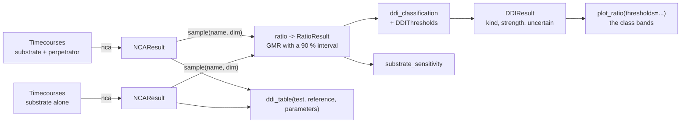

# Drug-drug interactions

A drug-drug interaction study gives a substrate alone and together with a perpetrator and reads the change of the exposure. The number that carries the result is the AUC ratio, the exposure with the perpetrator over the exposure without it; the FDA and the EMA guidances turn it into a class, a strong, moderate or weak inhibitor or inducer[^fda_ddi][^ema_ddi]. `pkpdutils.stats.ddi` computes the ratio with its interval from the parameters of a non-compartmental analysis, classifies it conservatively and writes the table and the figure of the report.

## Concepts



**Perpetrator and victim.** The perpetrator is the drug that changes an enzyme or a transporter, the victim, or substrate, is the drug whose exposure is measured[^bjornsson]. A study characterizes one of the two: an index substrate such as midazolam measures how strong a perpetrator is, an index perpetrator such as itraconazole measures how sensitive a substrate is; the FDA keeps the tables of the index substrates, inhibitors and inducers[^fda_ddi_table]. The same ratio is read in both directions, which is why the same thresholds classify the perpetrator and grade the sensitivity of the substrate.

**The classes of a perpetrator.** The FDA guidance classifies a perpetrator by the AUC ratio of a sensitive index substrate with and without it[^fda_ddi]; the EMA guideline uses the same numbers[^ema_ddi]:

| class | AUC ratio | change of the exposure |
| --- | --- | --- |
| strong inhibitor | \(\ge 5\) | 5-fold increase or more |
| moderate inhibitor | \(2 \le r < 5\) | 2- to 5-fold increase |
| weak inhibitor | \(1.25 \le r < 2\) | 1.25- to 2-fold increase |
| no interaction | \(0.8 < r < 1.25\) | less than a 1.25-fold increase, less than a 20 % decrease |
| weak inducer | \(0.5 < r \le 0.8\) | 20-50 % decrease |
| moderate inducer | \(0.2 < r \le 0.5\) | 50-80 % decrease |
| strong inducer | \(\le 0.2\) | 80 % decrease or more |

`DDIThresholds` holds these numbers, `DDIThresholds.fda()` and `DDIThresholds.ema()` are the two named sets and differ only in the `source` string they carry into the table, and a study which applies its own boundaries constructs the dataclass with them. `DDIKind` is the direction (`inhibitor`, `inducer`, `none`) and `DDIStrength` the strength (`strong`, `moderate`, `weak`, `none`).

**Sensitive substrates.** The same scale read from the other side: a substrate is sensitive when a strong index inhibitor raises its AUC at least 5-fold and moderately sensitive at 2- to 5-fold[^fda_ddi]. `substrate_sensitivity` returns a `Sensitivity` (`sensitive`, `moderately_sensitive`, `none`). The classes of a perpetrator are defined against a sensitive substrate, so a weak effect on an insensitive victim does not mean the perpetrator is weak.

**The exposure ratio.** The AUC ratio of a study is not one number but an estimate with an uncertainty, and it is estimated the way every ratio of a pharmacokinetic parameter is: as the geometric mean ratio of the log values with a t interval at 90 %, the same level bioequivalence uses. A crossover, where every subject is measured with and without the perpetrator, is paired by subject label; two parallel arms give the Welch interval. `ratio` decides that from the labels, `paired=` overrides it. `AUCR` is usually reported for `auc_inf_obs` and `auc_last`, with \(C_\mathrm{max}\) beside it.

**The conservative reading.** An interval can straddle a boundary, and then the point estimate alone overstates what the study has shown. `ddi_classification` therefore classifies the bound of the interval closer to 1: the lower bound of an increase, the upper bound of a decrease, and 1 itself when the interval contains 1, which gives no interaction. It classifies both bounds as well and sets `uncertain` when they fall into different classes, so a table row carries the class the data supports and a flag saying the study cannot separate it from the neighbouring class.

**Out of scope.** The package classifies the result of a clinical study. The prediction of an interaction before it is measured, the basic and mechanistic static models with their \(R\) values, the \(K_i\), \(\mathrm{IC}_{50}\) and \(\mathrm{EC}_{50}\) of in vitro data, physiologically based models and the enzyme or transporter attribution of an observed effect are not part of `pkpdutils`.

## Math

**The ratio.** With the log exposures \(x_i\) of the arm with the perpetrator and \(y_i\) of the arm without it, paired by subject in a crossover, \(d_i = x_i - y_i\):

\[\ln\mathrm{AUCR} = \bar d, \qquad \mathrm{se} = \frac{s_d}{\sqrt{n}}, \qquad \nu = n - 1,\]

and for parallel arms \(\ln\mathrm{AUCR} = \bar x - \bar y\) with the Welch standard error and its degrees of freedom. The reported interval is the exponentiated t interval at `ci_level`, 0.90 by default:

\[\left(\exp\left(\ln\mathrm{AUCR} - t_{1-\alpha,\nu}\,\mathrm{se}\right),\ \exp\left(\ln\mathrm{AUCR} + t_{1-\alpha,\nu}\,\mathrm{se}\right)\right), \qquad \alpha = \frac{1 - \mathrm{ci\_level}}{2}.\]

**The classification.** With the thresholds \(\theta\) of `DDIThresholds`, a ratio \(r > 0\) is classified by the first rule that matches:

\[c(r) = \begin{cases}
\text{strong inhibitor} & r \ge \theta_\mathrm{inh,strong} = 5\\
\text{moderate inhibitor} & r \ge \theta_\mathrm{inh,moderate} = 2\\
\text{weak inhibitor} & r \ge \theta_\mathrm{inh,weak} = 1.25\\
\text{strong inducer} & r \le \theta_\mathrm{ind,strong} = 0.2\\
\text{moderate inducer} & r \le \theta_\mathrm{ind,moderate} = 0.5\\
\text{weak inducer} & r \le \theta_\mathrm{ind,weak} = 0.8\\
\text{none} & \text{otherwise.}
\end{cases}\]

**The bound that is classified.** With an interval \((l, u)\) the reported class is \(c(r^*)\) of the bound closer to unity, and the uncertainty flag compares the two bounds:

\[r^* = \begin{cases} l & l > 1\\ u & u < 1\\ 1 & \text{otherwise,}\end{cases} \qquad \mathrm{uncertain} = \left[c(l) \ne c(u)\right].\]

Without an interval the point estimate is classified, `ci_low` and `ci_high` are `NaN` and `uncertain` is `False`.

**Sensitivity.** \(\mathrm{sensitive}\) at \(r \ge \theta_\mathrm{sensitive} = 5\), \(\mathrm{moderately\ sensitive}\) at \(r \ge \theta_\mathrm{mod.sensitive} = 2\), else none, from the AUC ratio of the substrate with a strong index inhibitor.

## Results

| function | result | fields |
| --- | --- | --- |
| `ratio` | `RatioResult` | `gmr`, `ci_low`, `ci_high`, `ci_level`, `log_ratio`, `se_log`, `df`, `paired`, `n_test`, `n_reference`, `name`, `unit` |
| `ddi_classification` | `DDIResult` | `kind`, `strength`, `auc_ratio`, `cmax_ratio`, `ci_low`, `ci_high`, `uncertain`, `kind_low`, `strength_low`, `kind_high`, `strength_high`, `thresholds`, `to_dict()` |
| `substrate_sensitivity` | `Sensitivity` | `sensitive`, `moderately_sensitive`, `none` |
| `ddi_table` | `pandas.DataFrame` | `parameter`, `unit`, `n_test`, `n_reference`, `ratio`, `ci_low`, `ci_high`, `kind`, `strength`, `uncertain`, `source` |

`kind` and `strength` are the classification of the conservative bound, `kind_low`/`strength_low` and `kind_high`/`strength_high` the classes of the two ends of the interval, and `cmax_ratio` is carried along and reported but never classified: the classes are defined for the AUC. `ddi_table` applies them to every parameter of the table all the same, so that the peak is read in the same units of measure as the exposure; the row of \(C_\mathrm{max}\) is descriptive.

## API

An interaction study of two parallel arms, from the curves to the table and the figure of the report:

```python
import numpy as np

from pkpdutils import Route, Timecourses, ddi_classification, nca, ratio
from pkpdutils.console import print_table
from pkpdutils.plot import plot_ratio
from pkpdutils.stats import DDIThresholds, ddi_table, substrate_sensitivity

# the substrate given alone and together with the perpetrator, two parallel
# groups of ten subjects; the inhibitor lowers the elimination to 35 %
time = np.array([0.5, 1, 2, 4, 6, 8, 12, 24, 36, 48])
rng = np.random.default_rng(8)


def arm(clearance_factor: float, label: str) -> Timecourses:
    ke = 0.12 * clearance_factor
    values = np.stack(
        [
            rng.lognormal(np.log(8), 0.2)
            * np.exp(-ke * time)
            * rng.lognormal(0, 0.05, time.size)
            for _ in range(10)
        ]
    )
    return Timecourses.from_arrays(
        time,
        values,
        time_unit="hr",
        unit="mg/l",
        dims=("individual",),
        coords={"individual": [f"{label}{i}" for i in range(10)]},
        dose={"amount": np.full(10, 100.0), "unit": "mg"},
        route=Route.IV_BOLUS,
        substance="substrate",
    )


control = nca(arm(1.0, "control"))
inhibited = nca(arm(0.35, "inhibitor"))

# the exposure ratio with over without the perpetrator: the two arms are
# different subjects, so the interval is an unpaired Welch interval
auc_ratio = ratio(
    inhibited.sample("auc_inf_obs", "individual"),
    control.sample("auc_inf_obs", "individual"),
)
cmax_ratio = ratio(
    inhibited.sample("cmax", "individual"), control.sample("cmax", "individual")
)
ddi = ddi_classification(auc_ratio, cmax_ratio=cmax_ratio)
print(f"AUCR {ddi.auc_ratio:.2f} [{ddi.ci_low:.2f}, {ddi.ci_high:.2f}] (90 %)")
print(f"{ddi.strength} {ddi.kind}, uncertain: {ddi.uncertain}")
print(
    f"bounds: {ddi.strength_low} {ddi.kind_low} .. {ddi.strength_high} {ddi.kind_high}"
)
print("substrate sensitivity:", substrate_sensitivity(auc_ratio))

# the same over several parameters at once, one row each, already formatted
print_table(
    ddi_table(inhibited, control, ["auc_inf_obs", "cmax"], dim="individual").drop(
        columns=["unit", "n_reference", "source"]
    ),
    title="Exposure with / without the perpetrator, 90 % intervals, FDA 2020",
)

plot_ratio(
    {"auc_inf_obs": auc_ratio, "cmax": cmax_ratio},
    limits=None,
    thresholds=DDIThresholds.fda(),
).savefig("ddi.png", dpi=120)
```

```text
AUCR 2.88 [2.46, 3.36] (90 %)
moderate inhibitor, uncertain: False
bounds: moderate inhibitor .. moderate inhibitor
substrate sensitivity: moderately_sensitive
Exposure with / without the perpetrator, 90 % intervals, FDA 2020

  parameter     n_test   ratio   ci_low   ci_high   kind        strength   uncertain
 ━━━━━━━━━━━━━━━━━━━━━━━━━━━━━━━━━━━━━━━━━━━━━━━━━━━━━━━━━━━━━━━━━━━━━━━━━━━━━━━━━━━━
  auc_inf_obs   10       2.88    2.46     3.36      inhibitor   moderate   False
  cmax          10       1.07    0.904    1.26      none        none       True
```

The exposure is raised almost threefold, a moderate inhibition, and the whole interval stays inside that class, so the row is not uncertain. The peak of an intravenous bolus is set by the dose and the initial volume and is not affected by a change of the clearance, which is what the second row says: its interval runs from below 1 to above the weak boundary at 1.25, so the conservative class is none and `uncertain` is set.

`plot_ratio` draws the ratios on a logarithmic axis over the class bands, blues for the induction classes, oranges for the inhibition classes and gray for the range without an interaction, darker the stronger the class, with the boundaries as the ticks of the axis:


The classification also works on numbers from a publication, with or without their interval:

```python
# a perpetrator taken from a publication: the point estimate alone, then the
# same estimate with its interval, which the classification reads
# conservatively, and the EMA thresholds instead of the FDA ones
point = ddi_classification(0.45)
print(f"0.45 alone: {point.strength} {point.kind}")
inducer = ddi_classification(0.45, ci=(0.30, 0.62), thresholds=DDIThresholds.ema())
print(
    f"0.45 [0.30, 0.62]: {inducer.strength} {inducer.kind}, "
    f"uncertain {inducer.uncertain} ({inducer.strength_low} .. {inducer.strength_high})"
)
spanning = ddi_classification(1.3, ci=(0.90, 1.90))
print(f"1.3 [0.90, 1.90]: {spanning.strength} {spanning.kind}, {spanning.uncertain}")
kind, strength = DDIThresholds.fda().classify(6.1)
print(f"6.1 alone: {strength} {kind}, substrate {substrate_sensitivity(6.1)}")
```

```text
0.45 alone: moderate inducer
0.45 [0.30, 0.62]: weak inducer, uncertain True (moderate .. weak)
1.3 [0.90, 1.90]: none none, True
6.1 alone: strong inhibitor, substrate sensitive
```

The second and the third line are the conservative reading at work: the point estimate 0.45 is a moderate inducer, but with its interval the study only supports a weak one and says so, and an interval which contains 1 gives no interaction whatever the point estimate is.

A crossover study, other parameters and another level, a study which sets its own boundaries, and the figure with the names a paper prints:

```python
# not executed
# a crossover study, the same subjects in both arms: `ratio` and `ddi_table`
# pair them by label on their own
ddi_table(inhibited, control, ["auc_inf_obs", "auc_last", "cmax"], dim="individual")
ddi_table(inhibited, control, paired=True, ci_level=0.95, digits=4)
# thresholds of a study which sets its own boundaries
ddi_classification(auc_ratio, thresholds=DDIThresholds(inhibitor_weak=1.5))
# one row, the EMA bands, and the name a paper prints instead of the variable
plot_ratio(
    {"auc_inf_obs": auc_ratio},
    limits=None,
    thresholds=DDIThresholds.ema(),
    labels={"auc_inf_obs": "AUC(0-inf)"},
)
```

The ratios, the tests and the samples behind them are on the [Statistics](statistics.md) page, the figures on [Plotting](plotting.md), the runnable study in the third walk-through of [Workflows](workflows.md) and in `examples/ddi.py`. The reference of the module is in [API: stats.ddi](api/stats.ddi.md).

## References

[^fda_ddi]: U.S. Food and Drug Administration. *Clinical Drug Interaction Studies.* 2020. See [References](references.md#regulatory-guidance).
[^ema_ddi]: European Medicines Agency. *Guideline on the investigation of drug interactions.* 2012. See [References](references.md#regulatory-guidance).
[^bjornsson]: Bjornsson TD, Callaghan JT, Einolf HJ, et al. *J Clin Pharmacol.* 2003;43:443-469. See [References](references.md#statistics).
[^fda_ddi_table]: U.S. Food and Drug Administration. *Drug Development and Drug Interactions: Table of Substrates, Inhibitors and Inducers.* See [References](references.md#regulatory-guidance).
