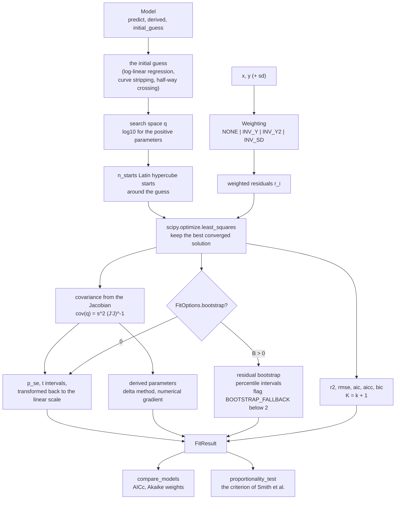
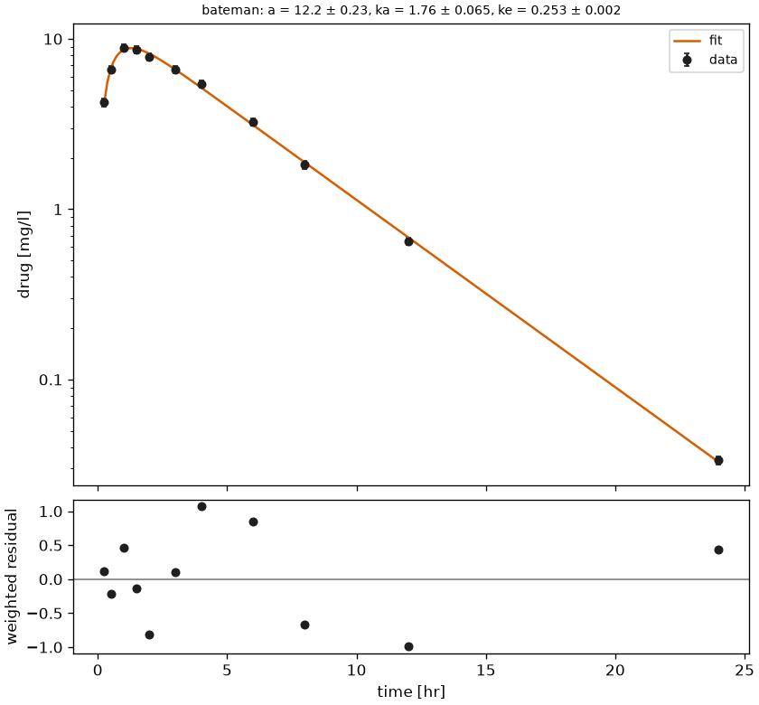
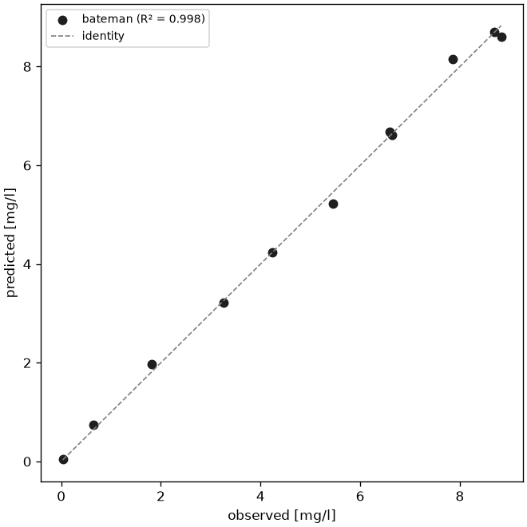
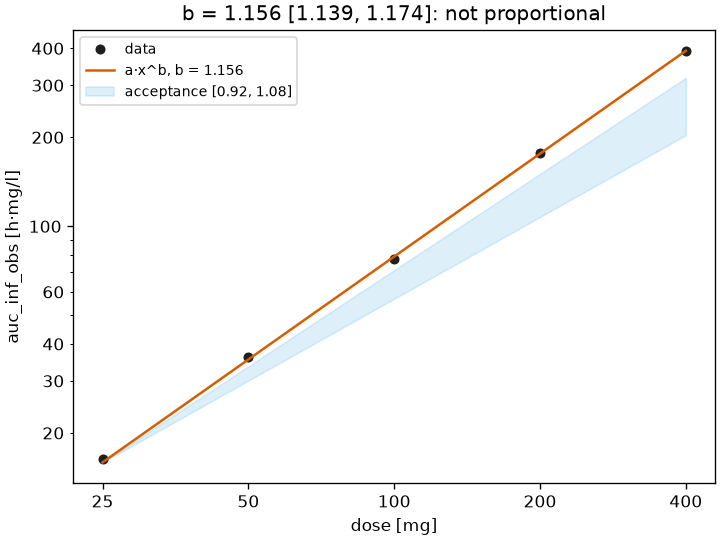
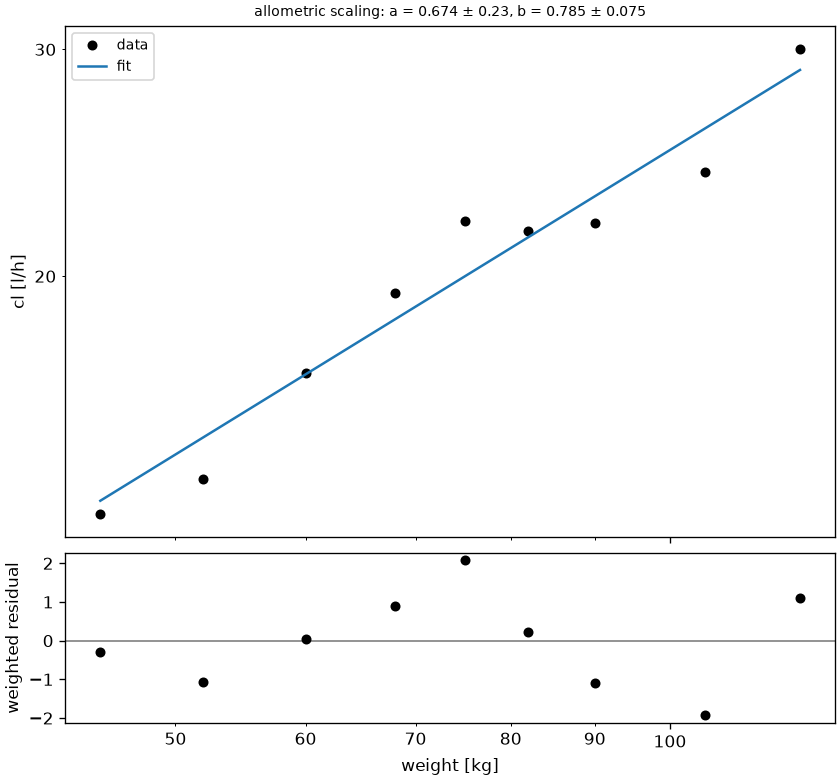

# Curve fitting

Non-compartmental analysis reads parameters from the observed points; some questions need a curve through them: the rate constants of the phases of a decline, the absorption rate of an oral curve, the concentration of half-maximal effect, whether the exposure grows in proportion to the dose, how a clearance scales with body weight. `pkpdutils.fit` fits small parametric models to one curve or to every curve of a batch with the same engine, reports standard errors, confidence intervals and goodness of fit, compares models and applies the dose proportionality criterion. The models are descriptive: the coefficients carry no compartmental interpretation, and population (mixed effects) modelling is outside the scope of the package.

## Concepts

**Model.** A `Model` is a function \(y = f(x; p)\) with named parameters, bounds and an initial guess from the data. Every parameter states whether it is positive; positive parameters are searched on the logarithmic scale, which keeps them positive and makes the search insensitive to their magnitude (`FitOptions.parameter_scale`, `log10` by default). Bounds, start values and every reported number stay on the linear scale. The model library has three families: exponentials for concentration timecourses (`MonoExp`, `BiExp`, `TriExp`, `Bateman` with an optional lag time), the Emax family for concentration-effect data (`Emax`, `SigmoidEmax`, `Imax`, `SigmoidImax`), and `Linear`, `LogLinear`, `Power` and `Allometric` for a parameter against a dose or a covariate. The initial guesses are analytical: a log-linear regression of the terminal points, curve stripping for a sum of exponentials, the half-way crossing for an `ec50`, a log-log regression for a power model.

**Weighting.** Concentrations span orders of magnitude and their error grows with their size, so an unweighted fit is dominated by the high points. `Weighting` names the variance model of the residuals: constant (`NONE`, the default), proportional to \(\lvert y \rvert\) (`INV_Y`), proportional to \(y^2\) (constant CV, `INV_Y2`) or the reported standard deviations (`INV_SD`). Residuals are divided by the standard deviation of that model before the sum of squares. The two \(y\) based models use the absolute value, so a negative value (an effect) weighs like its positive counterpart, and a point whose value is zero or not finite would have no variance at all: it is given the smallest \(\lvert y \rvert\) of the row instead (1 when the row has no non-zero value), which keeps the weight of such a point finite and large without dividing by zero. Under `INV_SD` a point without a finite positive standard deviation carries no weight and is dropped from the fit, so `n_points` can be smaller than the number of observed points.

**Uncertainty of the parameters.** The standard errors come from the Jacobian of the residuals at the optimum, a first order (Wald) approximation [^seber]. They are computed in the search space and transformed with \(|dp/dq|\), and the confidence intervals use the t distribution with \(n - k\) degrees of freedom on the search scale and are transformed back, so the interval of a parameter fitted on the log scale is asymmetric around the estimate. Derived parameters (half-lives, areas, \(\mathrm{EC}_{90}\), \(t_\mathrm{max}\)) get their uncertainty from the delta method with a numerical gradient; their interval is \(d \pm t\,\mathrm{se}(d)\) and therefore always symmetric, even for a strongly non-linear function of the parameters such as a half-life. The covariance is the least-squares covariance and is exact only for `loss="linear"`; under a robust loss (`soft_l1`, `huber`, `cauchy`, `arctan`) it is an approximation.

**Residual bootstrap.** `FitOptions(bootstrap=B)` replaces the Jacobian uncertainties by the empirical ones of \(B\) refits [^efron]: the weighted residuals of the fit are centered and inflated so that their variance matches the residual variance of the fit, resampled with replacement, added back to the fitted curve, and the model is refitted from the fitted parameters. The standard errors are the standard deviations of the replicates, the intervals their percentiles at `ci_level` and the correlation matrix is theirs as well; no local linear approximation is involved, and the intervals of the derived parameters are free to be asymmetric. A replicate whose refit does not converge is skipped, so `n_bootstrap`, the number of converged replicates, is the honest sample size and a value far below the requested `attrs["bootstrap"]` signals an unstable fit. Fewer than two converged replicates cannot estimate anything: the Jacobian uncertainties are reported instead and `FitFlag.BOOTSTRAP_FALLBACK` is set.

**Multi-start.** Nonlinear least squares finds a local optimum. `FitOptions(n_starts=m)` starts from the initial guess and \(m - 1\) Latin hypercube points of a box around it (`start_spread`) and keeps the best solution, a converged one before a non-converged one and the smaller cost among equals; `n_starts_converged` says how many of them converged. `n_workers` spreads the rows of a batch over a process pool (never the starts of a single row): a row is a python-heavy `least_squares` search, so the workers are processes, unlike the threads of the [NCA](nca.md). The default `n_workers=None` decides by size, the calling process up to 2 000 rows and one worker per core, at most 8, above it; `n_workers=1` forces the serial run and `n_workers=n` uses that many workers. The threshold is high because the workers of a process pool import `pkpdutils` and its dependencies when the pool starts, about a second, which only a large batch earns back on its own; a smaller batch of expensive rows - several starts, a residual bootstrap, a sum of exponentials - is worth an explicit `n_workers`. The pool is created once per process and shared with every later fit, so only the first pooled call pays the start-up of the workers; the workers start with `forkserver` (`spawn` on macOS and Windows) on every python version and import the main module afresh, so a pooled call needs an `if __name__ == "__main__":` guard, like every other use of `multiprocessing`, and a model which can be imported, not one defined in an interactive session.

**Model comparison.** `compare_models` fits every model to the same data and ranks them per sample by the corrected Akaike information criterion; the Akaike weight is the probability that a model is the best of the candidate set [^burnham]. AICc penalizes parameters, so a bi-exponential only wins over a mono-exponential when the second phase is supported by the data, and with few points the penalty can also favour a fixed exponent over a free one. The information criteria count the residual variance as an estimated parameter, \(K = k + 1\) [^burnham]; the reported `n_parameters` stays \(k\), the free parameters of the model.

**Dose proportionality.** With \(\mathrm{AUC} = a D^b\) the exposure is proportional to the dose when \(b = 1\). `proportionality_test` applies the confidence interval criterion of Smith et al. [^smith]: over a dose range \(r = D_\mathrm{high} / D_\mathrm{low}\) the fit is proportional when the interval of \(b\) lies within \(1 + \ln(\theta) / \ln(r)\) for the acceptance limits \(\theta = 0.8\) and \(1.25\), inconclusive when it overlaps the bounds without lying inside, and not proportional otherwise.

**Phases of a sum of exponentials.** After a fit the phases of `BiExp` and `TriExp` are ordered by decreasing rate constant, \(k_1 > k_2 > k_3\), so that `k1` always names the fast phase; the labelling is kept as the user wrote it when `FitOptions.fixed` or `FitOptions.bounds` names one of the phase parameters. `lambda_z` is the smallest rate constant either way, the terminal phase of the curve.

**Flags.** `NOT_CONVERGED` (1, no start converged), `AT_BOUND` (2, a parameter rests on a finite bound, measured relative to the bound and to the start value), `TOO_FEW_POINTS` (4, fewer points than parameters + 1), `FLIP_FLOP` (8, a Bateman fit with \(k_a < k_e\), where the terminal phase reflects absorption), `SINGULAR` (16, the Jacobian gives no usable covariance, so no standard errors), `NO_DATA` (32, fewer than two finite points), `BOOTSTRAP_FALLBACK` (64, see above).

**Units.** The parameters are reported in the raw units of the data: `k` in `1/[x]`, `a` in `[y]`, `auc` in `[y]·[x]`, `slope` in `[y]/[x]`. Nothing is normalized to liter or liter per hour as in the NCA, so the parameters, the data and the predicted curve always live on the same scale.

What one row of a fit does, from the data and the model to the result:



## Math

Weighted residuals and the objective, with the scipy cost \(\mathrm{cost} = \tfrac12 \sum_i \rho(r_i^2)\) (\(\rho(z) = z\) for `loss="linear"`):

\[
r_i = \frac{y_i - f(x_i; p)}{\sqrt{v_i}}, \qquad v_i \in \{1,\ \tilde y_i,\ \tilde y_i^2,\ \mathrm{sd}_i^2\}, \qquad \min_p\ \tfrac12 \sum_i \rho(r_i^2)
\]

with \(\tilde y_i = \lvert y_i \rvert\) for a finite non-zero value and \(\tilde y_i = \min_{j:\, y_j \ne 0} \lvert y_j \rvert\) (1 when the row has no such value) for a zero or non-finite one.

Covariance in the search space \(q\) (\(q_j = \log_{10} p_j\) for a positive parameter, \(q_j = p_j\) otherwise), standard errors and intervals of the \(k\) free parameters:

\[
\mathrm{cov}(q) = s^2 (J^\top J)^{-1},\quad s^2 = \frac{\sum_i r_i^2}{n - k}, \qquad
\mathrm{se}(p_j) = \mathrm{se}(q_j) \left|\frac{dp_j}{dq_j}\right|, \qquad
\mathrm{CI}(p_j) = p\!\left(q_j \pm t_{n-k,\,1-\alpha/2}\, \mathrm{se}(q_j)\right)
\]

Derived parameters \(d(p)\) by the delta method, with the gradient \(g = \partial d / \partial q\) from central differences:

\[
\mathrm{se}(d) = \sqrt{g\, \mathrm{cov}(q)\, g^\top}, \qquad \mathrm{CI}(d) = d \pm t_{n-k,\,1-\alpha/2}\, \mathrm{se}(d)
\]

Goodness of fit with the unweighted residuals \(e_i = y_i - f(x_i; \hat p)\) and the weighted \(\mathrm{RSS} = \sum_i r_i^2\) (which is \(2\,\mathrm{cost}\) for `loss="linear"`), counting \(K = k + 1\) estimated parameters [^burnham]:

\[
R^2 = 1 - \frac{\sum_i e_i^2}{\sum_i (y_i - \bar y)^2}, \qquad
\mathrm{RMSE} = \sqrt{\tfrac1n \sum_i e_i^2}
\]

\[
\mathrm{AIC} = n \ln\!\frac{\mathrm{RSS}}{n} + 2K, \qquad
\mathrm{AICc} = \mathrm{AIC} + \frac{2K(K+1)}{n-K-1}, \qquad
\mathrm{BIC} = n \ln\!\frac{\mathrm{RSS}}{n} + K \ln n
\]

\(\mathrm{AICc}\) is `NaN` when \(n - K - 1 \le 0\). Akaike weights over the candidate models: \(\Delta_i = \mathrm{AICc}_i - \min_j \mathrm{AICc}_j\), \(w_i = e^{-\Delta_i/2} / \sum_j e^{-\Delta_j/2}\).

Residual bootstrap replicate \(b\) of a fit \(\hat p\) [^efron]:

\[
r^\mathrm{adj}_i = (r_i - \bar r)\sqrt{\frac{n}{n-k}}, \qquad
y_i^{(b)} = f(x_i; \hat p) + r^{(b)}_i \sqrt{v_i}, \quad r^{(b)} \sim \text{resample of } r^\mathrm{adj}, \qquad
\mathrm{CI}(p_j) = \left[p_j^{(\alpha/2)},\ p_j^{(1-\alpha/2)}\right]
\]

Dose proportionality over the dose range \(r = D_\mathrm{high}/D_\mathrm{low}\) with the acceptance limits \(\theta_L = 0.8\), \(\theta_H = 1.25\) [^smith]:

\[
b \in \left[1 + \frac{\ln \theta_L}{\ln r},\ 1 + \frac{\ln \theta_H}{\ln r}\right]
\]

## Models

| model | curve | parameters | derived |
| --- | --- | --- | --- |
| `MonoExp` | \(a e^{-kx}\) | `a`, `k` | `thalf`, `auc` |
| `BiExp` | \(a_1 e^{-k_1 x} + a_2 e^{-k_2 x}\), \(k_1 > k_2\) | `a1`, `k1`, `a2`, `k2` | `lambda_z`, `thalf_1`, `thalf_2`, `auc` |
| `TriExp` | three phases, \(k_1 > k_2 > k_3\) | `a1`..`a3`, `k1`..`k3` | `lambda_z`, `thalf_1`..`thalf_3`, `auc` |
| `Bateman(lag)` | \(a \frac{k_a}{k_a - k_e}\left(e^{-k_e t} - e^{-k_a t}\right)\), \(t = \max(x - t_\mathrm{lag}, 0)\) | `a`, `ka`, `ke` (+ `tlag`) | `tmax`, `cmax`, `thalf`, `auc`, `flip_flop` |
| `Emax` | \(e_0 + e_\mathrm{max} \frac{x}{\mathrm{ec}_{50} + x}\) | `e0`, `emax`, `ec50` | `ec90` |
| `SigmoidEmax` | \(e_0 + e_\mathrm{max} \frac{x^n}{\mathrm{ec}_{50}^n + x^n}\) | + `hill` | `ec90` |
| `Imax`, `SigmoidImax` | \(e_0 \left(1 - i_\mathrm{max} \frac{x^n}{\mathrm{ic}_{50}^n + x^n}\right)\) | `e0`, `imax`, `ic50` (+ `hill`) | `ic90` |
| `Linear`, `LogLinear` | \(\mathrm{intercept} + \mathrm{slope}\,x\), \(\mathrm{intercept} + \mathrm{slope}\,\ln x\) | `intercept`, `slope` | |
| `Power` | \(a x^b\) | `a`, `b` | |
| `Allometric(exponent)` | \(a x^b\), \(b\) free or fixed | `a` (+ `b`) | |

The half-life of a rate constant is \(t_{1/2} = \ln 2 / k\), the area of a sum of exponentials \(\sum_i a_i / k_i\), the area of a Bateman curve \(a / k_e\), and \(\mathrm{EC}_{90} = 9^{1/n}\,\mathrm{EC}_{50}\) (\(n = 1\) without a Hill coefficient).

## Variables

A `FitResult` is an `xarray.Dataset` over the sample dimensions of the input, with `attrs["units"]` on every variable. For every model parameter and every derived parameter `p`:

| name | formula | unit | meaning |
| --- | --- | --- | --- |
| `p` | \(\hat p\) | unit of the parameter | the estimate |
| `p_se` | \(\mathrm{se}(\hat p)\) | unit of `p` | standard error, from the Jacobian or from the bootstrap replicates |
| `p_ci_low`, `p_ci_high` | \(p(q \pm t\,\mathrm{se}(q))\) | unit of `p` | confidence interval at `ci_level` (percentiles of the replicates with a bootstrap) |
| `p_cv` | \(\mathrm{se}(\hat p) / \lvert \hat p \rvert\) | 1 | relative standard error, a fraction |
| `cost` | \(\tfrac12\sum_i \rho(r_i^2)\) | - | the objective at the optimum |
| `r2` | see Math | - | coefficient of determination of the unweighted residuals |
| `rmse` | see Math | unit of `y` | root mean squared error of the unweighted residuals |
| `aic`, `aicc`, `bic` | see Math | - | information criteria, \(K = k + 1\) |
| `n_points` | \(n\) | - | points used in the fit |
| `n_parameters` | \(k\) | - | free model parameters (fixed ones excluded) |
| `n_starts_converged` | | - | starts which converged, of `n_starts` |
| `n_bootstrap` | \(B\) | - | converged bootstrap replicates, 0 without a bootstrap |
| `x_data`, `y_data`, `sd_data` | | unit of `x`, of `y` | the data of the fit, over the dimension `point` |
| `y_pred`, `residuals` | \(f(x_i; \hat p)\), \(r_i\) | unit of `y`, - | prediction and weighted residual per point |
| `correlation` | \(\mathrm{cov}(q)_{ij} / (\mathrm{se}(q_i)\mathrm{se}(q_j))\) | - | correlation matrix over `(parameter, parameter_)` |
| `flags` | | - | `FitFlag` bits, see above |

Discrete indicators (`flip_flop`) and the counts carry no uncertainty variables. The `_cv` variables are fractions (`0.12` is a relative standard error of 12 %, the convention of the whole package, which a table formats as a percentage where it prints). Three kinds of variable carry `attrs["units"] = "dimensionless"` without being dimensionless: `rmse` carries the unit of `y`, a weighted residual is dimensionless only under `INV_SD` (it is the residual divided by the square root of the variance model otherwise), and `cost` is the sum of the squared weighted residuals and carries \([y]^2\) under `NONE`. `proportionality_test` returns a `ProportionalityResult` with `slope`, `ci_low`, `ci_high`, `bounds`, `proportional`, `inconclusive`, `dose_range` and `criterion`, and `to_dict`.

## API

One curve:

```python
import numpy as np

from pkpdutils import Bateman, FitOptions, Weighting, fit

# an oral curve with 5 % noise and the standard deviations of the group
rng = np.random.default_rng(0)
t = np.array([0.25, 0.5, 1, 1.5, 2, 3, 4, 6, 8, 12, 24])
c = 5.0 * 1.2 / (1.2 - 0.15) * (np.exp(-0.15 * t) - np.exp(-1.2 * t))
sd = 0.05 * c
c = c * rng.lognormal(0, 0.05, t.size)

result = fit(
    Bateman(),
    t,
    c,
    sd=sd,
    x_unit="hr",
    y_unit="mg/l",
    options=FitOptions(weighting=Weighting.INV_SD, n_starts=5, seed=0),
)
q = result.to_quantities()
for name in ("a", "ka", "ke", "tmax", "cmax", "thalf", "auc"):
    print(f"{name:<6} {q[name]:~P}")
print(f"ka 95 % interval {q['ka_ci_low']:~P} - {q['ka_ci_high']:~P}")
print("r2", round(float(result["r2"]), 4), "| flags", result.flags())
print(result.predict(np.array([0.0, 1.0, 4.0])).round(3))  # the fitted curve
```

```text
a      5.1233145604293835 mg/l
ka     1.1679414997936728 1/h
ke     0.15360699594336222 1/h
tmax   1.9999326676335676 h
cmax   3.7682019656913637 mg/l
thalf  4.512471429462247 h
auc    33.3533933722553 h⋅mg/l
ka 95 % interval 1.0663803842676483 1/h - 1.2791752052688965 1/h
r2 0.9953 | flags []
[0.    3.225 3.136]
```

The rate constants come back where the curve was built (1.2 and 0.15 per hour), the parameters carry the raw units of the data, and the derived `tmax`, `cmax`, `thalf` and `auc` come with their own standard errors and intervals. `result.correlation()` is the correlation matrix of the parameters, which says how much the fit could trade one against another.

`FitOptions` also carries `fixed`, `bounds` and `initial` per parameter name, `loss`, `ci_level`, `bootstrap`, `n_workers` and the scipy tolerances.

A single `Timecourse` is fitted by `fit_timecourse`, which takes the times relative to the dose and the units from the curve and returns a result without a sample dimension, so nothing has to be indexed:

```python
# not executed
from pkpdutils import Bateman, FitOptions, fit_timecourse

# `timecourse`: one oral curve, e.g. the `tc` of the Timecourses page
result = fit_timecourse(Bateman(), timecourse, options=FitOptions(n_starts=5, seed=1))
result.to_quantities()["ka"]  # no indexer, the result is one sample
```





A batch of timecourses is fitted over its sample dimensions, with the times taken relative to the dose and the units taken from the batch:

```python
# not executed
from pkpdutils import BiExp, FitOptions, fit_timecourses

# `batch`: a Timecourses over "individual", e.g. the one of the NCA page
fits = fit_timecourses(BiExp(), batch, options=FitOptions(n_starts=10, seed=1))
fits["k1"]  # DataArray over the sample dims of the batch
fits.to_dataframe()  # one row per sample, flags decoded
fits.summarize("individual")  # mean, sd, se, interval over the individuals
```

`summarize` reduces the parameters and the derived parameters over a sample dimension; the goodness of fit and the counts of the single fits (`FitResult.statistics`) are left out, they describe one fit and are read from the unsummarized result (`fits.to_dataframe()`).

`fit_timecourses` passes the `sd` of the batch to the engine and nothing else, so `Weighting.INV_SD` on a batch that carries `se` and `n` but no `sd` raises `ValueError: Weighting.INV_SD needs 'sd'` rather than deriving the standard deviation; give the batch an `sd` (or use another weighting) in that case.

A parameter against a dose or a covariate is fitted along one dimension of any dataset, the result of another analysis included:

```python
import numpy as np

from pkpdutils import Power, Route, Timecourses, fit_table, nca, proportionality_test
from pkpdutils.fit import proportionality_table

# the exposure of a dose escalation, five dose groups
time = np.array([0.5, 1, 2, 4, 6, 8, 12, 24])
doses = np.array([25.0, 50.0, 100.0, 200.0, 400.0])
rng = np.random.default_rng(4)
values = np.stack(
    [
        d**1.15 / 10 * np.exp(-0.25 * time) * rng.lognormal(0, 0.04, time.size)
        for d in doses
    ]
)
batch = Timecourses.from_arrays(
    time,
    values,
    time_unit="hr",
    unit="mg/l",
    dims=("dose",),
    coords={"dose": doses},
    dose={"amount": doses, "unit": "mg"},
    route=Route.IV_BOLUS,
    substance="drug",
)
result = nca(batch)

# the dose coordinate of an NCAResult carries no unit, the fit needs one
ds = result.ds.assign_coords(dose=("dose", doses, {"units": "mg"}))
power = fit_table(Power(), ds, "dose", "auc_inf_obs", dim="dose")
print(
    power.to_dataframe()
    .T.loc[["a", "b", "b_se", "b_ci_low", "b_ci_high", "r2"]]
    .to_string(header=False)
)

test = proportionality_test(power, dose_range=(25.0, 400.0))
print(test.to_dict())  # the verdict as plain python values
print(proportionality_table(test).to_string(index=False))
```

```text
a          0.384314
b           1.15642
b_se       0.005503
b_ci_low   1.138906
b_ci_high  1.173933
r2         0.999973
{'slope': 1.15641953119868, 'ci_low': 1.138906039242174, 'ci_high': 1.173933023155186, 'bounds': [0.9195179762781595, 1.0804820237218407], 'proportional': False, 'inconclusive': False, 'dose_range': [25.0, 400.0], 'criterion': [0.8, 1.25]}
slope ci_low ci_high bound_low bound_high dose_low dose_high          verdict
 1.16   1.14    1.17     0.920       1.08     25.0       400 not proportional
```

`proportionality_table` is the table a dose escalation reports: the exponent with its interval, the acceptance bounds the criterion derives from the dose range and the verdict, one row per sample and every number formatted with `digits` significant digits.

| slope | ci_low | ci_high | bound_low | bound_high | dose_low | dose_high | verdict |
| --- | --- | --- | --- | --- | --- | --- | --- |
| 1.16 | 1.14 | 1.17 | 0.920 | 1.08 | 25.0 | 400 | not proportional |

The other two front ends of `fit_table` and the model comparison, with the `t` and `c` of the first snippet of this section and a dataset `weights_ds` of a clearance per individual with a `weight` coordinate:

```python
# not executed
from pkpdutils import Allometric, BiExp, MonoExp, compare_models, fit_table

# `weights_ds`: a dataset of a clearance per individual with a `weight`
# coordinate; `t` and `c` are the arrays of the first snippet of this section
allometric = fit_table(
    Allometric(exponent=0.75), weights_ds, "weight", "cl", dim="individual"
)

comparison = compare_models([MonoExp(), BiExp()], t, c, x_unit="hr", y_unit="mg/l")
comparison.table  # one row per sample and model, with delta_aicc and akaike_weight
comparison.best  # name of the best model per sample
```

The power model of the dose escalation above (`examples/dose_proportionality.py`) and the allometric model of a clearance against the body weight (`examples/covariate.py`):





The units of `fit_table` come from `attrs["units"]` of the `x` and `y` variables and fall back to `dimensionless`, so a coordinate without units (the `dose` of an `NCAResult`) is best given one before the fit. A sample dimension must not share its name with a variable of the result (a dimension `k` with a model that has a rate constant `k` raises a `ValueError`), and the candidate models of `compare_models` need distinct names, which `Allometric(exponent=0.75)` gets as `allometric_0.75`.

Figures: `plot_fit`, `plot_goodness_of_fit` and `plot_dose_proportionality`, see [Plotting](plotting.md). Examples: `examples/fitting_exponential.py`, `examples/emax.py`, `examples/dose_proportionality.py` and `examples/covariate.py`. The reference of the modules is in [API: fit](api/fit.md) and [API: fit.models](api/fit.models.md); the concentration-effect models are described in [Pharmacodynamics](pd.md).

## References

[^seber]: Seber GAF, Wild CJ. *Nonlinear Regression*. Wiley; 1989, ch. 2 and 5. See [References](references.md#statistics).
[^burnham]: Burnham KP, Anderson DR. *Model Selection and Multimodel Inference*. 2nd ed. Springer; 2002, ch. 2. See [References](references.md#statistics).
[^efron]: Efron B, Tibshirani RJ. *An Introduction to the Bootstrap*. Chapman & Hall/CRC; 1993, ch. 9. See [References](references.md#statistics).
[^smith]: Smith BP, Vandenhende FR, DeSante KA, et al. Confidence interval criteria for assessment of dose proportionality. *Pharm Res.* 2000;17(10):1278-1283. See [References](references.md#statistics).
