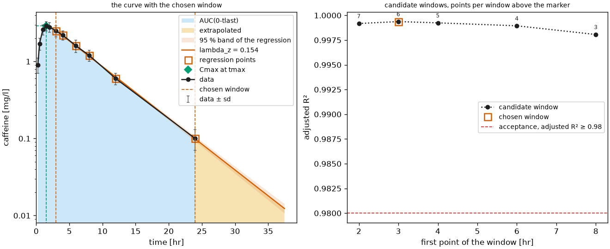
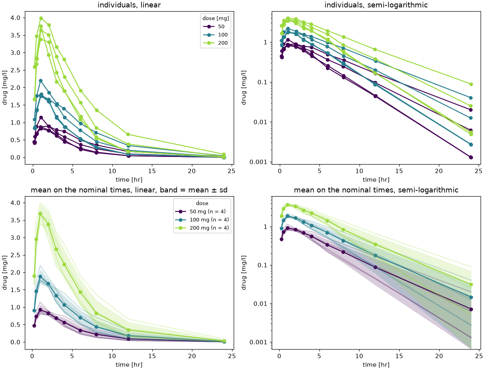
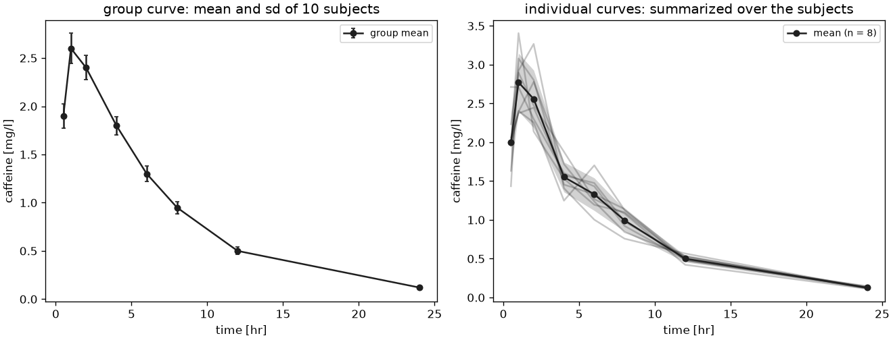
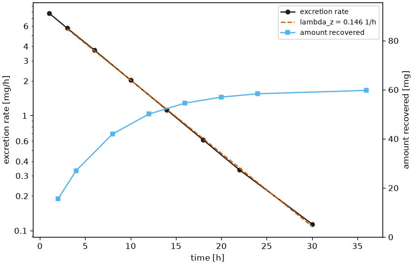
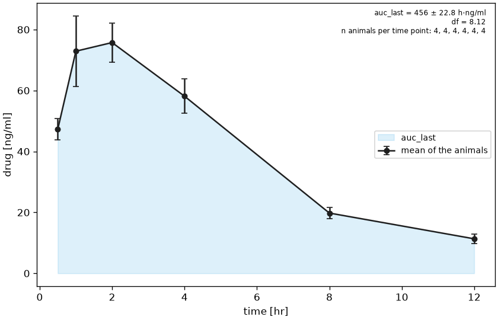

# Gallery

Every figure of this page is written by one of the [examples](https://github.com/matthiaskoenig/pkpdutils/tree/develop/examples) of the repository. An example is a module of the `examples` package and is run from the root of a checkout with `python -m examples.<name>`; it writes its figures into the working directory and never opens a window. The figures shown here are rendered by `uv run python scripts/render_examples.py`.

The snippet of a card is the core of its example. It runs from the root of a checkout, where the data of the example comes from its module (`from examples.<name> import ...`); the card links to the full source and to the page of the user guide which explains the method.

<div class="grid cards" markdown>

-   __Timecourses__

    ---

    [](images/timecourses.png)

    One curve with its dose, its units and the uncertainty of a group, and a batch of several curves over the sample dimensions.

    ```python
    from pkpdutils import Dose, Route, Timecourse

    tc = Timecourse(
        time=[0.5, 1, 2, 4, 8, 12, 24],
        value=[1.2, 2.5, 2.1, 1.3, 0.5, 0.2, 0.03],
        sd=[0.3, 0.5, 0.4, 0.3, 0.1, 0.05, 0.01],
        n=12,
        time_unit="hr",
        unit="mg/l",
        dose=Dose(amount=100, unit="mg", route=Route.ORAL),
    )
    ```

    [timecourses.py](https://github.com/matthiaskoenig/pkpdutils/blob/develop/examples/timecourses.py) &middot; [Timecourses](timecourses.md)

-   __NCA of one curve__

    ---

    [](images/nca_single.png)

    [](images/nca_terminal_windows.png)

    The non-compartmental analysis of a single timecourse with its diagnostic figure: the trapezoidal area, the extrapolated tail, the terminal regression with its confidence band and the parameters with their intervals; and the diagnostic of the terminal phase, every candidate window with its adjusted \(R^2\) and the chosen one marked.

    ```python
    from examples.nca_single import tc
    from pkpdutils import Acceptance, NCAOptions, TerminalPhase, nca_single
    from pkpdutils.plot import plot_nca, plot_terminal_windows

    result = nca_single(tc, options=NCAOptions(seed=1))  # a fixed bootstrap seed
    print(result.to_quantities()["auc_inf_obs"])
    plot_nca(tc, result).savefig("nca_single.png", dpi=120)

    diagnostic = NCAOptions(
        terminal=TerminalPhase(keep_candidates=True),
        acceptance=Acceptance(r2_adj_min=0.98),
    )
    windows = nca_single(tc, options=diagnostic)
    plot_terminal_windows(tc, windows, options=diagnostic).savefig(
        "nca_terminal_windows.png", dpi=120
    )
    ```

    [nca_single.py](https://github.com/matthiaskoenig/pkpdutils/blob/develop/examples/nca_single.py) &middot; [Non-compartmental analysis](nca.md)

-   __NCA of a batch__

    ---

    [](images/nca_batch_curves.png)

    [](images/nca_batch_study.png)

    A `(dose, individual)` batch analysed at once: the parameters of every curve as a data frame, the mean curve per dose group, a diagnostic panel per sample and the four panels a study report shows, the individuals on their actual sampling times and the means on the nominal ones.

    ```python
    from examples.nca_batch import batch, study
    from pkpdutils import nca
    from pkpdutils.plot import plot_mean_timecourse, plot_nca_grid, plot_study_curves

    result = nca(batch)
    print(result.to_dataframe()[["dose", "individual", "auc_inf_obs", "cmax"]])
    plot_mean_timecourse(batch, by="dose").savefig("nca_batch_curves.png", dpi=120)
    plot_nca_grid(batch, result, ncols=4).savefig("nca_batch.png", dpi=100)
    plot_study_curves(study, by="dose").savefig("nca_batch_study.png", dpi=110)
    ```

    [nca_batch.py](https://github.com/matthiaskoenig/pkpdutils/blob/develop/examples/nca_batch.py) &middot; [Non-compartmental analysis](nca.md)

-   __Group uncertainty__

    ---

    [](images/group_uncertainty.png)

    The uncertainty of a published mean curve propagated to the parameters with the bootstrap or the delta method, and individual results summarized over the subjects.

    ```python
    from examples.group_uncertainty import group
    from pkpdutils import NCAOptions, nca_single

    boot = nca_single(group, options=NCAOptions(seed=1, n_boot=2000))
    q = boot.to_quantities()
    print(q["auc_inf_obs"], q["auc_inf_obs_ci_low"], q["auc_inf_obs_ci_high"])
    ```

    [group_uncertainty.py](https://github.com/matthiaskoenig/pkpdutils/blob/develop/examples/group_uncertainty.py) &middot; [Uncertainty](uncertainty.md)

-   __Multiple dosing and steady state__

    ---

    [](images/steady_state.png)

    [](images/steady_state_troughs.png)

    A single dose curve superposed into a regimen of ten doses, the parameters of every dosing interval and the steady state parameters of the last one, with the trough of every interval running into its plateau.

    ```python
    from examples.steady_state import single
    from pkpdutils import AUCMethod, Dose, Dosing, NCAOptions, Route, nca_single
    from pkpdutils.nca import superposition
    from pkpdutils.plot import plot_troughs

    dose = Dose(amount=100, unit="mg", route=Route.IV_BOLUS)
    protocol = Dosing.regimen(dose, interval=12, n_doses=10)
    options = NCAOptions(auc_method=AUCMethod.LOG)
    predicted = superposition(single, protocol, options=options)
    result = nca_single(predicted, options=options)
    print(result.to_quantities()["auc_tau"])
    plot_troughs(result, x="interval").savefig("steady_state_troughs.png", dpi=120)
    ```

    [steady_state.py](https://github.com/matthiaskoenig/pkpdutils/blob/develop/examples/steady_state.py) &middot; [Non-compartmental analysis](nca.md)

-   __Exchange formats__

    ---

    [](images/formats.png)

    A twice daily batch written as event records and read back, analysed interval by interval; `from_adnca` reads a CDISC ADaM extract the same way.

    ```python
    import pandas as pd
    from examples.formats import batch
    from pkpdutils import AUCMethod, NCAOptions, Route, Timecourses, nca
    from pkpdutils.plot import plot_intervals

    batch.to_events().to_csv("events.csv", index=False)
    read_back = Timecourses.from_events(
        pd.read_csv("events.csv"),
        time_unit="hr",
        unit="mg/l",
        dose_unit="mg",
        route=Route.ORAL,
    )
    result = nca(read_back, options=NCAOptions(auc_method=AUCMethod.LOG))
    plot_intervals(result, "interval_ctrough").savefig("formats.png", dpi=120)
    ```

    [formats.py](https://github.com/matthiaskoenig/pkpdutils/blob/develop/examples/formats.py) &middot; [Data formats](formats.md)

-   __Exponential fitting__

    ---

    [](images/fitting_exponential.png)

    A Bateman model fitted to an oral curve with `1/sd` weighting and a residual bootstrap, and the AICc comparison of the exponential models.

    ```python
    from examples.fitting_exponential import tc
    from pkpdutils import Bateman, FitOptions, Weighting, fit_timecourse
    from pkpdutils.plot import plot_fit

    options = FitOptions(weighting=Weighting.INV_SD, n_starts=5, bootstrap=200, seed=1)
    result = fit_timecourse(Bateman(), tc, options=options)
    print(result.to_dataframe().T)
    plot_fit(result, log_y=True).savefig("fitting_exponential.png", dpi=120)
    ```

    [fitting_exponential.py](https://github.com/matthiaskoenig/pkpdutils/blob/develop/examples/fitting_exponential.py) &middot; [Curve fitting](fitting.md)

-   __Emax__

    ---

    [](images/emax.png)

    The concentration-effect relationship as a sigmoid Emax model, with `ec50`, `ec90` and the comparison against the Emax and the linear model.

    ```python
    from examples.emax import concentration, effect
    from pkpdutils import FitOptions, SigmoidEmax, fit
    from pkpdutils.plot import plot_fit

    result = fit(
        SigmoidEmax(),
        concentration,
        effect,
        x_unit="ng/ml",
        y_unit="mmHg",
        x_name="concentration",
        y_name="effect",
        options=FitOptions(n_starts=10, seed=0),
    )
    print(result.to_quantities()["ec50"])
    plot_fit(result, log_x=True).savefig("emax.png", dpi=120)
    ```

    [emax.py](https://github.com/matthiaskoenig/pkpdutils/blob/develop/examples/emax.py) &middot; [Pharmacodynamics](pd.md)

-   __Dose proportionality__

    ---

    [](images/dose_proportionality.png)

    The power model \(AUC = a \cdot dose^b\) over a dose escalation and the confidence interval criterion of the dose proportionality.

    ```python
    from examples.dose_proportionality import batch, doses
    from pkpdutils import Power, fit_table, nca, proportionality_test
    from pkpdutils.plot import plot_dose_proportionality

    result = nca(batch)
    ds = result.ds.assign_coords(dose=("dose", doses, {"units": "mg"}))
    power = fit_table(Power(), ds, "dose", "auc_inf_obs", dim="dose")
    test = proportionality_test(power, dose_range=(25.0, 400.0))
    print(test.slope, test.ci_low, test.ci_high, test.proportional)
    plot_dose_proportionality(power, test=test).savefig("dose_proportionality.png", dpi=120)
    ```

    [dose_proportionality.py](https://github.com/matthiaskoenig/pkpdutils/blob/develop/examples/dose_proportionality.py) &middot; [Curve fitting](fitting.md)

-   __Covariate and allometry__

    ---

    [](images/covariate.png)

    The clearance against the body weight as an allometric model, with a free exponent and with the exponent fixed at 0.75.

    ```python
    from examples.covariate import ds
    from pkpdutils import Allometric, fit_table
    from pkpdutils.plot import plot_fit

    free = fit_table(Allometric(), ds, "weight", "cl", dim="individual")
    print(free.to_dataframe().T.loc[["a", "b", "b_ci_low", "b_ci_high"]])
    plot_fit(free, log_x=True, log_y=True).savefig("covariate.png", dpi=120)
    ```

    [covariate.py](https://github.com/matthiaskoenig/pkpdutils/blob/develop/examples/covariate.py) &middot; [Curve fitting](fitting.md)

-   __Bioequivalence__

    ---

    [](images/bioequivalence.png)

    Average bioequivalence of a test against a reference formulation in a 2x2 crossover: the geometric mean ratios with their 90 % intervals against the 80-125 % limits.

    ```python
    from examples.bioequivalence import PERIOD_REF, PERIOD_TEST, batch, curves
    from pkpdutils import bioequivalence, nca
    from pkpdutils.plot import plot_ratio

    reference = nca(batch(curves(1.0, 1.5, PERIOD_REF), PERIOD_REF))
    test = nca(batch(curves(0.93, 0.9, PERIOD_TEST), PERIOD_TEST))
    result = bioequivalence(test, reference, parameters=["auc_inf_obs", "auc_last", "cmax"])
    print(result.to_dataframe()[["parameter", "gmr", "ci_low", "ci_high"]])
    plot_ratio(result).savefig("bioequivalence.png", dpi=120)
    ```

    [bioequivalence.py](https://github.com/matthiaskoenig/pkpdutils/blob/develop/examples/bioequivalence.py) &middot; [Statistics](statistics.md)

-   __Drug-drug interaction__

    ---

    [](images/ddi.png)

    The exposure with and without a perpetrator as a geometric mean ratio, classified against the FDA and EMA thresholds of an interaction.

    ```python
    from examples.ddi import batch
    from pkpdutils import ddi_classification, nca, ratio
    from pkpdutils.plot import plot_ratio

    control = nca(batch(1.0, "control"))
    inhibited = nca(batch(0.35, "inhibitor"))
    auc = ratio(
        inhibited.sample("auc_inf_obs", "individual"),
        control.sample("auc_inf_obs", "individual"),
    )
    print(ddi_classification(auc).to_dict())
    plot_ratio({"auc_inf_obs": auc}, limits=None).savefig("ddi.png", dpi=120)
    ```

    [ddi.py](https://github.com/matthiaskoenig/pkpdutils/blob/develop/examples/ddi.py) &middot; [Statistics](statistics.md)

-   __Meta-analysis__

    ---

    [](images/meta_analysis.png)

    Published summary statistics of several studies pooled with the fixed effect and the random effects model, with the heterogeneity and a forest plot.

    ```python
    from examples.meta_analysis import STUDIES
    from pkpdutils import meta_analysis
    from pkpdutils.plot import plot_forest
    from pkpdutils.stats import EffectKind

    result = meta_analysis(STUDIES, EffectKind.LOG_RATIO)
    print(result.to_dataframe())
    print(result.random.to_dict(), result.heterogeneity.i2)
    plot_forest(result).savefig("meta_analysis.png", dpi=120)
    ```

    [meta_analysis.py](https://github.com/matthiaskoenig/pkpdutils/blob/develop/examples/meta_analysis.py) &middot; [Statistics](statistics.md)

-   __Simulation scan__

    ---

    [](images/nca_from_sbmlsim.png)

    The result of a simulation scan read as a batch (`from_dataset`, `from_xresult` for an sbmlsim `XResult`) and analysed curve by curve.

    ```python
    from examples.nca_from_sbmlsim import DOSES, simulated_dataset
    from pkpdutils import NCAOptions, Route, Timecourses, nca
    from pkpdutils.plot import plot_timecourse

    batch = Timecourses.from_dataset(
        simulated_dataset(),
        "[Cve]",
        unit="mmol/l",
        time_unit="hr",
        dose={"amount": DOSES, "unit": "mg"},
        route=Route.ORAL,
    )
    result = nca(batch, options=NCAOptions())
    print(result.to_dataframe()[["dose", "auc_inf_obs", "cmax"]])
    plot_timecourse(batch, by="dose").savefig("nca_from_sbmlsim.png", dpi=120)
    ```

    [nca_from_sbmlsim.py](https://github.com/matthiaskoenig/pkpdutils/blob/develop/examples/nca_from_sbmlsim.py) &middot; [Non-compartmental analysis](nca.md)

-   __Urinary excretion__

    ---

    [](images/urine.png)

    The excretion rate of every urine collection against the midpoint of its interval with the terminal regression, and the amount recovered rising to its plateau on a second axis.

    ```python
    from examples.urine import excretion, plasma
    from pkpdutils import nca_urine
    from pkpdutils.plot import plot_excretion

    urine = excretion()
    result = nca_urine(urine, plasma=plasma())
    print(result.to_quantities()["clr"])
    plot_excretion(result, urine).savefig("urine.png", dpi=120)
    ```

    [urine.py](https://github.com/matthiaskoenig/pkpdutils/blob/develop/examples/urine.py) &middot; [Urinary excretion](urine.md)

-   __Sparse sampling__

    ---

    [](images/sparse.png)

    The mean curve of a destructive design with the standard error of every time point, the area the trapezoid rule integrates and the Bailer standard error of that area.

    ```python
    from examples.sparse import TIMES, serial_design
    from pkpdutils import nca_sparse, sparse_mean
    from pkpdutils.plot import plot_sparse

    values = serial_design()
    curve = sparse_mean(TIMES, values, time_unit="hr", unit="ng/ml")
    result = nca_sparse(TIMES, values, time_unit="hr", unit="ng/ml")
    plot_sparse(curve, result).savefig("sparse.png", dpi=120)
    ```

    [sparse.py](https://github.com/matthiaskoenig/pkpdutils/blob/develop/examples/sparse.py) &middot; [Sparse sampling](sparse.md)

</div>
