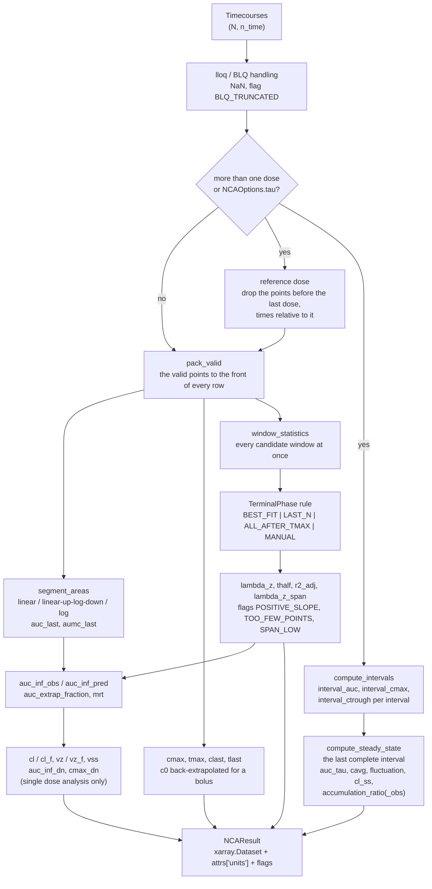

# Non-compartmental analysis

Non-compartmental analysis (NCA) describes a concentration timecourse by parameters computed directly from the measured points, without a model of the body: the exposure as the area under the curve, the peak, the terminal half-life, and, with the dose, the clearance and the volume of distribution. `pkpdutils.nca` computes these parameters for one curve or for a whole batch of curves in one vectorized call; every parameter carries its unit and every sample carries flags for the conditions that limit its interpretation. The definitions follow Gabrielsson & Weiner [^gw][^gw_mimb] and the NCA of Phoenix WinNonlin [^phoenix], consistent with other open-source implementations such as NonCompart [^noncompart].

## Concepts

**Exposure.** The area under the concentration–time curve, \(\mathrm{AUC}\), is proportional to the amount of drug that reached the systemic circulation [^fda_bioavailability]. \(\mathrm{AUC}_{0\text{-}t_\mathrm{last}}\) is measured up to the last quantifiable concentration \(C_\mathrm{last}\); \(\mathrm{AUC}_{0\text{-}\infty}\) adds the tail after \(t_\mathrm{last}\), predicted from the terminal phase. The fraction of \(\mathrm{AUC}_{0\text{-}\infty}\) that is extrapolated tells how much of the exposure was not observed; above 20 % the estimate is considered unreliable (flag `EXTRAPOLATION_HIGH`).

**Peak.** \(C_\mathrm{max}\) and \(t_\mathrm{max}\) are read from the observed points. After an extravascular dose they reflect the balance of absorption and elimination; after an intravenous bolus the concentration at time zero, \(C_0\), is not observed and is back-extrapolated from the first two points.

**Terminal phase.** When absorption and distribution are over, the concentration declines mono-exponentially, \(C(t) = C_\mathrm{last}\, e^{-\lambda_z (t - t_\mathrm{last})}\). The terminal rate constant \(\lambda_z\) is the slope of \(\ln C\) against \(t\) over the terminal points; the half-life is \(t_{1/2} = \ln 2 / \lambda_z\). Which points belong to the terminal phase is a judgement: the default `BEST_FIT` rule takes the window with the largest adjusted \(R^2\) among all windows of at least three points that end at \(t_\mathrm{last}\) and start after \(t_\mathrm{max}\), preferring more points when the adjusted \(R^2\) is equal within a tolerance, as Phoenix does. `LAST_N`, `ALL_AFTER_TMAX` (the rule of pkdb_analysis 0.3.1) and `MANUAL` are the alternatives. `TerminalPhase.exclude_cmax` (default `True`) restricts every window to start after \(t_\mathrm{max}\); with `exclude_cmax=False` the window start is unrestricted and every window of at least `min_points` points ending at \(t_\mathrm{last}\) is a candidate, including windows that begin before or at the maximum, which is how a curve that only rises reports `POSITIVE_SLOPE` instead of `TOO_FEW_POINTS`. How far the window reaches is the quality criterion every regulatory review asks for: the span \(\mathrm{span} = (t_\mathrm{last} - t_\mathrm{first}) / t_{1/2}\) (`lambda_z_span`, from `lambda_z_t_first` and `lambda_z_t_last`) counts the half-lives the regression covers, and a span below 2 flags the row `SPAN_LOW`: the half-life of such a curve is extrapolated from less than one doubling of the elimination and carries little information.

**Clearance and volume.** With the dose \(D\), the clearance \(\mathrm{CL} = D / \mathrm{AUC}_{0\text{-}\infty}\) is the volume of plasma cleared of drug per time and the volume of distribution \(V_z = \mathrm{CL} / \lambda_z\) is the apparent volume the dose would occupy at the plasma concentration. After an extravascular dose the fraction absorbed \(F\) is unknown and both are reported relative to it as \(\mathrm{CL}/F\) (`cl_f`) and \(V_z/F\) (`vz_f`). The mean residence time \(\mathrm{MRT} = \mathrm{AUMC}_{0\text{-}\infty} / \mathrm{AUC}_{0\text{-}\infty}\) is the average time a molecule stays in the body (after an infusion of duration \(T\), minus \(T/2\)); the steady state volume \(V_\mathrm{ss} = \mathrm{CL} \cdot \mathrm{MRT}\) is reported for intravenous doses. A dose of 0, the encoding of a placebo arm, makes none of them a quantity: \(\mathrm{CL}\), \(V_z\), \(V_\mathrm{ss}\), `auc_inf_dn` and `cmax_dn` are `NaN` there, which the analysis reports in a debug log and not with a flag, since a zero dose is a property of the data and not a finding of the analysis.

**Multiple dosing.** A curve accompanied by a dosing protocol of more than one dose, or analysed with `NCAOptions.tau`, is split into its dosing intervals \([t_k, t_{k+1}]\) and the last interval \([t_K, t_K + \tau]\), whose length \(\tau\) comes from the protocol (the distance of the last two doses) or from `tau` when it is given [^rt]. Every interval is described the same way as the classic steady state interval below: the value at its start and at its end are interpolated and inserted, so a sample outside the interval adds no area and does not enter its \(C_\mathrm{max}\) or \(C_\mathrm{min}\); after an intravenous bolus an interval that starts before the first sample of the curve starts at the back-extrapolated \(C_0\). An interval whose end is not covered by the data is incomplete: its parameters, and the steady state parameters when it is the last interval, are `NaN` and the row is flagged `INCOMPLETE_INTERVAL`. A sample recorded exactly at the end of a bolus interval may already be the post-dose value of the next dose; when it lies above the last sample inside the interval, which no decline can do, the trough is instead the log-linear regression of the last (up to three) samples of the interval and the row is flagged `EXTRAPOLATED_TROUGH`.

**Steady state.** The steady state parameters describe the last complete interval, under the assumption that repeated dosing has reached a state where every interval looks the same: with linear kinetics \(\mathrm{AUC}_{0\text{-}\tau}\) at steady state equals the single dose \(\mathrm{AUC}_{0\text{-}\infty}\). The interval is described by the average concentration \(C_\mathrm{avg} = \mathrm{AUC}_{0\text{-}\tau} / \tau\), the trough \(C_\mathrm{trough} = C(\tau)\), the fluctuation, the swing, the clearance at steady state \(\mathrm{CL}_\mathrm{ss}\), and the accumulation ratio, predicted from the terminal phase or observed as the ratio of the exposure of the last and the first interval of the protocol (`accumulation_ratio_obs`, `NaN` for a single dose protocol or when the first interval is incomplete).

**The reference dose.** With more than one dose the point parameters (\(C_\mathrm{max}\), \(t_\mathrm{max}\), \(C_\mathrm{last}\), \(\mathrm{AUC}_{0\text{-}t_\mathrm{last}}\), the extrapolated areas, the terminal phase, \(\mathrm{MRT}\)) are computed from the last dose on: the values before it are dropped and the times are relative to it, the same analysis a single dose curve given with its last dose only would get. With one dose the reference dose is that dose and the analysis covers the whole curve.

**No single dose quantities.** That slice is not a single dose curve: it carries the exposure of every earlier dose as well, so dividing the dose by its area would report a clearance that is too low and a volume that is too small. A multiple dose analysis therefore reports \(\mathrm{CL}\), \(\mathrm{CL}/F\), \(V_z\), \(V_z/F\), \(V_\mathrm{ss}\), `auc_inf_dn` and `cmax_dn` as `NaN`; the clearance of such an analysis is \(\mathrm{CL}_\mathrm{ss} = D_K / \mathrm{AUC}_{0\text{-}\tau}\) (`cl_ss`, `cl_ss_f` after an extravascular dose) over the dosing interval. \(\mathrm{AUC}_{0\text{-}\infty}\), \(\mathrm{AUMC}_{0\text{-}\infty}\) and \(\mathrm{MRT}\) are reported and describe the exposure and the decline after the last dose, extrapolated with its terminal phase, not the single dose exposure of the substance. A single dose curve analysed with `tau` is a multiple dose analysis as well, so the same holds for it. The decision is taken per sample and not per batch, so a batch mixing single dose and multiple dose subjects reports \(\mathrm{CL}\)/\(\mathrm{CL}/F\) for its single dose samples and \(\mathrm{CL}_\mathrm{ss}\)/\(\mathrm{CL}_\mathrm{ss}/F\) for its multiple dose ones; it carries the union of the two sets of variables and every sample is `NaN` in the variables of the other path.

**Routes.** A batch has one route. `IV_BOLUS` reports \(C_0\), \(\mathrm{CL}\), \(V_z\), \(V_\mathrm{ss}\); `IV_INFUSION` corrects the \(\mathrm{MRT}\) by half the duration; `ORAL` (any extravascular route) reports \(\mathrm{CL}/F\), \(V_z/F\) and the half maximum during absorption (`cmax_half`, `tmax_half`).

**Missing values and the limit of quantification.** `NaN` values are dropped; values below `lloq` become `NaN` (or 0 before the maximum with `BLQHandling.ZERO_BEFORE_TMAX`), and the sample is flagged `BLQ_TRUNCATED`.

The whole analysis of a batch, from the values to the result, with the multiple dosing path on the right:



## Math

Trapezoid rules on a segment from \((t_1, C_1)\) to \((t_2, C_2)\) with \(\Delta t = t_2 - t_1\) and \(L = \ln(C_1 / C_2)\):

\[
\mathrm{AUC}^\mathrm{lin} = \frac{\Delta t\,(C_1 + C_2)}{2}, \qquad
\mathrm{AUMC}^\mathrm{lin} = \frac{\Delta t\,(t_1 C_1 + t_2 C_2)}{2}
\]

\[
\mathrm{AUC}^\mathrm{log} = \frac{\Delta t\,(C_1 - C_2)}{L}, \qquad
\mathrm{AUMC}^\mathrm{log} = \frac{\Delta t\,(t_1 C_1 - t_2 C_2)}{L} + \frac{\Delta t^2\,(C_1 - C_2)}{L^2}
\]

The logarithmic rule is exact for a mono-exponential segment. `AUCMethod.LINEAR_LOG` (the default, "linear up/log down") uses the linear rule on rising and the logarithmic rule on falling segments[^chiou], the rule compared against alternative numerical integration schemes for the same problem[^yeh_kwan][^purves]; `LINEAR` uses the linear rule everywhere (the rule of pkdb_analysis 0.3.1); `LOG` the logarithmic rule wherever both values are positive.

Terminal regression of \(y = \ln C\) on \(t\) over \(n\) points:

\[
\lambda_z = -\frac{n \sum t y - \sum t \sum y}{n \sum t^2 - (\sum t)^2}, \qquad
R^2_\mathrm{adj} = 1 - (1 - R^2)\,\frac{n - 1}{n - 2}, \qquad
t_{1/2} = \frac{\ln 2}{\lambda_z}
\]

Extrapolation and moments, with the observed \(C_\mathrm{last}\) (`auc_inf_obs`) or the value of the regression line at \(t_\mathrm{last}\), \(\hat C_\mathrm{last} = e^{b - \lambda_z t_\mathrm{last}}\) (`auc_inf_pred`):

\[
\mathrm{AUC}_{0\text{-}\infty} = \mathrm{AUC}_{0\text{-}t_\mathrm{last}} + \frac{C_\mathrm{last}}{\lambda_z}, \qquad
\mathrm{AUMC}_{0\text{-}\infty} = \mathrm{AUMC}_{0\text{-}t_\mathrm{last}} + \frac{C_\mathrm{last}\, t_\mathrm{last}}{\lambda_z} + \frac{C_\mathrm{last}}{\lambda_z^2}
\]

\[
\mathrm{MRT} = \frac{\mathrm{AUMC}_{0\text{-}\infty}}{\mathrm{AUC}_{0\text{-}\infty}} - \frac{T_\mathrm{inf}}{2}, \qquad
\mathrm{CL} = \frac{D}{\mathrm{AUC}_{0\text{-}\infty}}, \qquad
V_z = \frac{\mathrm{CL}}{\lambda_z}, \qquad
V_\mathrm{ss} = \mathrm{CL} \cdot \mathrm{MRT}
\]

\(C_0\) after a bolus by log-linear back-extrapolation of the first two points \((t_1, C_1)\), \((t_2, C_2)\): \(C_0 = \exp\!\left(\ln C_1 - t_1 \frac{\ln C_2 - \ln C_1}{t_2 - t_1}\right)\); the point \((0, C_0)\) enters the areas.

Steady state over the last complete interval \([t_K, t_K + \tau]\) (the values at its bounds are interpolated, or, after a bolus, back-extrapolated at the start and log-linearly regressed at the end when a post-dose sample lies at it):

\[
C_\mathrm{avg} = \frac{\mathrm{AUC}_{0\text{-}\tau}}{\tau}, \quad
\mathrm{fluctuation} = \frac{C_\mathrm{max,ss} - C_\mathrm{min,ss}}{C_\mathrm{avg}}, \quad
\mathrm{swing} = \frac{C_\mathrm{max,ss} - C_\mathrm{min,ss}}{C_\mathrm{min,ss}}, \quad
\mathrm{CL}_\mathrm{ss} = \frac{D_K}{\mathrm{AUC}_{0\text{-}\tau}}
\]

Accumulation ratio, predicted from the terminal phase or observed within one protocol as the ratio of the exposure of the last and the first dosing interval:

\[
R_\mathrm{pred} = \frac{1}{1 - e^{-\lambda_z \tau}}, \qquad
R_\mathrm{obs} = \frac{\mathrm{AUC}_{0\text{-}\tau}\text{ of the last interval}}{\mathrm{AUC}_{0\text{-}\tau}\text{ of the first interval}}
\]

`accumulation_ratio` (`pkpdutils.nca.steady_state`) compares two separate results the same way, the steady state and the single dose analysis of the same dosing interval: \(R = \mathrm{AUC}_{0\text{-}\tau}^\mathrm{ss} / \mathrm{AUC}_{0\text{-}\tau}^\mathrm{single}\).

Superposition predicts the multiple dose curve as the sum of the single dose curve shifted to every dose time, scaled by the dose ratio, interpolated inside the observed range and extrapolated with \(\lambda_z\) beyond \(t_\mathrm{last}\); it assumes linear kinetics.

## Parameters

| name | symbol | definition | unit | needs |
| --- | --- | --- | --- | --- |
| `cmax`, `tmax` | \(C_\mathrm{max}\), \(t_\mathrm{max}\) | maximum observed value and its time | value, time | |
| `cmin`, `tmin` | \(C_\mathrm{min}\), \(t_\mathrm{min}\) | minimum observed value and its time | value, time | |
| `clast`, `tlast` | \(C_\mathrm{last}\), \(t_\mathrm{last}\) | last positive value and its time | value, time | |
| `c0` | \(C_0\) | back-extrapolated value at time 0 | value | `IV_BOLUS` |
| `cmax_half`, `tmax_half` | | value closest to \(C_\mathrm{max}/2\) before the maximum and its time | value, time | `ORAL` |
| `auc_last` | \(\mathrm{AUC}_{0\text{-}t_\mathrm{last}}\) | area to the last positive value | value·time | |
| `auc_inf_obs`, `auc_inf_pred` | \(\mathrm{AUC}_{0\text{-}\infty}\) | area extrapolated with the observed or predicted \(C_\mathrm{last}\) | value·time | \(\lambda_z\) |
| `auc_extrap_fraction` | | \((\mathrm{AUC}_{0\text{-}\infty} - \mathrm{AUC}_{0\text{-}t_\mathrm{last}}) / \mathrm{AUC}_{0\text{-}\infty}\) | – | \(\lambda_z\) |
| `aumc_last`, `aumc_inf` | \(\mathrm{AUMC}\) | first moment of the curve | value·time² | \(\lambda_z\) for `_inf` |
| `mrt` | \(\mathrm{MRT}\) | mean residence time | time | \(\lambda_z\) |
| `lambda_z` | \(\lambda_z\) | terminal rate constant | 1/time | ≥ 3 terminal points |
| `thalf` | \(t_{1/2}\) | terminal half-life | time | \(\lambda_z\) |
| `lambda_z_n_points`, `lambda_z_t_first`, `lambda_z_t_last`, `lambda_z_r2`, `lambda_z_r2_adj`, `lambda_z_intercept`, `lambda_z_stderr` | | diagnostics of the regression (`lambda_z_t_first` and `lambda_z_t_last` are the first and the last point of the window; `lambda_z_stderr` is the standard error of the slope) | –, time, time, –, –, – (\(\ln C\)), 1/time | \(\lambda_z\) |
| `lambda_z_span` | | half-lives the terminal phase covers, \((t_\mathrm{last} - t_\mathrm{first}) / t_{1/2}\); below 2 the row is flagged `SPAN_LOW` | – | \(\lambda_z\) |
| `cl`, `cl_f` | \(\mathrm{CL}\), \(\mathrm{CL}/F\) | clearance (`_f`: extravascular) | dose/(value·time) → l/h | dose, \(\lambda_z\), single dose analysis |
| `vz`, `vz_f` | \(V_z\), \(V_z/F\) | terminal volume of distribution | dose/value → l | dose, \(\lambda_z\), single dose analysis |
| `vss` | \(V_\mathrm{ss}\) | steady state volume of distribution | dose/value → l | intravenous dose, single dose analysis |
| `auc_inf_dn`, `cmax_dn` | | dose normalized exposure and peak | value·time/dose, value/dose | dose, single dose analysis |
| `auc_tau` | \(\mathrm{AUC}_{0\text{-}\tau}\) | area over the last complete dosing interval | value·time | protocol (≥ 2 doses) or `tau` |
| `cmin_ss`, `cmax_ss`, `ctrough`, `cavg` | \(C_\mathrm{min,ss}\), \(C_\mathrm{max,ss}\), \(C_\mathrm{trough}\), \(C_\mathrm{avg}\) | minimum, maximum, value at the end, average over the last interval | value | protocol (≥ 2 doses) or `tau` |
| `fluctuation`, `swing`, `accumulation_ratio` | | see Math | – | protocol (≥ 2 doses) or `tau` |
| `accumulation_ratio_obs` | \(R_\mathrm{obs}\) | observed accumulation, last over first interval | – | protocol of ≥ 2 doses, first interval complete |
| `cl_ss`, `cl_ss_f` | \(\mathrm{CL}_\mathrm{ss}\), \(\mathrm{CL}_\mathrm{ss}/F\) | \(D_K / \mathrm{AUC}_{0\text{-}\tau}\) (`_f`: extravascular) | → l/h | protocol (≥ 2 doses) or `tau`, dose |
| `n_doses`, `tau` | \(K\), \(\tau\) | number of doses of the protocol and the length of the last interval | –, time | protocol (≥ 2 doses) or `tau` |
| `flags` | | `NCAFlag` bits, see below | – | |

Volumes are reported in liter (per kilogram for doses per body weight), clearances in liter per hour; every other unit is derived from the units of the input. Effect timecourses (`Kind.EFFECT`) report `e0`, `emax_obs`, `temax`, `tlast`, `auec_last`, `auec_baseline`, `emax_baseline` and `time_above` instead, see [Pharmacodynamics](pd.md); with a protocol they additionally report `auec_tau`, `emin_ss`, `emax_ss`, `eavg`, `time_above_tau`, `accumulation_ratio_obs`, `n_doses` and `tau`, the effect analogues of the row above.

### Per-interval parameters

A protocol of more than one dose additionally reports the parameters of every single dosing interval, over the extra dimension `interval` (`NCAOptions.intervals`, default `True`); `NCAResult.intervals()` returns them as one row per sample and interval, with `interval_start`, `interval_end` and, with dose amounts, `interval_dose` as columns.

| name | symbol | definition | unit |
| --- | --- | --- | --- |
| `interval_auc` | \(\mathrm{AUC}_{0\text{-}\tau,k}\) | area over the interval | value·time |
| `interval_cmax`, `interval_tmax` | \(C_\mathrm{max,k}\), \(t_\mathrm{max,k}\) | maximum of the interval and its time relative to the interval start | value, time |
| `interval_cmin` | \(C_\mathrm{min,k}\) | minimum of the interval | value |
| `interval_ctrough` | \(C_\mathrm{trough,k}\) | value at the end of the interval | value |
| `interval_c_start` | \(C_\mathrm{start,k}\) | value at the start of the interval, interpolated or observed (after a bolus the post-dose value; the pre-dose value of interval \(k\) is `interval_ctrough` of interval \(k-1\)) | value |
| `interval_cavg`, `interval_fluctuation`, `interval_swing` | | average, fluctuation and swing of the interval | value, –, – |
| `interval_n_points` | | number of samples the interval uses (a boundary sample counts for both neighbours) | – |

For effect timecourses the same interval carries `interval_auec`, `interval_emax`, `interval_temax`, `interval_emin`, `interval_eavg` and `interval_time_above` instead. The interval variables are point variables (an extra dimension) and are excluded from `to_dataframe`.

Flags: `POSITIVE_SLOPE` (the terminal regression does not decline; \(\lambda_z\) and everything derived from it is `NaN`), `TOO_FEW_POINTS` (no window with the minimal number of points), `EXTRAPOLATION_HIGH`, `NO_MAX` (the maximum is the last point), `NO_ABSORPTION` (the maximum is the first point of an extravascular curve), `BLQ_TRUNCATED`, `NO_DATA` (fewer than two points), `DELTA_WINDOW_CHANGE` (the delta method skipped points at which the terminal window moved, see [Uncertainty](uncertainty.md)), `INCOMPLETE_INTERVAL` (the last dosing interval is not covered by the data; its parameters and the steady state parameters are `NaN`), `EXTRAPOLATED_TROUGH` (the trough of at least one dosing interval of a bolus was regressed because the sample at the dose time carries the post-dose value), `SPAN_LOW` (the terminal phase covers fewer than two half-lives, `lambda_z_span < 2`).

## API

One curve:

```python
from pkpdutils import Dose, Route, Timecourse, nca_single

tc = Timecourse(
    time=[0.25, 0.5, 1, 2, 4, 6, 8, 12, 24],
    value=[0.9, 1.7, 2.6, 2.8, 2.2, 1.6, 1.2, 0.6, 0.1],
    time_unit="hr",
    unit="mg/l",
    dose=Dose(amount=100, unit="mg", route=Route.ORAL),
    substance="caffeine",
)
result = nca_single(tc)
q = result.to_quantities()
print(f"{q['auc_inf_obs']:~P}")  # hour * milligram / liter
print(f"{q['cl_f']:~P}", f"{q['thalf']:~P}")
print(result.flags())
```

```text
23.08206165659116 h⋅mg/l
4.332368637072965 l/h 4.477500250658255 h
[]
```


Options select the methods; the analysis of a batch returns the parameters over its sample dimensions. The batch below is the dose escalation of `examples/nca_batch.py`, four individuals at three dose levels:

```python
import numpy as np

from pkpdutils import (
    AUCMethod,
    NCAOptions,
    Route,
    TerminalMethod,
    TerminalPhase,
    Timecourses,
    nca,
)

# a dose escalation: four individuals at three dose levels
rng = np.random.default_rng(1)
time = np.array([0.25, 0.5, 1, 2, 3, 4, 6, 8, 12, 24])
doses = np.array([50.0, 100.0, 200.0])
individuals = ["s1", "s2", "s3", "s4"]
ke = rng.uniform(0.15, 0.3, size=4)
ka = rng.uniform(1.0, 3.0, size=4)
values = np.stack(
    [
        np.stack(
            [
                d
                / 40
                * ka[j]
                / (ka[j] - ke[j])
                * (np.exp(-ke[j] * time) - np.exp(-ka[j] * time))
                * rng.lognormal(0, 0.05, size=time.size)
                for j in range(4)
            ]
        )
        for d in doses
    ]
)
batch = Timecourses.from_arrays(
    time,
    values,
    time_unit="hr",
    unit="mg/l",
    dims=("dose", "individual"),
    coords={"dose": doses, "individual": individuals},
    dose={"amount": np.broadcast_to(doses[:, None], (3, 4)), "unit": "mg"},
    route=Route.ORAL,
    substance="drug",
)

options = NCAOptions(
    auc_method=AUCMethod.LINEAR_LOG,
    terminal=TerminalPhase(method=TerminalMethod.BEST_FIT, min_points=3),
    lloq=0.001,
    extrapolation_warning=0.2,
)
result = nca(batch, options=options)
print(result["thalf"].dims, result["thalf"].attrs["units"])
print(
    result.to_dataframe()[
        ["dose", "individual", "auc_inf_obs", "cmax", "thalf", "cl_f", "flags"]
    ]
    .head(4)
    .to_string(index=False)
)
```

```text
('dose', 'individual') hour
 dose individual  auc_inf_obs     cmax    thalf      cl_f flags
 50.0         s1     5.407557 0.890678 3.023747  9.246319
 50.0         s2     4.121210 0.874586 2.414383 12.132360
 50.0         s3     7.287995 1.146958 3.888391  6.860598
 50.0         s4     4.078572 0.818410 2.371655 12.259193
```

`result.ds` is the `xarray.Dataset` behind it, one variable per parameter over `(dose, individual)`, and `result.flag_table()` is one boolean column per flag. `plot_nca_grid(batch, result, ncols=4)` draws the diagnostic panel of every sample of this batch:


### The parameter table of a publication

`summary_table(result, dim, ...)` (also `NCAResult.summary_table(...)`) turns the individual parameters into the table a paper prints: one row per parameter, the statistics of `summarize` as columns, the unit in its own column and every number formatted with `digits` significant digits as a string, so that the frame goes into the manuscript with `to_csv`, `to_markdown` or `to_latex` without further rounding. `cv` and `geocv` are fractions in the result and percentages in the table; `range` is `min - max` in one cell; a statistic a parameter does not carry (the `sd` of a discrete parameter such as \(t_\mathrm{max}\)) is an empty cell. `by` groups the samples by a coordinate along `dim`, which is how a dose escalation or a treatment arm is reported, `layout` transposes the table or unfolds it into one row per parameter, group and statistic, and `unit_style="short"` writes the units in the short symbols of pint (`mg/l` instead of `milligram / liter`). On the console, `pkpdutils.console.print_table(table, title=...)` renders the frame as a rich table, and `console.print(result)` renders a result itself (`NCAResult.rich_table(parameters=..., transpose=...)`): one row per variable with a column per sample for a handful of samples, one row per sample with the parameters in the header (`cmax [mg/l]`) for many, three significant digits, the flags by name.

With the `result` of the snippet above, whose sample dimensions are `(dose, individual)`, the statistics are taken over the individuals and the dose stays a column of the table:

```python
from pkpdutils import summary_table
from pkpdutils.console import print_table

table = summary_table(
    result,
    "individual",
    parameters=["auc_inf_obs", "cmax", "tmax", "thalf", "cl_f"],
)
print(table.to_string(index=False))
print_table(table, title="Pharmacokinetic parameters")  # the rich rendering

# the "geometric mean [CV %]" convention of the pharmacokinetic literature
geometric = result.summary_table(
    "individual", parameters=["auc_inf_obs", "cmax"], stats=("n", "geomean", "geocv")
)
```

| parameter | unit | dose | n | mean | sd | cv | geomean | geocv | median | min | max |
| --- | --- | --- | --- | --- | --- | --- | --- | --- | --- | --- | --- |
| auc_inf_obs | hour * milligram / liter | 50.0 | 4 | 5.22 | 1.51 | 28.9 % | 5.07 | 28.0 % | 4.76 | 4.08 | 7.29 |
| cmax | milligram / liter | 50.0 | 4 | 0.933 | 0.146 | 15.7 % | 0.925 | 14.9 % | 0.883 | 0.818 | 1.15 |
| tmax | hour | 50.0 | 4 | 1.25 | | | | | 1.00 | 1.00 | 2.00 |
| thalf | hour | 50.0 | 4 | 2.92 | 0.708 | 24.2 % | 2.86 | 23.5 % | 2.72 | 2.37 | 3.89 |
| cl_f | liter / hour | 50.0 | 4 | 10.1 | 2.58 | 25.5 % | 9.86 | 28.0 % | 10.7 | 6.86 | 12.3 |
| auc_inf_obs | hour * milligram / liter | 100.0 | 4 | 10.4 | 2.92 | 27.9 % | 10.2 | 27.1 % | 9.58 | 8.22 | 14.4 |
| cmax | milligram / liter | 100.0 | 4 | 1.88 | 0.209 | 11.1 % | 1.87 | 10.6 % | 1.79 | 1.75 | 2.19 |
| tmax | hour | 100.0 | 4 | 1.00 | | | | | 1.00 | 1.00 | 1.00 |
| thalf | hour | 100.0 | 4 | 2.93 | 0.727 | 24.8 % | 2.87 | 24.2 % | 2.73 | 2.35 | 3.91 |
| cl_f | liter / hour | 100.0 | 4 | 10.1 | 2.51 | 24.9 % | 9.84 | 27.1 % | 10.6 | 6.94 | 12.2 |
| auc_inf_obs | hour * milligram / liter | 200.0 | 4 | 21.0 | 5.62 | 26.8 % | 20.4 | 26.0 % | 19.3 | 16.6 | 28.6 |
| cmax | milligram / liter | 200.0 | 4 | 3.69 | 0.250 | 6.78 % | 3.69 | 6.82 % | 3.70 | 3.38 | 3.99 |
| tmax | hour | 200.0 | 4 | 1.00 | | | | | 1.00 | 1.00 | 1.00 |
| thalf | hour | 200.0 | 4 | 2.97 | 0.791 | 26.6 % | 2.89 | 25.9 % | 2.75 | 2.33 | 4.05 |
| cl_f | liter / hour | 200.0 | 4 | 10.0 | 2.39 | 23.9 % | 9.79 | 26.0 % | 10.5 | 6.98 | 12.0 |

The statistics are `n`, `mean`, `sd`, `se`, `cv`, `geomean`, `geocv`, `median`, `q25`, `q75`, `min`, `max` and `range`; the flags stay out of the table and are reported by `flag_table`. A parameter read from the sampling grid, such as \(t_\mathrm{max}\), carries no standard deviation and no geometric statistics, so those cells stay empty. `by` groups the samples by a coordinate along the dimension the statistics are taken over, which is what a study with one sample dimension and a dose group coordinate needs, see the first walk-through of [Workflows](workflows.md).

Multiple dosing and steady state: a curve carrying a dosing protocol of more than one dose is analysed over its dosing intervals without any further option, `nca_single` and `nca` the same way. `superposition` predicts such a curve from a single dose curve and a protocol; the prediction carries a sample right before every later dose (the trough) and takes a fine `grid` of times for a smooth figure:

```python
import numpy as np

from pkpdutils import AUCMethod, Dose, Dosing, NCAOptions, Route, Timecourse, nca_single
from pkpdutils.nca import superposition

# one intravenous bolus, sampled over two days
dose = Dose(amount=100, unit="mg", route=Route.IV_BOLUS)
t = np.array([0, 0.5, 1, 2, 4, 6, 8, 12, 16, 24, 36, 48])
single = Timecourse(
    time=t,
    value=8.0 * np.exp(-0.15 * t),
    time_unit="hr",
    unit="mg/l",
    dose=dose,
    substance="drug",
)

# the curve of ten doses every twelve hours, predicted by superposition
options = NCAOptions(auc_method=AUCMethod.LOG)
protocol = Dosing.regimen(dose, interval=12, n_doses=10)
predicted = superposition(single, protocol, options=options)

# the protocol drives the analysis: every dosing interval, the steady state
# parameters of the last one and the point parameters from the last dose on
result = nca_single(predicted, options=options)
print(
    result.intervals()[["interval", "interval_auc", "interval_ctrough"]]
    .tail(3)
    .to_string(index=False)
)
q = result.to_quantities()
for name in (
    "n_doses",
    "tau",
    "auc_tau",
    "cavg",
    "fluctuation",
    "accumulation_ratio",
    "accumulation_ratio_obs",
    "cl_ss",
):
    print(f"{name:<22} {q[name]:~P}")
print(result.flags())
```

```text
 interval  interval_auc  interval_ctrough
        8     53.333304          1.584268
        9     53.333328          1.584269
       10     53.333333          1.584269
n_doses                10.0
tau                    12.0 h
auc_tau                53.333332521067746 h⋅mg/l
cavg                   4.444444376755645 mg/l
fluctuation            1.8
accumulation_ratio     1.198033626515006
accumulation_ratio_obs 1.198033608268978
cl_ss                  1.8750000285562125 l/h
['EXTRAPOLATED_TROUGH']
```

The intervals no longer change, which is what steady state means, and the predicted accumulation \(1/(1 - e^{-\lambda_z \tau})\) agrees with the observed one. The flag says that the sample at the end of an interval is the post-dose value of the next bolus, so the trough of those intervals was regressed rather than read, as "Multiple dosing" above describes. `plot_timecourse(predicted)` draws the curve with a dotted line at every dose time, the figure of `examples/steady_state.py`:


`accumulation_ratio` compares two analyses of the same dosing interval instead, the steady state study against a single dose study; with the `result` and the `single` curve of the snippet above:

```python
from pkpdutils.nca import accumulation_ratio

first_dose = nca_single(single, options=NCAOptions(auc_method=AUCMethod.LOG, tau=12))
print(float(accumulation_ratio(result, first_dose)))  # 1.1980336082689775
```

The per-interval parameters (`interval_*`, `NCAResult.intervals()`), the steady state parameters of the last interval and the point parameters from the last dose on are all part of the one result. A batch is analysed the same way, and `NCAOptions(tau=...)` turns a single dose curve into a multiple dose analysis of one interval; the walk-through of a twice daily study is in [Workflows](workflows.md).

Large batches are analysed in chunks of at most `NCAOptions(chunk_rows=5000)` rows, which bounds the memory of the vectorized core, and the chunks are mapped in order over the workers of `NCAOptions(n_workers=...)`; both apply to the steady state path as well. The core is vectorized numpy and releases the GIL, so the workers are threads of the calling process (no `if __name__ == "__main__":` guard, no copy of the batch, a pool that starts in half a millisecond and is shared with every later call). The default `n_workers=None` decides by size: the calling thread up to 20 000 rows (`pkpdutils.parallel.NCA_WORKER_THRESHOLD`), where the analysis is faster than the pool, and one thread per usable core, at most 8, above it; `n_workers=1` forces the serial run and `n_workers=n` uses that many threads. The rows are cut into about one chunk per worker, so a large batch keeps every thread busy, and the temporaries of the core live for as many chunks as run at once: a parallel run holds `min(n_workers, n_chunks) * chunk_rows` rows of them, not `chunk_rows`, which is what a large batch pays for its speed. Group timecourses with `sd`/`se` get uncertainty variables per parameter, individual results are summarized with `NCAResult.summarize`, see [Uncertainty](uncertainty.md)[^fda_poppk]; partial areas come from `partial_auc`, whose interval may start before the first sample of a curve but not before its dose: the value at the dose is then 0 for an extravascular dose, the back-extrapolated \(C_0\) for a bolus and `NaN` for an infusion. The figures are described in [Plotting](plotting.md), the examples are `examples/nca_single.py`, `examples/nca_batch.py`, `examples/steady_state.py` and `examples/nca_from_sbmlsim.py`, the reference of the modules is in [API: nca](api/nca.md).

## References

[^gw]: Gabrielsson J, Weiner D. *Pharmacokinetic and Pharmacodynamic Data Analysis: Concepts and Applications*. 5th ed. Swedish Pharmaceutical Press; 2016. See [References](references.md#textbooks).
[^phoenix]: Certara. *Phoenix WinNonlin User's Guide: Noncompartmental Analysis*. See [References](references.md#non-compartmental-analysis).
[^rt]: Rowland M, Tozer TN. *Clinical Pharmacokinetics and Pharmacodynamics*. 4th ed. 2011, ch. 11. See [References](references.md#textbooks).
[^gw_mimb]: Gabrielsson J, Weiner D. Non-compartmental analysis. *Methods Mol Biol.* 2012;929:377-389. See [References](references.md#non-compartmental-analysis).
[^noncompart]: Bae KS. *NonCompart: Noncompartmental Analysis for Pharmacokinetic Data*. CRAN package. See [References](references.md#non-compartmental-analysis).
[^fda_bioavailability]: U.S. Food and Drug Administration. *Bioavailability Studies Submitted in NDAs or INDs - General Considerations.* 2022. See [References](references.md#regulatory-guidance).
[^chiou]: Chiou WL. *J Pharmacokinet Biopharm.* 1978;6(6):539-546. See [References](references.md#non-compartmental-analysis).
[^yeh_kwan]: Yeh KC, Kwan KC. *J Pharmacokinet Biopharm.* 1978;6(1):79-98. See [References](references.md#non-compartmental-analysis).
[^purves]: Purves RD. *J Pharmacokinet Biopharm.* 1992;20(3):211-226. See [References](references.md#non-compartmental-analysis).
[^fda_poppk]: U.S. Food and Drug Administration. *Population Pharmacokinetics.* 2022. See [References](references.md#regulatory-guidance).
