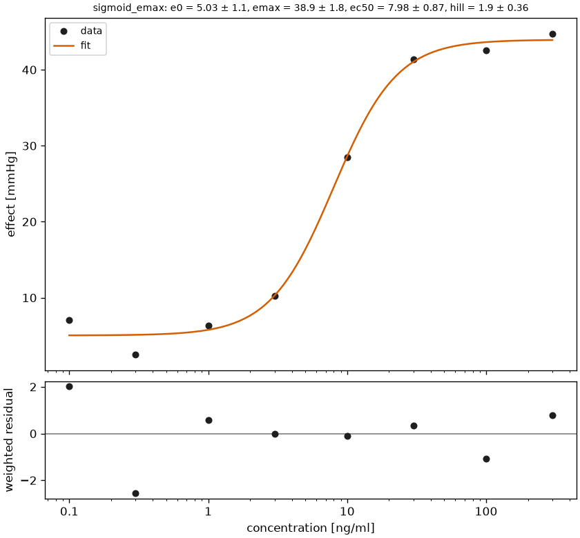

# Pharmacodynamics

A pharmacodynamic timecourse measures an effect over time, a concentration-effect relationship measures the effect against the concentration. `pkpdutils` treats both with the tools of the previous pages: effect timecourses go through the non-compartmental analysis with `Kind.EFFECT`, concentration-effect data are fitted with the Emax family of the [curve fitting](fitting.md).

## Effect timecourses

`NCAOptions(kind=Kind.EFFECT)` switches the analysis to effect parameters: the baseline `e0` (the first value), the observed maximum `emax_obs` and its time `temax`, the area under the effect curve `auec_last` (linear trapezoids, any sign) to the time of the last valid point `tlast`, the baseline corrected `auec_baseline` and `emax_baseline`, and, with `effect_threshold`, the time the linearly interpolated curve spends above the threshold, `time_above`. No terminal phase and no dose parameters are computed. The areas are always linear trapezoids: the logarithmic rules are exact for the mono-exponential decline of a concentration and need positive values, which an effect does not have, so `auc_method` does not apply here; `lloq` and `blq` do apply and work as they do for a concentration, the sample being flagged `BLQ_TRUNCATED`. Group effect curves with `sd`/`se` get the same uncertainty variables as concentrations ([Uncertainty](uncertainty.md)); their bootstrap draws are not clipped at 0, because an effect is legitimately negative, for the same reason log-normal draws are rejected.

\[
\mathrm{AUEC} = \int_0^{t_\mathrm{last}} E(t)\,dt, \qquad
\mathrm{AUEC}_\mathrm{baseline} = \int_0^{t_\mathrm{last}} \left(E(t) - E_0\right) dt, \qquad
E_{\mathrm{max},\mathrm{baseline}} = E_\mathrm{max} - E_0
\]

| name | formula | unit | meaning |
| --- | --- | --- | --- |
| `e0` | \(E_0 = E(t_1)\) | value | baseline, the first value of the curve |
| `emax_obs`, `temax` | \(E_\mathrm{max}\) | value, time | largest observed effect and its time |
| `tlast` | \(t_\mathrm{last}\) | time | time of the last valid point (any sign, unlike the last positive value of a concentration curve) |
| `auec_last` | \(\mathrm{AUEC}\) | value·time | area under the effect curve to the last point |
| `auec_baseline` | \(\mathrm{AUEC}_\mathrm{baseline}\) | value·time | area of the baseline corrected curve |
| `emax_baseline` | \(E_\mathrm{max} - E_0\) | value | largest effect above the baseline |
| `time_above` | | time | time the interpolated curve spends above `effect_threshold` |

```python
import numpy as np

from pkpdutils import Kind, NCAOptions, Timecourse, nca_single

# an effect over time: a baseline of 10, a maximum around two hours
time = np.array([0.0, 0.5, 1, 2, 3, 4, 6, 8, 12])
effect = 10 + 12 * (np.exp(-0.2 * time) - np.exp(-1.5 * time))
tc = Timecourse(
    time=time,
    value=effect,
    time_unit="hr",
    unit="mmHg",
    substance="effect",
)
result = nca_single(tc, options=NCAOptions(kind=Kind.EFFECT, effect_threshold=15.0))
q = result.to_quantities()
for name in (
    "e0",
    "emax_obs",
    "temax",
    "emax_baseline",
    "auec_last",
    "auec_baseline",
    "time_above",
):
    print(f"{name:<14} {q[name]:~P}")
```

```text
e0             10.0 mmHg
emax_obs       17.446395732013304 mmHg
temax          2.0 h
emax_baseline  7.446395732013304 mmHg
auec_last      166.56834496993235 h⋅mmHg
auec_baseline  46.56834496993237 h⋅mmHg
time_above     3.9323708621578644 h
```

### Effect intervals

An effect timecourse carrying a dosing protocol of more than one dose gets the same multiple dosing analysis as a concentration timecourse ([Non-compartmental analysis](nca.md), "Multiple dosing"): every dosing interval reports `interval_auec`, `interval_emax`, `interval_temax`, `interval_emin`, `interval_eavg` and, with `effect_threshold`, `interval_time_above` (`NCAResult.intervals()`), and the last complete interval reports the steady state parameters `auec_tau`, `emin_ss`, `emax_ss`, `eavg`, `time_above_tau`, `accumulation_ratio_obs`, `n_doses` and `tau`. The baseline `e0`, the observed maximum `emax_obs`/`temax` and the baseline corrected variables are computed from the last dose on, the same reference dose rule as a concentration timecourse.

```python
# `tc_protocol`: an effect timecourse carrying a `Dosing` of several doses,
# built like the curve above but with `dosing=Dosing.regimen(...)`
result = nca_single(
    tc_protocol,
    options=NCAOptions(kind=Kind.EFFECT, effect_threshold=15.0),
)
result.intervals()[["interval", "interval_auec", "interval_emax"]]
result.to_quantities()["auec_tau"]  # the last, complete interval
```

## Concentration-effect relationships

The Emax model describes a saturable effect, the Hill coefficient \(n\) of the sigmoid form makes the transition steeper, and the Imax forms describe inhibition [^gw]:

\[
E = E_0 + E_\mathrm{max}\,\frac{C^n}{\mathrm{EC}_{50}^n + C^n}, \qquad
E = E_0\left(1 - I_\mathrm{max}\,\frac{C^n}{\mathrm{IC}_{50}^n + C^n}\right), \qquad
\mathrm{EC}_{90} = 9^{1/n}\,\mathrm{EC}_{50}
\]

\(E_0\) is the effect without drug, \(E_\mathrm{max}\) the maximal effect above it, \(\mathrm{EC}_{50}\) the concentration of half-maximal effect and \(\mathrm{EC}_{90}\) the concentration of 90 % of it; \(I_\mathrm{max}\) is a fraction between 0 and 1, so the inhibited effect is \(E_0(1 - I_\mathrm{max})\) at saturation. The models are fitted with the [curve fitting](fitting.md) engine, which reports the standard errors and confidence intervals of the parameters and of \(\mathrm{EC}_{90}\); `compare_models` decides between Emax, sigmoid Emax and a linear relationship by AICc, which with few concentrations often keeps the simpler model. The same models describe a pharmacokinetic parameter against the dose of a perpetrator, for example `Imax` for a clearance against the dose of an inhibitor.

```python
import numpy as np

from pkpdutils import Emax, FitOptions, Linear, SigmoidEmax, compare_models, fit

# the effect at eight concentrations, e0 = 5, emax = 40, ec50 = 12, hill = 1.6
rng = np.random.default_rng(3)
concentration = np.array([0.5, 1, 2, 5, 10, 20, 50, 100.0])
effect = 5 + 40 * concentration**1.6 / (12.0**1.6 + concentration**1.6)
effect = effect + rng.normal(0, 1.0, concentration.size)

result = fit(
    SigmoidEmax(),
    concentration,
    effect,
    x_unit="ng/ml",
    y_unit="mmHg",
    options=FitOptions(n_starts=10, seed=0),
)
q = result.to_quantities()
for name in ("e0", "emax", "ec50", "hill", "ec90"):
    print(f"{name:<5} {q[name]:~P}")
print(f"ec90 95 % interval {q['ec90_ci_low']:~P} - {q['ec90_ci_high']:~P}")

comparison = compare_models(
    [Emax(), SigmoidEmax(), Linear()],
    concentration,
    effect,
    x_unit="ng/ml",
    y_unit="mmHg",
)
print(
    comparison.table[["model", "aicc", "delta_aicc", "akaike_weight"]].to_string(
        index=False
    )
)
print("best:", comparison.best.item())
```

```text
e0    5.0646456598207035 mmHg
emax  38.73988957163847 mmHg
ec50  11.977716913982151 ng/ml
hill  1.643997431701769
ec90  45.5842101424971 ng/ml
ec90 95 % interval 3.6372317046843747 ng/ml - 87.53118858030982 ng/ml
       model      aicc  delta_aicc  akaike_weight
        emax 31.418000    0.000000       0.996360
sigmoid_emax 43.834014   12.416013       0.002006
      linear 44.244300   12.826299       0.001634
```

The sigmoid model recovers the parameters the data was built from, but with eight concentrations the plain `Emax` wins the comparison by a wide margin: the Hill coefficient costs a parameter and an AICc penalty which this much data does not pay for, which is why the interval of \(\mathrm{EC}_{90}\) is so wide.



The example is `examples/emax.py`, the figures are described in [Plotting](plotting.md) and the reference of the models is in [API: fit.models](api/fit.models.md).

## References

[^gw]: Gabrielsson J, Weiner D. *Pharmacokinetic and Pharmacodynamic Data Analysis*. 5th ed. Swedish Pharmaceutical Press; 2016, ch. 4. See [References](references.md#textbooks).
