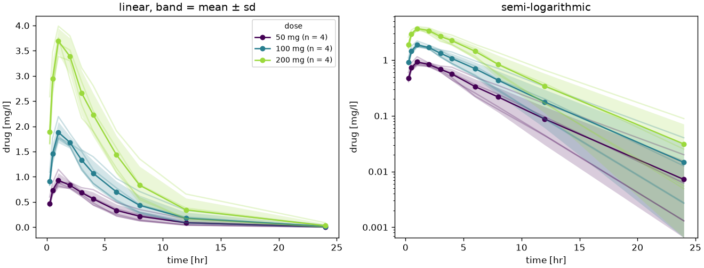
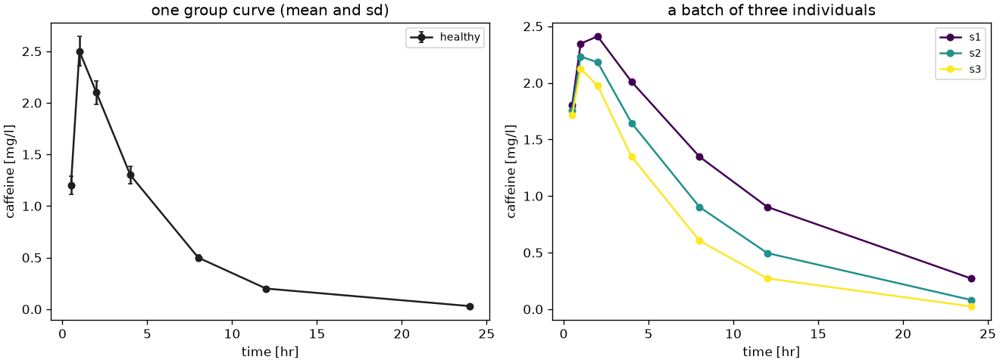
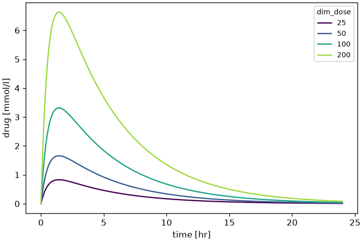
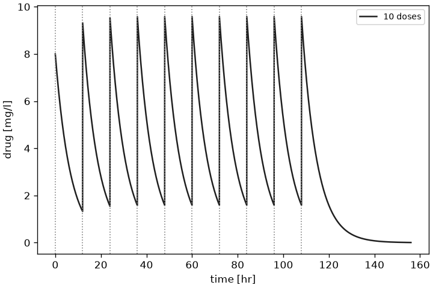
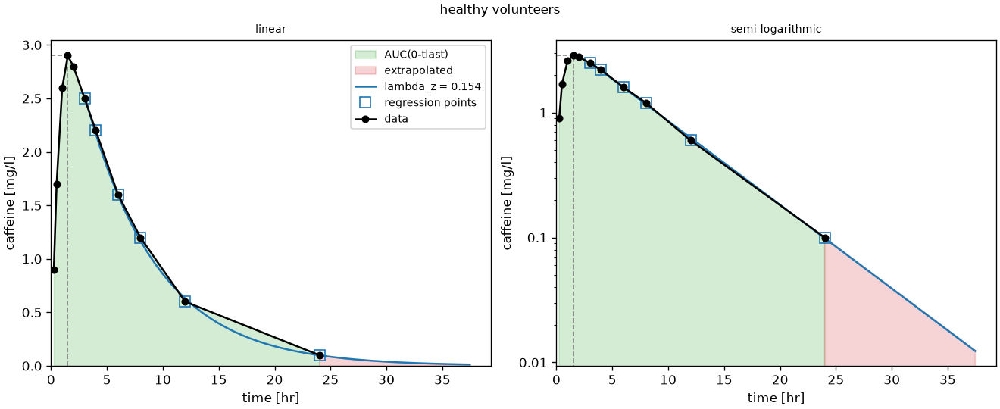
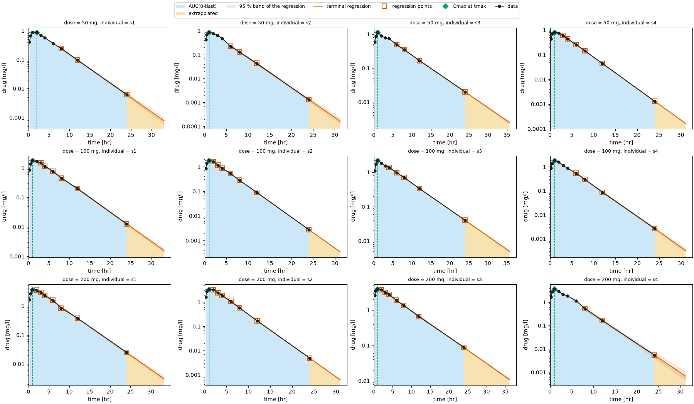
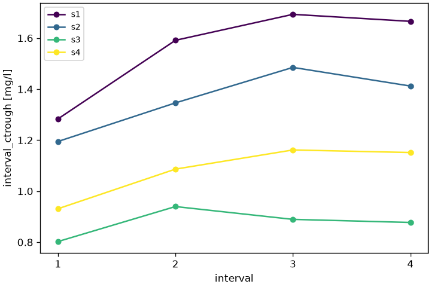
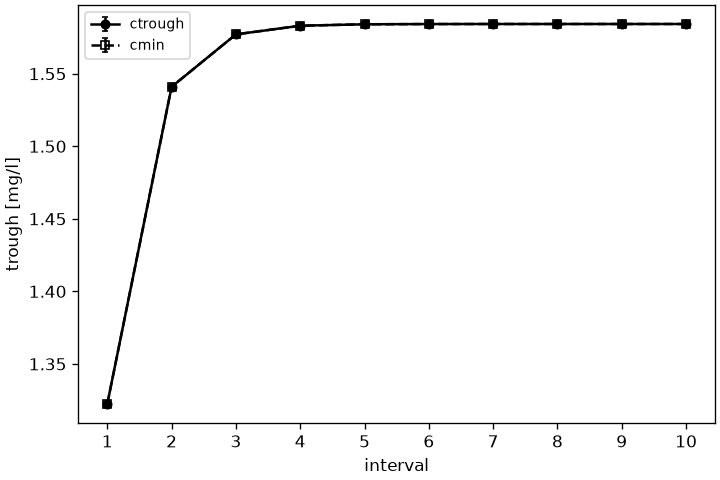
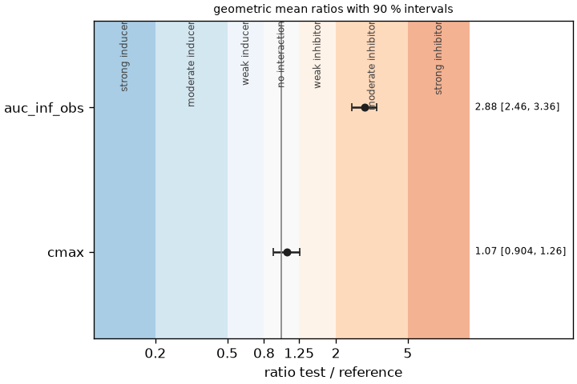

# Plotting

The figures of `pkpdutils.plot` are matplotlib figures. Every function returns the `Figure` it drew and never shows it, so a script saves it (`fig.savefig("name.png")`) and a notebook displays it. Colors and markers come from a `PlotStyle`.

Every signature has the same shape, `f(data, *, <options>, ax=None, style=DEFAULT_STYLE)`: the data first and positionally, every option as a keyword, and `ax` and `style` last. A figure of several panels takes `axes` instead of `ax` (`plot_nca` and `plot_fit` two of them, `plot_nca_grid` one per sample), and a logarithmic axis is `log_x` or `log_y`, with plain tick labels (`10`, `100`) rather than powers of ten; an axis without a positive value stays linear and says so in a debug log. `draw_nca_panel` draws a single NCA panel into an axes and returns the `Axes`, for a figure the caller lays out itself.

## The data of this page

The snippet below builds the `batch`, the `result` and the single curve `tc` every snippet of this page draws, and writes the two figures of the next two sections; it is the dose escalation of `examples/nca_batch.py`. The fit, the bioequivalence and the meta-analysis figures further down use the results of [Curve fitting](fitting.md) and [Statistics](statistics.md), whose pages build them the same way.

```python
import numpy as np

from pkpdutils import Route, Timecourses, nca
from pkpdutils.plot import plot_mean_timecourse, plot_nca_grid

# a dose escalation of four individuals at three dose levels
rng = np.random.default_rng(1)
time = np.array([0.25, 0.5, 1, 2, 3, 4, 6, 8, 12, 24])
doses = np.array([50.0, 100.0, 200.0])
ke = rng.uniform(0.15, 0.3, size=4)
ka = rng.uniform(1.0, 3.0, size=4)
values = np.stack(
    [
        np.stack(
            [
                d
                / 40
                * ka[j]
                / (ka[j] - ke[j])
                * (np.exp(-ke[j] * time) - np.exp(-ka[j] * time))
                * rng.lognormal(0, 0.05, size=time.size)
                for j in range(4)
            ]
        )
        for d in doses
    ]
)
batch = Timecourses.from_arrays(
    time,
    values,
    time_unit="hr",
    unit="mg/l",
    dims=("dose", "individual"),
    coords={"dose": doses, "individual": ["s1", "s2", "s3", "s4"]},
    dose={"amount": np.broadcast_to(doses[:, None], (3, 4)), "unit": "mg"},
    route=Route.ORAL,
    substance="drug",
)
result = nca(batch)
tc = batch.sel(dose=50.0, individual="s1")  # one curve of the batch

plot_mean_timecourse(batch, by="dose").savefig("mean_curves.png", dpi=120)
plot_nca_grid(batch, result, ncols=4).savefig("nca_grid.png", dpi=100)
```

## Timecourses

`plot_mean_timecourse` is the concentration-time figure of a study report: the mean of every group at every time point, the band of its spread around it, the individual curves faint behind both, on a linear and a semi-logarithmic panel. `by` names the coordinate the groups come from (a dose level, a treatment, an arm) and `spread` the statistic of the band, `"sd"`, `"se"` or `None`; the reduction is `Timecourses.groupby` and `Timecourses.mean`, so the band is the scatter of the curves. The legend is drawn once, on the first panel, and names every group with the number of subjects behind its mean.

```python
from pkpdutils.plot import plot_mean_timecourse

fig = plot_mean_timecourse(batch, by="dose", spread="sd")
fig = plot_mean_timecourse(
    batch, by="dose", spread="se", individuals=False, panels=("log",)
)
fig.savefig("mean_curves.png")
```

`plot_mean_timecourse(batch, by="dose")` of the dose escalation of `examples/nca_batch.py`:



`plot_timecourse` draws one curve or every curve of a batch, with the standard error (or the standard deviation) as error bars when present. Without `by` every sample gets its own color and its label in the legend; `by` names a coordinate and gives one color and one legend entry per group, `facet` a coordinate drawn as one panel per value, and `max_legend` (12 by default) the number of entries above which no legend is drawn at all, since it would cover the figure rather than explain it. A faceted figure takes `axes`, one per value; the panels scale on their own data.

```python
from pkpdutils.plot import plot_timecourse

fig = plot_timecourse(batch, log_y=True, by="dose")  # one color per dose
fig = plot_timecourse(tc)  # the single curve of the batch
fig.savefig("curves.png")
```

`facet` needs a second coordinate, `plot_timecourse(batch, facet="dose", by="sex")` with a `sex` along the individual dimension.

`plot_timecourse` of a single curve and of a batch (`examples/timecourses.py`), and of a dose scan with `by` (`examples/nca_from_sbmlsim.py`):





A curve carrying a dosing protocol of more than one dose gets a thin dotted vertical line at every dose time (`style.dose_color`, default `"gray"`) and an infusion the shaded window from the dose time to the end of the infusion; a batch draws no dose markers, since its curves may carry different protocols, while `plot_mean_timecourse` draws them for the protocol of the group.



## NCA diagnostics

`plot_nca` shows what the analysis did with one curve, on a linear and a logarithmic axis: the data, the area to \(t_\mathrm{last}\), the extrapolated tail, the terminal regression line and the points it used, \(C_\mathrm{max}\)/\(t_\mathrm{max}\), \(C_0\) for a bolus, and the flags in the title. A multiple dose result (carrying `auc_tau`) shades the analysed last dosing interval `[0, tau]`, relative to the last dose, labelled `AUC(0-tau)` instead of `AUC(0-tlast)`. For a batch, `plot_nca_grid` draws one such panel per sample, titled by the coordinates of the sample (`dose = 50 mg, individual = s1`, with the unit of a coordinate which carries one and the dose unit of the batch for its `dose`), with one legend for the whole figure instead of the same legend in every panel. A panel starts at the dose it analyses (the last one of a multiple dose curve), so it marks that dose alone: an infusion by its window, as in `plot_timecourse`.

```python
import matplotlib.pyplot as plt

from pkpdutils import nca_single
from pkpdutils.plot import draw_nca_panel, plot_nca, plot_nca_grid

single = nca_single(tc)
fig = plot_nca(tc, single)
fig = plot_nca(
    batch.sel(dose=50.0, individual="s2"), result, dose=50.0, individual="s2"
)
fig = plot_nca_grid(batch, result, ncols=4)

# one panel into an axes of a figure the caller lays out
fig, axes = plt.subplots(ncols=2, figsize=(11, 4.5))
values = {name: float(single[name]) for name in single.parameters}
draw_nca_panel(tc, values, single.flags(), ax=axes[0])
draw_nca_panel(tc, values, single.flags(), log_y=True, ax=axes[1])
```

`plot_nca` of one curve (`examples/nca_single.py`) and `plot_nca_grid` of a `(dose, individual)` batch (`examples/nca_batch.py`):





`plot_intervals` plots a per-interval parameter (`interval_*`) against the interval number, one line per sample of a batch result or a single line with `**indexers` selecting one sample; a missing (incomplete) interval breaks the line rather than raising.

```python
# not executed
from pkpdutils.plot import plot_intervals

# `ss_result`: the NCAResult of a multiple dose batch, see the steady state
# walk-through of [Workflows](workflows.md)
fig = plot_intervals(ss_result, "interval_ctrough")  # one line per sample
fig = plot_intervals(ss_result, "interval_auc", individual="s2")  # one sample
```



`plot_troughs` is the steady state figure of a multiple dose study: the trough of every dosing interval (`interval_ctrough`, and `interval_cmin` when the analysis reports it), averaged over the subjects of a group with its spread as error bars. `x="time"` puts them at the end of their interval, the time the trough was taken, and `x="interval"` at the interval number; steady state is where the troughs stop rising.

```python
# not executed
from pkpdutils.plot import plot_troughs

# the same `ss_result`, with an "arm" coordinate along its samples
fig = plot_troughs(ss_result, by="arm")  # mean +- sd per arm
fig = plot_troughs(ss_result, x="interval", spread="se")
```

Over a batch the title names the statistic and the dimension it was taken over (`mean ± sd over individual`); a result of a single curve draws that curve's troughs and carries no title, as in the ten dose regimen of `examples/steady_state.py`:



## Fits

`plot_fit` draws one sample of a [fit](fitting.md): the data with error bars when the fit had standard deviations, the fitted curve on a fine grid, the model name, the parameters as `name = value +- se` and the flags in the title, and the weighted residuals against \(x\) in a second panel below. `plot_goodness_of_fit` plots the predicted against the observed values of every sample with the identity line and the \(R^2\) per sample, and `plot_dose_proportionality` shows the exposure against the dose on log-log axes with the power fit, the acceptance wedge of the criterion and the verdict in the title.

`plot_fit` and `plot_dose_proportionality` label their axes with the names the front end of the fit stored in the result, `attrs["x_name"]` and `attrs["y_name"]`: `time` and the substance of the batch for `fit_timecourse` and `fit_timecourses`, the two column names for `fit_table`. A result built by `fit` itself carries no names and falls back to `x` and `y`.

```python
# not executed
from pkpdutils import proportionality_test
from pkpdutils.plot import plot_dose_proportionality, plot_fit, plot_goodness_of_fit

# `fit_result`, `fits` and `power`: the FitResult objects of the fitting page
fig = plot_fit(fit_result, log_y=True)  # 0-D result: no indexers
fig = plot_fit(fits, individual="s2", log_x=True)  # one sample of a batch
fig = plot_goodness_of_fit(fits, log_x=True, log_y=True)
fig = plot_dose_proportionality(
    power, test=proportionality_test(power, dose_range=(25, 400))
)
```

`plot_fit` of a Bateman fit on a logarithmic value axis (`examples/fitting_exponential.py`), of a sigmoid Emax fit with `log_x` (`examples/emax.py`) and of an allometric fit on log-log axes (`examples/covariate.py`):


`plot_goodness_of_fit` of the same Bateman fit and `plot_dose_proportionality` of a power fit with its acceptance wedge (`examples/dose_proportionality.py`):


## Parameters, ratios and forest plots

`plot_parameters` draws the individual values of a parameter of a result as jittered points with a box plot per group (`by` names a coordinate along the sample dimension) and the geometric mean with its interval. `plot_ratio` draws geometric mean ratios with their intervals on a logarithmic axis against the acceptance limits of bioequivalence or the thresholds of the interaction classes, from a dictionary of `ratio` results or a `bioequivalence` result. `plot_forest` is the forest plot of a `meta_analysis`: the effect of every study with its interval and a marker sized by its random effects weight, the pooled fixed and random effects as diamonds, the heterogeneity in the title. Both write their numbers in a column to the right of the intervals (`annotate=True`, the default): `estimate [low, high]` and, in the forest plot, the weight of the study in percent. `plot_ratio` takes `labels` to give the rows the names of a publication instead of the variable names. `plot_bland_altman` shows the agreement of the predictions of a fit with the data.

```python
# not executed
from pkpdutils.plot import plot_bland_altman, plot_forest, plot_parameters, plot_ratio
from pkpdutils.stats import DDIThresholds

# `result`: the NCAResult of the snippet at the top of this page; `be`,
# `auc_ratio`, `cmax_ratio` and `meta`: the results of the statistics page;
# `fit_result`: the FitResult of the fitting page
fig = plot_parameters(result, "auc_inf_obs", "individual", by="dose", log_y=True)
fig = plot_ratio(be, labels={"auc_inf_obs": "AUC(0-inf)", "cmax": "Cmax"})
fig = plot_ratio(
    {"auc": auc_ratio, "cmax": cmax_ratio}, limits=None, thresholds=DDIThresholds.fda()
)
fig = plot_forest(meta)
fig = plot_forest(meta, annotate=False)  # the markers alone
fig = plot_bland_altman(fit_result, log_ratio=True)
```

`plot_parameters` and `plot_ratio` of a 2x2 crossover (`examples/bioequivalence.py`), `plot_ratio` against the interaction thresholds (`examples/ddi.py`) and `plot_forest` of five studies (`examples/meta_analysis.py`):





## Style

```python
from pkpdutils.plot import PlotStyle

style = PlotStyle(fit_color="tab:red", auc_color="lightgray", alpha=0.3)
fig = plot_nca(tc, nca_single(tc), style=style)
```

The reference of the module is in [API: plot](api/plot.md).
