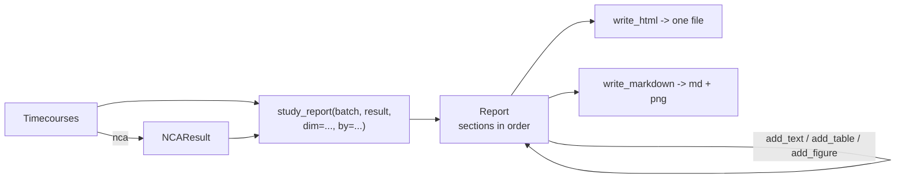
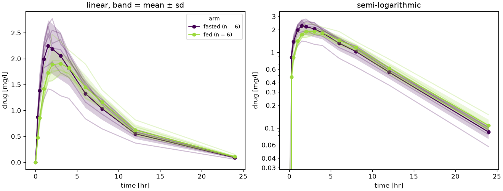

# Reporting

An analysis of `pkpdutils` ends in data frames and figures. A study report is those pieces in the order a reader expects them, in a file which can be sent to a colleague, attached to a study file or archived next to the data. `pkpdutils.report` builds it: `Report` collects paragraphs, tables and figures and writes a self-contained HTML page or markdown with its figures next to it, and `study_report` assembles the package ICH M13A[^ich_m13a] names for the pharmacokinetic section of a study.

## Concepts



**What it is.** A `Report` is a title and a list of sections, nothing more: a paragraph (with an optional heading), a data frame with a caption, or a figure with a caption. Sections are added in the order they are read and every `add_*` returns the report, so the calls chain. A figure is rendered to PNG the moment it is added, which means the report does not keep a matplotlib figure alive, the caller may close it right away, and writing the report twice gives the same bytes.

**Self-contained HTML.** `write_html` embeds the figures as base64 PNG and carries its own style sheet, so the page is one file which needs no directory beside it. `write_markdown` writes the figures as `<stem>_1.png`, `<stem>_2.png` next to the document and references them by name, which is the form a static site or a pandoc conversion wants.

**How the numbers are formatted.** A float in a table is rounded to three significant digits with the same rule the publication tables of the package use (`pkpdutils.result.format_number`), so a report shows the numbers a manuscript shows; `digits=` changes it per table or for the whole report. A table which already holds formatted strings, as `summary_table` returns, passes through untouched. Every cell is escaped, so a parameter name with angle brackets stays text instead of becoming markup.

**What `study_report` assembles.** The sections ICH M13A (2.2.2) asks for, in its order: the sentence describing the non-compartmental methods, the summary statistics of every parameter with the eight statistics M13A lists, the ratio of the observed to the extrapolated area of every subject with the acceptability verdict, the parameters of every subject, the mean curves per group and one analysis panel per subject. The report is returned rather than written, so anything else can be added before it goes to a file.

## Results

| object | what it carries |
| --- | --- |
| `Report` | `title`, `subtitle`, `digits`, `sections`, `add_text(text, heading=, level=)`, `add_table(frame, caption, heading=, digits=)`, `add_figure(fig, caption, dpi=, heading=)`, `write_html(path)`, `write_markdown(path)` |
| `Section` | `kind` (`"text"`, `"table"`, `"figure"`), `heading`, `text`, `frame`, `caption`, `image` (the rendered PNG), `digits`, `level` |
| `study_report` | `(batch, result, *, dim, by=None, options=None, title=..., subtitle=...) -> Report` |

## API

The whole package of a single dose study in one call. The `by` coordinate groups the subjects in the summary table and in the mean curve figure; `options` is what the analysis was run with and is what the methods sentence describes.

```python
import numpy as np

from pkpdutils import Report, Route, Timecourses, nca, study_report
from pkpdutils.plot import plot_mean_timecourse

# twelve subjects in two arms, an oral single dose of 100 mg
report_time = np.array([0.0, 0.25, 0.5, 1.0, 1.5, 2.0, 3.0, 4.0, 6.0, 8.0, 12.0, 24.0])
report_arm = ["fasted"] * 6 + ["fed"] * 6
report_rng = np.random.default_rng(7)
ke = 0.15
report_values = np.stack(
    [
        report_rng.lognormal(0.0, 0.22)
        * 100
        * (ka := 1.4 if arm == "fasted" else 0.7)
        / (ka - ke)
        * (np.exp(-ke * report_time) - np.exp(-ka * report_time))
        / 30
        * report_rng.lognormal(0.0, 0.05, report_time.size)
        for arm in report_arm
    ]
)
study = Timecourses.from_arrays(
    report_time,
    report_values,
    time_unit="hr",
    unit="mg/l",
    dims=("individual",),
    coords={
        "individual": [f"s{i + 1:02d}" for i in range(12)],
        "arm": ("individual", report_arm),
    },
    dose={"amount": np.full(12, 100.0), "unit": "mg"},
    route=Route.ORAL,
    substance="drug",
)
study_result = nca(study)

report = study_report(
    study,
    study_result,
    dim="individual",
    by="arm",
    subtitle="Single dose, 100 mg oral, twelve subjects in two arms",
)
for section in report.sections:
    print(f"{section.kind:<7} {section.heading or section.caption}")
print(report.write_html("report.html").name)
```

```text
text    Methods
table   Pharmacokinetic parameters
table   Acceptability of the extrapolation
table   Individual parameters
figure  Figures
figure  The analysis of every subject.
report.html
```

`report.html` is one file of about a megabyte, most of it the two embedded figures, and opens in any browser without a server beside it.

A report is built by hand the same way, from any frame and any figure of the package. `write_markdown` puts the figures next to the document instead of into it:

```python
import pathlib

extra = Report(title="Cmax of the two arms", subtitle="an added table and figure")
extra.add_text(
    "The peak of the fed arm is lower and later, as the slower absorption asks."
)
extra.add_table(
    study_result.summary_table("individual", by="arm", parameters=["cmax", "tmax"]),
    "Peak and time of the peak per arm.",
    heading="Peak",
)
figure = plot_mean_timecourse(study, by="arm")
extra.add_figure(figure, "The mean curves of the two arms.")
print(
    extra.write_markdown("cmax/report.md").name,
    sorted(p.name for p in pathlib.Path("cmax").iterdir()),
)
```

```text
report.md ['report.md', 'report_1.png']
```

The mean curve figure of the report is the one `examples/report.py` writes from the same simulation:



Anything else the study needs goes in before the file is written: the ratio table and the figure of a bioequivalence comparison ([Bioequivalence](bioequivalence.md)), the interaction table of a drug-drug interaction study ([Drug-drug interactions](ddi.md)), the flags of the analysis (`NCAResult.flag_table`) or the exclusions and their reasons ([Non-compartmental analysis](nca.md#acceptance-criteria-and-exclusions)).

```python
# not executed
from pkpdutils.plot import plot_ratio
from pkpdutils.stats import bioequivalence, ratio_table

be = bioequivalence(test, reference)
report.add_table(ratio_table(be), "Average bioequivalence, 90 % intervals.")
report.add_figure(plot_ratio(be), "The ratios against the acceptance limits.")
report.add_table(study_result.flag_table(), "The flags of every subject.")
report.write_html("study.html")
```

The reference of the module is in [API: report](api/report.md), the runnable example is `examples/report.py`, and the tables it assembles are described on [Non-compartmental analysis](nca.md#the-tables-of-a-regulatory-report).

## References

[^ich_m13a]: International Council for Harmonisation. *Bioequivalence for Immediate-Release Solid Oral Dosage Forms M13A.* 2024. See [References](references.md#regulatory-guidance).
