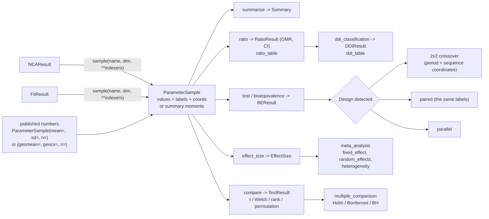
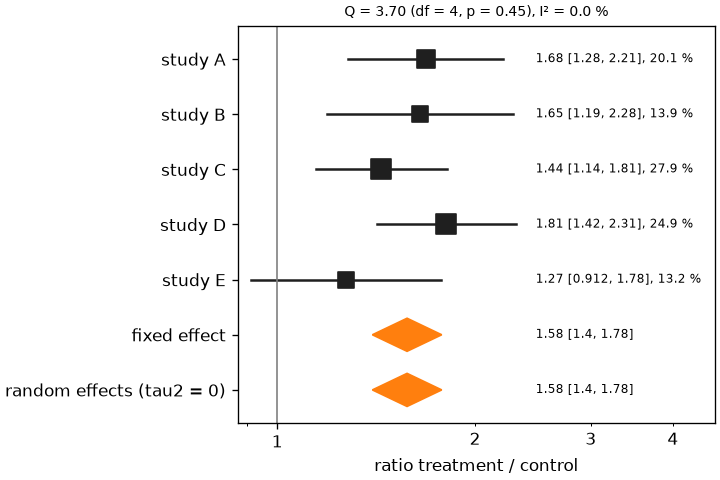

# Statistics

Statistics on pharmacokinetic parameters: comparisons of two groups, geometric mean ratios, average bioequivalence, the classification of drug-drug interactions and the meta-analysis of published studies. Every function of `pkpdutils.stats` works on a `ParameterSample`, the values of one parameter over the individuals of a group or the summary statistics of the group, taken from an `NCAResult` or a `FitResult` with `sample` or typed in from a publication.

## Concepts

Every analysis of this page starts at a `ParameterSample`, whether the numbers come from an analysis of the package or from a publication:



**Log-normal parameters.** Exposure, clearance, volume and half-life are positive and skewed: their logarithms are close to normal. The statistics therefore run on the log scale by default (`Scale.LOG`): differences of the logarithms are ratios of geometric means, intervals are symmetric on the log scale and asymmetric around the ratio, and the geometric mean and the geometric coefficient of variation \(\mathrm{CV}_g = \sqrt{e^{\sigma^2} - 1}\) describe a group. `Scale.LINEAR` compares arithmetic means, for parameters like \(t_\mathrm{max}\) or an effect which may be negative; `summarize` on `Scale.LINEAR` tolerates a non-positive value and reports `geomean`/`geocv` as `NaN` instead, while `Scale.LOG` raises on one.

**Individual and summary data.** With the individual values of a group every test of scipy is available; a publication often gives only the mean, the standard deviation and the number of subjects. A summary sample is analysed with the Welch t test from its moments; on the log scale the moments of the logarithm follow from the log-normal relations \(\sigma^2 = \ln(1 + \mathrm{sd}^2/\mathrm{mean}^2)\) and \(\mu = \ln\mathrm{mean} - \sigma^2/2\), or directly from the geometric mean and CV when they are reported.

**Designs.** In a parallel design two groups of different subjects are compared with the Welch interval. In a paired or crossover design every subject receives both treatments, and the within-subject differences remove the between-subject variability: the 2x2 crossover with its sequence, period and subject-within-sequence effects[^chow] is the design of a bioequivalence study and is analysed on [Bioequivalence](bioequivalence.md).

**Bioequivalence.** Two formulations are bioequivalent when the 90 % confidence interval of the geometric mean ratio of \(\mathrm{AUC}\) and \(C_\mathrm{max}\) lies within 80-125 %[^fda_be], the two one-sided tests procedure of Schuirmann at \(\alpha = 0.05\)[^schuirmann]. The designs, the procedure, the within-subject CV and the table and figure of the report are on [Bioequivalence](bioequivalence.md).

**Drug-drug interactions.** A perpetrator is classified by how much it changes the \(\mathrm{AUC}\) of a sensitive substrate, a strong, moderate or weak inhibitor or inducer[^fda_ddi][^ema_ddi], read conservatively from the bound of the interval closer to 1. The thresholds, the sensitivity of a substrate and the table and figure of the report are on [Drug-drug interactions](ddi.md).

**Meta-analysis.** Effects of several studies (Hedges' g, a mean difference or the log ratio of geometric means, the effect native to pharmacokinetics) are pooled with inverse variance weights[^borenstein]. The fixed effect model assumes one true effect; the random effects model of DerSimonian and Laird adds the between-study variance \(\tau^2\) to every weight and widens the interval when the studies disagree[^dl]. \(Q\), \(I^2\) and \(H^2\) measure that disagreement[^higgins].

## Math

**Two-sample t tests.** With the means \(\bar a\), \(\bar b\), the variances \(s_a^2\), \(s_b^2\) and the sizes \(n_a\), \(n_b\) (on the analysis scale), Welch's statistic is \(t = (\bar a - \bar b) / \sqrt{s_a^2/n_a + s_b^2/n_b}\) with the Welch-Satterthwaite degrees of freedom; Student's uses the pooled variance \(s_p^2 = ((n_a-1)s_a^2 + (n_b-1)s_b^2)/(n_a+n_b-2)\) with \(n_a + n_b - 2\); the paired test is the one-sample test of the differences. The interval of the effect is \(\hat\theta \pm t_{1-\alpha/2,\nu}\,\mathrm{se}\), exponentiated on the log scale. The standardized effect sizes are Cohen's \(d = (\bar a - \bar b)/s_p\) and Hedges' \(g = J d\) with \(J = 1 - 3/(4N - 9)\), \(N = n_a + n_b\)[^hedges]. The rank tests (Mann-Whitney, Wilcoxon) and the permutation test report the same interval-free `TestResult`, with `effect` the difference or the ratio of the medians of the raw values for the rank tests.

**Geometric mean ratio.** Paired: \(d_i = \ln t_i - \ln r_i\), \(\ln\mathrm{GMR} = \bar d\), \(\mathrm{se} = s_d/\sqrt{n}\), \(n - 1\) degrees of freedom. Parallel: \(\ln\mathrm{GMR} = \bar{\ln t} - \bar{\ln r}\) with the Welch standard error. The interval of the ratio is \(\exp(\ln\mathrm{GMR} \pm t\,\mathrm{se})\). A paired `ratio` with no pair of finite values raises `ValueError`.

**Pairing and degenerate samples.** Paired analyses (`compare(paired=True)`, `ratio`, `tost`) match the two samples with `paired_values`: by label when both samples carry labels, so the order of the individuals does not matter and an individual only one sample holds is dropped, and by position otherwise, which then needs equal sizes. A pair is dropped when either of its values is missing, which is logged at debug level; the analysis runs on the remaining pairs, so a missing parameter of one subject costs that subject and does not shift the pairing of the others. A sample of a single value and two samples without variance leave the statistic undefined: `statistic`, `p_value`, `df` and the interval come back as `NaN` instead of raising, while the effect itself (the difference or the ratio of the means) stays finite. A sample without a finite value at all (a parameter no subject of the group has) gives `NaN` throughout an unpaired `compare` or `ratio` and raises on a paired one, where no pair remains; `tost` reports `NaN` p values and no bioequivalence when the design leaves no standard error; `effect_size` gives a `NaN` effect and variance for such a group instead of raising, and the pooling drops that study with a warning naming it, keeps it with a `NaN` weight in `MetaResult.to_dataframe` and raises only when no study is left; a variance which is zero or negative is an error rather than a missing value, it carries an infinite weight and is named in a `ValueError`. `ParameterSample` rejects a negative `sd` or `geocv`, a non-positive `geomean` and an `n` which is not a whole number.

**Strings instead of enumeration members.** Every option of `pkpdutils.stats` is taken either as its enumeration member or as the string of the member, so `compare(a, b, scale="log", test="paired_t")`, `multiple_comparison(p, method="holm")`, `effect_size(control, treatment, "log_ratio")` and `tost(test, reference, design="parallel")` run the analysis their members name. An unknown string raises a `ValueError` listing the members rather than falling back to a default.

**The 2x2 crossover and the two one-sided tests.** The period-difference analysis of a crossover, the within-subject CV and the equivalence of the two one-sided tests with the interval inclusion are on [Bioequivalence](bioequivalence.md#math); the thresholds and the conservative reading of an interval are on [Drug-drug interactions](ddi.md#math).

**Multiple comparisons.** Bonferroni \(\tilde p_i = \min(1, m p_i)\); Holm sorts the p values and takes \(\tilde p_{(i)} = \max_{j \le i}\min(1, (m-j+1)p_{(j)})\)[^holm]; Benjamini-Hochberg takes \(\tilde p_{(i)} = \min_{j \ge i}\min(1, m p_{(j)}/j)\)[^bh].

**Effect sizes of a study.** Hedges' g as above with \(\mathrm{var}(d) = N/(n_C n_T) + d^2/(2N)\) and \(\mathrm{var}(g) = J^2\mathrm{var}(d)\); the mean difference \(\bar x_T - \bar x_C\) with \(s_T^2/n_T + s_C^2/n_C\); the log ratio \(\mu_T - \mu_C\) with \(\sigma_T^2/n_T + \sigma_C^2/n_C\).

**Pooling.** With \(w_i = 1/v_i\): \(\hat\theta_F = \sum w_i\theta_i/\sum w_i\), \(\mathrm{se} = 1/\sqrt{\sum w_i}\). Heterogeneity \(Q = \sum w_i(\theta_i - \hat\theta_F)^2\), \(C = \sum w_i - \sum w_i^2/\sum w_i\), \(\tau^2 = \max(0, (Q - (k-1))/C)\), \(I^2 = 100\max(0, (Q-(k-1))/Q)\) in percent, \(H^2 = Q/(k-1)\). Random effects: \(w_i^* = 1/(v_i + \tau^2)\) and the same pooling[^dl][^higgins]. The intervals of the effects and the pooled effects are normal, \(\hat\theta \pm z_{1-\alpha/2}\,\mathrm{se}\).

## Results

| function | result | fields |
| --- | --- | --- |
| `summarize` | `Summary` | `n`, `mean`, `sd`, `se`, `cv`, `geomean`, `geocv`, `median`, `q25`, `q75`, `min`, `max`, `ci_low`, `ci_high` |
| `compare` | `TestResult` | `test`, `statistic`, `p_value`, `effect`, `ci_low`, `ci_high`, `df`, `cohen_d`, `hedges_g`, `n_a`, `n_b` |
| `ratio` | `RatioResult` | `gmr`, `ci_low`, `ci_high`, `log_ratio`, `se_log`, `df`, `paired`, `n_test`, `n_reference` |
| `tost`, `bioequivalence` | `BEParameter`, `BEResult` | `gmr`, `ci_low`, `ci_high`, `bioequivalent`, `p_lower`, `p_upper`, `p_value`, `design`, `cv_intra`, `p_period`, `p_sequence` |
| `ddi_classification` | `DDIResult` | `kind`, `strength`, `auc_ratio`, `cmax_ratio`, `ci_low`, `ci_high`, `uncertain`, `kind_low`, `strength_low`, `kind_high`, `strength_high` |
| `effect_size` | `EffectSize` | `estimate`, `variance`, `se`, `ci_low`, `ci_high`, `kind`, `n_control`, `n_treatment`, `label` |
| `fixed_effect`, `random_effects` | `PooledEffect` | `estimate`, `se`, `ci_low`, `ci_high`, `z`, `p_value`, `weights`, `model`, `tau2` |
| `heterogeneity` | `Heterogeneity` | `q`, `df`, `p_value`, `i2`, `h2`, `tau2` |
| `meta_analysis` | `MetaResult` | `effects`, `fixed`, `random`, `heterogeneity`, `to_dataframe()` |

The `effect` of `compare` is `a - b` on the linear scale and the ratio of the geometric means `a / b` on the log scale; `ratio`, `tost` and `ddi_classification` report test over reference and with over without the perpetrator. `p_value` of a `BEParameter` is the larger of the two one-sided p values, `bioequivalent` is `p_value < (1 - ci_level) / 2`, which is the interval within the limits.

**Confidence levels and argument order.** `ci_level` is 0.95 everywhere except `ratio`, `tost`, `bioequivalence` and `ddi_table`, which default to 0.90, the regulatory interval of the two one-sided tests: the 90 % interval of the ratio is the interval the bioequivalence decision reads[^schuirmann]. Every function takes `ci_level` as a keyword, so a comparison at another level is one argument away. The samples of a comparison are given test (or treatment) first: `compare(a, b)`, `ratio(test, reference)`, `tost(test, reference)`, `bioequivalence(test, reference)`; the meta-analysis reverses it, `effect_size(control, treatment)` and `Study(label, control, treatment)`, the convention of its own literature[^hedges].

## API

A sample comes from a result with `sample(name, dim, **indexers)` or from the numbers of a publication; `summarize` describes it, `compare` tests two of them against each other and `ratio` reports the geometric mean ratio with its 90 % interval:

```python
import numpy as np

from pkpdutils import ParameterSample, Route, Timecourses, compare, nca, ratio
from pkpdutils.stats import Scale, summarize

# two parallel groups of eight subjects, smokers clear the drug 40 % faster
time = np.array([0.5, 1, 2, 4, 8, 12, 24])
rng = np.random.default_rng(5)


def group(ke: float, label: str) -> Timecourses:
    values = np.stack(
        [
            2.5
            * np.exp(-ke * rng.lognormal(0, 0.2) * time)
            * rng.lognormal(0, 0.05, time.size)
            for _ in range(8)
        ]
    )
    return Timecourses.from_arrays(
        time,
        values,
        time_unit="hr",
        unit="mg/l",
        dims=("individual",),
        coords={"individual": [f"{label}{i}" for i in range(8)]},
        dose={"amount": np.full(8, 100.0), "unit": "mg"},
        route=Route.IV_BOLUS,
        substance="drug",
    )


smokers = nca(group(0.28, "sm")).sample("cl", "individual")
non_smokers = nca(group(0.20, "ns")).sample("cl", "individual")

s = summarize(smokers)  # geometric mean with its interval, quantiles, CV
print(f"n={s.n} geomean={s.geomean:.4g} geocv={s.geocv:.3g}")
print(f"ci=[{s.ci_low:.4g}, {s.ci_high:.4g}] {s.unit}")
print(f"arithmetic mean {summarize(smokers, scale=Scale.LINEAR).mean:.4g}")

test = compare(smokers, non_smokers)  # Welch t on the log scale
print(test.test, round(test.p_value, 5), round(test.effect, 3), round(test.hedges_g, 2))
r = ratio(smokers, non_smokers)  # the same effect as a ratio with a 90 % interval
print(round(r.gmr, 3), round(r.ci_low, 3), round(r.ci_high, 3), r.paired)

published = ParameterSample(mean=45.2, sd=12.1, n=12, name="cl", unit="l/hr")
print(f"{compare(smokers, published).p_value:.3g}")  # Welch t from mean, sd, n
```

```text
n=8 geomean=12.02 geocv=0.14
ci=[10.69, 13.5] liter / hour
arithmetic mean 12.12
welch_t 0.00115 1.403 1.96
1.403 1.214 1.621 False
5.08e-11
```

The effect of a comparison on the log scale is the ratio of the geometric means, so `compare` and `ratio` report the same 1.403 with different intervals: the 95 % interval of the test and the 90 % interval of the ratio.

The other tests, the pairing and the correction for multiple comparisons, with the samples of the snippet above and `before`/`after` two samples of the same subjects:

```python
# not executed
from pkpdutils.stats import Alternative, TestMethod, multiple_comparison

compare(smokers, non_smokers, test=TestMethod.MANN_WHITNEY)
compare(before, after, paired=True, alternative=Alternative.LESS)
tests = [compare(smokers, non_smokers), compare(before, after, paired=True)]
multiple_comparison([t.p_value for t in tests])  # Holm
```

Ratios and bioequivalence, with `test_result` and `reference_result` two `NCAResult` objects of the same subjects:

```python
# not executed
from pkpdutils import bioequivalence, ratio
from pkpdutils.stats import ratio_table

r = ratio(
    test_result.sample("auc_inf_obs", "individual"),
    reference_result.sample("auc_inf_obs", "individual"),
)  # paired by label when both carry the same subjects, 90 % interval
be = bioequivalence(test_result, reference_result, parameters=["auc_inf_obs", "cmax"])
be.bioequivalent, be["cmax"].gmr, be.to_dataframe()
```

`ratio_table` formats the ratios of a study the way a paper prints them: one row per parameter with the point estimate and its interval in percent of the reference (`parameter`, `unit`, `n_test`, `n_reference`, `gmr`, `ci_low`, `ci_high`, `ci_level`), the numbers rounded to `digits` significant digits as strings. It takes a mapping of `RatioResult` objects or the result of `bioequivalence`, which adds `cv_intra`, `limits` and `bioequivalent`.

```python
# not executed
ratio_table(be)  # the table of a bioequivalence report
ratio_table({"auc_inf_obs": r}, percent=False, digits=4)  # plain ratios
```

The designs, the two one-sided tests, the within-subject CV and the table and figure of a study are on [Bioequivalence](bioequivalence.md), which runs the crossover above end to end.

Drug-drug interactions: `ddi_classification` classifies the exposure ratio of a substrate with and without a perpetrator, `substrate_sensitivity` grades the substrate against a strong inhibitor, and `ddi_table` does both over several parameters of two results. The thresholds, the conservative reading of an interval and the figure with the class bands are on [Drug-drug interactions](ddi.md).

```python
# not executed
from pkpdutils import ddi_classification
from pkpdutils.stats import DDIThresholds, ddi_table, substrate_sensitivity

# `inhibited` and `control`: the NCAResult of the two arms of the study
ddi = ddi_classification(
    ratio(
        inhibited.sample("auc_inf_obs", "individual"),
        control.sample("auc_inf_obs", "individual"),
    )
)
ddi.kind, ddi.strength, ddi.uncertain
ddi_classification(3.2, ci=(2.4, 4.3), thresholds=DDIThresholds.ema())
substrate_sensitivity(6.1)
ddi_table(inhibited, control, ["auc_inf_obs", "cmax"], dim="individual")
```

Meta-analysis:

```python
import numpy as np

from pkpdutils import ParameterSample, meta_analysis
from pkpdutils.stats import EffectKind, Study, effects_from_arrays, random_effects

studies = [
    Study(
        "Smith 1990",
        control=ParameterSample(mean=1.2, sd=0.4, n=10),
        treatment=ParameterSample(mean=2.0, sd=0.6, n=10),
    ),
    Study(
        "Jones 1998",
        control=ParameterSample(mean=1.4, sd=0.5, n=24),
        treatment=ParameterSample(mean=2.1, sd=0.7, n=22),
    ),
    Study(
        "Meyer 2004",
        control=ParameterSample(mean=1.1, sd=0.3, n=16),
        treatment=ParameterSample(mean=2.4, sd=0.8, n=16),
    ),
]
meta = meta_analysis(studies, EffectKind.LOG_RATIO)
print(
    f"random effect {meta.random.estimate:.3f} "
    f"[{meta.random.ci_low:.3f}, {meta.random.ci_high:.3f}]"
)
print(
    f"fixed effect  {meta.fixed.estimate:.3f}, "
    f"tau2 {meta.heterogeneity.tau2:.4f}, I2 {meta.heterogeneity.i2:.1f} %"
)
print(meta.to_dataframe().round(4).to_string(index=False))

# effects computed elsewhere
pooled = random_effects(
    effects_from_arrays(
        np.array([0.51, 0.41, 0.78]),
        np.array([0.02, 0.01, 0.03]),
        labels=["Smith 1990", "Jones 1998", "Meyer 2004"],
        kind=EffectKind.LOG_RATIO,
    )
)
print(f"{pooled.estimate:.3f}, p = {pooled.p_value:.2e}")
```

```text
random effect 0.566 [0.345, 0.788]
fixed effect  0.565, tau2 0.0255, I2 66.8 %
     label  estimate     se  ci_low  ci_high  n_control  n_treatment  weight_fixed  weight_random
Smith 1990    0.5204 0.1384  0.2492   0.7917         10           10        0.2134         0.2869
Jones 1998    0.4128 0.0990  0.2189   0.6067         24           22        0.4174         0.3629
Meyer 2004    0.7634 0.1052  0.5571   0.9696         16           16        0.3692         0.3502
0.530, p = 1.83e-07
```

The three studies agree on the direction and disagree on the size, which is what \(I^2 = 66.8\) % says: the random effects interval is wider than the fixed effect one would be, and the weights of the three studies are more even under it.



`effects_from_arrays` defaults to `EffectKind.HEDGES_G` like `effect_size` and `meta_analysis`, so the kind of an effect computed elsewhere is given explicitly. Every scalar result carries `to_dict` (`Summary`, `TestResult`, `RatioResult`, `BEParameter`, `BEResult`, `EffectSize`, `PooledEffect`, `Heterogeneity`, `Study`, `MetaResult`, `DDIResult`) and every collection a `to_dataframe` (`BEResult`, `MetaResult`).

Figures: `plot_parameters`, `plot_ratio` and `plot_forest`, see [Plotting](plotting.md). Examples: `examples/bioequivalence.py`, `examples/ddi.py` and `examples/meta_analysis.py`. The reference of the modules is in [API: stats](api/stats.md), [API: stats.bioequivalence](api/stats.bioequivalence.md), [API: stats.ddi](api/stats.ddi.md) and [API: stats.meta](api/stats.meta.md).

## References

[^fda_be]: U.S. Food and Drug Administration. *Statistical Approaches to Establishing Bioequivalence.* 2026. See [References](references.md#regulatory-guidance).
[^schuirmann]: Schuirmann DJ. *J Pharmacokinet Biopharm.* 1987;15:657-680. See [References](references.md#statistics).
[^fda_ddi]: U.S. Food and Drug Administration. *Clinical Drug Interaction Studies.* 2020. See [References](references.md#regulatory-guidance).
[^ema_ddi]: European Medicines Agency. *Guideline on the investigation of drug interactions.* 2012. See [References](references.md#regulatory-guidance).
[^chow]: Chow SC, Liu JP. *Design and Analysis of Bioavailability and Bioequivalence Studies.* 3rd ed. 2009, ch. 3. See [References](references.md#statistics).
[^hedges]: Hedges LV. *J Educ Stat.* 1981;6:107-128. See [References](references.md#statistics).
[^dl]: DerSimonian R, Laird N. *Control Clin Trials.* 1986;7:177-188. See [References](references.md#statistics).
[^higgins]: Higgins JPT, Thompson SG. *Stat Med.* 2002;21:1539-1558. See [References](references.md#statistics).
[^holm]: Holm S. *Scand J Stat.* 1979;6:65-70. See [References](references.md#statistics).
[^bh]: Benjamini Y, Hochberg Y. *J R Stat Soc B.* 1995;57:289-300. See [References](references.md#statistics).
[^borenstein]: Borenstein M, Hedges LV, Higgins JPT, Rothstein HR. *Introduction to Meta-Analysis.* 2nd ed. Wiley; 2021. See [References](references.md#statistics).
