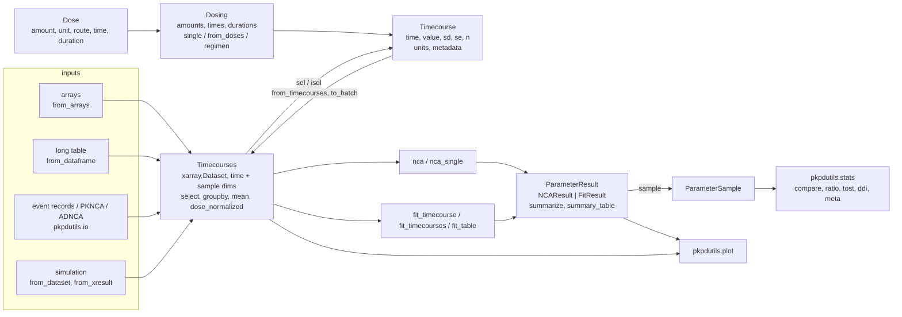

# Timecourses

A pharmacokinetic timecourse is the concentration of a substance in a tissue over time after a dose; a pharmacodynamic timecourse is an effect over time. `pkpdutils` represents one curve as a `Timecourse` and many curves as a `Timecourses` batch, which is the input of every analysis of the package. The first analysis is the [non-compartmental analysis](nca.md).

## Concepts

Everything the package does starts at a `Timecourse` or a `Timecourses` batch, whichever way the data came in, and ends at a `ParameterResult` which the statistics and the figures read:



**Single curve.** A `Timecourse` holds the sampling times and the values with their units, an optional dose, and metadata (substance, label, tissue, the limit of quantification `lloq` of its assay). It is a frozen [pydantic](https://docs.pydantic.dev) model: the arrays are converted to `float64`, sorted by time, and duplicate times or an unknown unit raise a `ValueError` when the object is created (a dimensionless value is spelled `unit="dimensionless"`, the empty string is not a unit). Missing values are `NaN` in `value`; every analysis drops them. `lloq` travels into a batch as the coordinate `lloq` along its sample dimension, where the readers of [Formats](formats.md) also write it, and the [non-compartmental analysis](nca.md) reads it per sample when its options name no limit of their own.

**Group data.** Publications report the mean curve of a group with the standard deviation or the standard error and the number of subjects. A `Timecourse` carries these as `sd`, `se` and `n`; the missing one of `sd` and `se` is derived from the other with \(\mathrm{se} = \mathrm{sd}/\sqrt{n}\). The uncertainty analyses of the package propagate them to the parameters, see [Uncertainty](uncertainty.md).

**Doses and routes.** A `Dose` has an `amount` with a dose unit (an amount or an amount per body weight, see [Units](units.md)), a `Route`, the `time` of the administration and, for an infusion, its `duration`. The route decides which parameters an analysis can report: after an intravenous bolus the clearance and the volume are absolute (`cl`, `vz`), after an extravascular dose they are relative to the unknown fraction absorbed (`cl_f`, `vz_f`), and an infusion shifts the mean residence time by half its duration. `Route.ORAL` stands for every extravascular route, and a route is also accepted as a string (`"oral"`, `"iv_bolus"`, ignoring the case). Either all or none of the curves of a batch carry a dose. A batch of curves which were given by one route carries it in `attrs`, and `Timecourses.route` returns it; curves of different routes travel in one batch as well, their routes becoming the coordinate `route` along the sample dimension, which `Timecourses.routes` reads back and the analysis follows per sample (`Timecourses.route` raises for such a batch). The substance works the same way: one substance in `attrs` and `Timecourses.substance`, several as the coordinate `substance` and `Timecourses.substances`, which is how a study of a parent and its metabolite is held in one batch, see [Data formats](formats.md).

**Batches.** `Timecourses` wraps an [xarray](https://xarray.dev) dataset with a `time` dimension and any number of *sample dimensions*: the individuals of a study, the groups of a publication, the doses of a dose escalation, the dimensions of a simulation scan. Every analysis of the package is vectorized over the sample dimensions and returns a dataset over the same dimensions, so the parameters of a thousand curves are one call. Curves with different sampling times are stored per sample and padded with `NaN`, the `times` and `values` properties return the padded `(samples..., time)` arrays.

**Repeated dosing.** A timecourse is accompanied by its dosing protocol, not a single dose: the vector of the doses given and the times they were given, see [Dosing protocols](#dosing-protocols).

## Dosing protocols

A `Dosing` is a frozen model of the doses given and the times they were given: `amounts`, `times` and `durations` (`None` unless the route is `IV_INFUSION`), one `unit` and one `route` for the whole protocol. The doses are sorted by time on construction and duplicate times raise. `Dosing.single(dose)` wraps a single `Dose` into a protocol of one, `Dosing.from_doses(doses)` builds one from a list of `Dose` objects sharing a unit and a route, and `Dosing.regimen(dose, interval, n_doses)` builds a regular protocol at `dose.time + k * interval`; `DosingRegimen(dose=..., interval=..., n_doses=...).dosing()` delegates to the same constructor and stays the convenient way to describe a regimen.

`n_doses`, `doses` (the protocol as a list of `Dose`), `first` and `last` (the first and the last `Dose`), `intervals` (`np.diff(times)`), `tau` (the common interval when every interval is equal within a relative tolerance, `None` for an irregular protocol or a single dose), `is_regular`, `total_amount` and `shifted(offset)` (a copy with every time shifted by `-offset`) read and transform a protocol.

`Timecourse.dosing` carries the protocol of one curve, `None` without dose information. The constructor also accepts a single `dose: Dose` keyword for backwards compatibility, converted into a protocol of one dose (giving both `dose` and `dosing` raises); `Timecourse.dose` is a read-only property returning the first dose of the protocol (or `None`), so `tc.dose.amount`, `tc.dose.route` and `tc.dose.time` keep working for a single dose curve. `relative_to_dose(which="first" | "last")` shifts the curve and its protocol so that the chosen dose is at time 0, which the non-compartmental analysis of a multiple dose curve uses to report the point parameters from the last dose on, see [Non-compartmental analysis](nca.md).

```python
from pkpdutils import Dose, Dosing, DosingRegimen, Route, Timecourse

dose = Dose(amount=100, unit="mg", time=0, route=Route.ORAL)
protocol = Dosing.regimen(dose, interval=12, n_doses=4)  # 4 doses every 12 hr
same = DosingRegimen(dose=dose, interval=12, n_doses=4).dosing()
print(protocol.tau, protocol.total_amount)  # 12.0, 400.0

tc = Timecourse(
    time=[0.5, 1, 2, 11.5, 12.5, 13, 14, 23.5, 47.5],
    value=[0.9, 1.7, 2.6, 0.4, 1.0, 1.8, 2.5, 0.5, 0.2],
    time_unit="hr",
    unit="mg/l",
    dosing=protocol,
    substance="drug",
)
print(tc.dose.amount)  # the first dose, 100 mg
shifted = tc.relative_to_dose(which="last")
print(shifted.dosing.last.time)  # 0.0
print(shifted.dosing.first.time)  # -36.0
```

## Data layout of a batch

| variable | dimensions | content |
| --- | --- | --- |
| `value` | `(*sample, time)` | the values, `NaN` for missing points |
| `sd`, `se` | `(*sample, time)` | standard deviation and error of group data (optional) |
| `n` | `(*sample)` or `(*sample, time)` | the counts behind the values of group data (optional): one number per sample, or one per time point when a count varies over the curve (the group curve of a ragged batch); `n_subjects` reads the number of subjects of a sample back either way |
| `dose_amount`, `dose_time`, `dose_duration` | `(*sample, dose_index)` | the dosing protocol of every sample (optional), the doses at the front of the row and the remaining columns `NaN`; `dose_duration` is `NaN` without infusion |
| `time` (coordinate) | `(time)` | the shared sampling grid, or an integer index for ragged data |
| `times` | `(*sample, time)` | the sampling times per sample, only for ragged data |

Every variable carries `attrs["units"]`; the dataset carries `substance`, `time_unit` and `unit` in its `attrs`, `tissue` when the curves name one and `route` only when doses are present. Any further metadata (sex, body weight, study) is a coordinate on a sample dimension and travels with the results, so neither a coordinate nor a sample dimension may take the name of a variable of a result (`cmax`, `n`, `flags`) or of a dimension a result adds (`interval` and `candidate` of an NCA, `point`, `parameter` and `parameter_` of a fit): the analysis raises a `ValueError` which names it. Several sample dimensions span their cartesian product: a combination without data is a sample of `NaN` values, which iteration and `sel`/`isel` return as a `Timecourse` with `NaN` values and without a dose. The dose dimension is called `dose_index` so that `dose` stays free as a sample dimension (the dose groups of a dose proportionality study, the dose axis of a simulation scan); a single dose batch has one dose column, and `n_doses`, `first_dose_amount`, `last_dose_time` and `dosing_of` read the protocol of a sample back.

## API

A single curve:

```python
from pkpdutils import Dose, Route, Timecourse

tc = Timecourse(
    time=[0.5, 1, 2, 4, 8, 12, 24],
    value=[1.2, 2.5, 2.1, 1.3, 0.5, 0.2, 0.03],
    sd=[0.3, 0.5, 0.4, 0.3, 0.1, 0.05, 0.01],
    n=12,
    time_unit="hr",
    unit="mg/l",
    dose=Dose(amount=100, unit="mg", route=Route.ORAL),
    substance="caffeine",
)
print(tc.se)  # derived from sd and n
print(tc.value_q)  # a pint quantity
print(tc.to_dataframe())
```

```text
[0.08660254 0.14433757 0.11547005 0.08660254 0.02886751 0.01443376
 0.00288675]
[1.2 2.5 2.1 1.3 0.5 0.2 0.03] milligram / liter
   time  value    sd        se     n
0   0.5   1.20  0.30  0.086603  12.0
1   1.0   2.50  0.50  0.144338  12.0
2   2.0   2.10  0.40  0.115470  12.0
3   4.0   1.30  0.30  0.086603  12.0
4   8.0   0.50  0.10  0.028868  12.0
5  12.0   0.20  0.05  0.014434  12.0
6  24.0   0.03  0.01  0.002887  12.0
```

A batch from arrays, with the individuals as coordinate labels:

```python
import numpy as np

from pkpdutils import Dose, Route, Timecourses

time = np.array([0.5, 1, 2, 4, 8, 12, 24])
values = np.random.default_rng(0).uniform(0, 3, size=(3, time.size))
tcs = Timecourses.from_arrays(
    time,
    values,
    time_unit="hr",
    unit="mg/l",
    dims=("individual",),
    coords={"individual": ["s1", "s2", "s3"]},
    dose=Dose(amount=100, unit="mg", route=Route.ORAL),
    substance="caffeine",
)
print(tcs.ds)
print(tcs.sel(individual="s2"))  # a Timecourse
for tc in tcs:  # iteration over the samples
    print(tc.label)
```

The curve with the uncertainty of its group and the batch of three individuals, as `examples/timecourses.py` builds them:


### Doses and coordinates of a batch

`dose=` takes three forms. A single `Dose` or a single `Dosing` gives every sample of the batch the same protocol, as above. A **mapping** gives every sample its own doses, which is what a dose escalation, a crossover or a study with weight based dosing needs: `amount` (and `time`, `duration`) are arrays of the sample shape for one dose per sample, or of the shape `(*sample_shape, n_dose)` for one protocol per sample, padded with `NaN`; `unit` is the dose unit of the whole batch and the route is given by `route=`, since a mapping carries none.

```python
import numpy as np
from pkpdutils import Route, Timecourses

time = np.array([0.5, 1, 2, 4, 8, 12, 24])
doses = np.array([50.0, 100.0, 200.0])
values = doses[:, None] / 40 * np.exp(-0.2 * time[None, :])
tcs = Timecourses.from_arrays(
    time,
    values,
    time_unit="hr",
    unit="mg/l",
    dims=("dose",),
    coords={"dose": doses},
    dose={"amount": doses, "unit": "mg"},  # one dose per sample
    route=Route.ORAL,
    substance="drug",
)
print(tcs.first_dose_amount, tcs.n_dose)

bid = np.tile(np.array([100.0, 100.0]), (3, 1))  # two doses per sample
tcs = Timecourses.from_arrays(
    time,
    values,
    time_unit="hr",
    unit="mg/l",
    dims=("dose",),
    coords={"dose": doses},
    dose={"amount": bid, "time": np.tile([0.0, 12.0], (3, 1)), "unit": "mg"},
    route=Route.ORAL,
)
print(tcs.n_doses)
```

```text
[ 50. 100. 200.] 1
[2 2 2]
```

`coords` names the samples and carries everything else that is known about them: a non-dimension coordinate is given as `(dimension, values)` and travels through every analysis into the result, where `summary_table(by=...)`, `plot_timecourse(by=...)` and the design detection of a bioequivalence study read it. The period and the sequence of a 2x2 crossover are exactly such coordinates, see [Statistics](statistics.md):

```python
coords = {
    "individual": ["s1", "s2", "s3"],
    "sex": ("individual", ["m", "f", "f"]),
    "weight": ("individual", [82.0, 61.0, 74.0]),
}
```

From a long table (one row per sample and time point) with a dose column, and from a list of `Timecourse` objects:

```python
import pandas as pd
from pkpdutils import Route, Timecourse, Timecourses

df = pd.DataFrame(
    {
        "subject": ["a", "a", "a", "a", "b", "b", "b"],
        "time": [0.5, 1, 2, 4, 1, 4, 8],
        "value": [1.0, 2.0, 1.5, 0.8, 1.8, 1.0, 0.4],
        "dose": [50, 50, 50, 50, 100, 100, 100],
    }
)
tcs = Timecourses.from_dataframe(
    df,
    sample=["subject"],
    time_unit="hr",
    unit="mg/l",
    dose_amount="dose",
    dose_unit="mg",
    route=Route.ORAL,
)
print(tcs.sample_dims, tcs.sample_shape, tcs.first_dose_amount)

tc_a, tc_b = tcs.sel(subject="a"), tcs.sel(subject="b")
grouped = Timecourses.from_timecourses([tc_a, tc_b], dim="group")
one = tc_a.to_batch(dim="individual", label="s1")  # one curve as a batch of one
print(grouped.sample_shape, one.sample_shape)
```

```text
('subject',) (2,) [ 50. 100.]
(2,) (1,)
```

The labels of the samples keep the dtype of what they came from: a subject column of integers gives an integer coordinate in `from_dataframe`, as the `labels` of `from_timecourses` do.

`Timecourses.relative_to_dose(which="first" | "last")` is the batch counterpart of `Timecourse.relative_to_dose`: every sample is shifted by the time of its own first (or last) dose, and its protocol with it. Equal shifts keep the layout of the batch; shifts which differ from sample to sample move the samples against each other, so the values are placed on the union of the shifted grids with `NaN` where a sample has no point at the time of another.

```python
aligned = tcs.relative_to_dose()  # every first dose at time 0
last = tcs.relative_to_dose(which="last")  # `tcs`: the batch of the snippet above
```

### Selecting, grouping and averaging a batch

A study arrives as one batch whose groups are coordinates on the individual dimension (the treatment, the dose group, the sex), so the four methods below cut the batch into the pieces an analysis or a figure needs. `select` keeps a batch (`sel` returns a single `Timecourse` and needs a label for every sample dimension), `groupby` walks the groups of a coordinate in the order of their first appearance, `mean` reduces a sample dimension to the group curve with its spread, and `dose_normalized` divides the values by the dose so that the curves of a dose escalation can be overlaid.

```python
import numpy as np

from pkpdutils import Route, Timecourses

time = np.array([0.5, 1, 2, 4, 8, 12, 24])
rates = [0.20, 0.25, 0.18, 0.30]
values = np.stack([2.5 * np.exp(-k * time) for k in rates])
tcs = Timecourses.from_arrays(
    time,
    values,
    time_unit="hr",
    unit="mg/l",
    dims=("individual",),
    coords={
        "individual": ["s1", "s2", "s3", "s4"],
        "treatment": ("individual", ["test", "reference", "test", "reference"]),
        "weight": ("individual", [82.0, 61.0, 74.0, 95.0]),
    },
    dose={"amount": np.full(4, 100.0), "unit": "mg"},
    route=Route.ORAL,
    substance="drug",
)

arm = tcs.select(treatment="test")  # a label, a list of labels or a slice
heavy = tcs.select(weight=slice(80.0, 100.0))  # a coordinate along a sample dimension
print(arm.n_samples, heavy.n_samples)

for treatment, group in tcs.groupby("treatment"):
    print(treatment, group.n_samples)

group_curve = arm.mean("individual")
print(group_curve.values.round(3))
print(group_curve.ds["sd"].values.round(3), group_curve.ds["n"].values)

normalized = tcs.dose_normalized()  # values per dose amount
print(normalized.ds["value"].attrs["units"])
```

```text
2 2
test 2
reference 2
[2.273 2.068 1.71  1.17  0.549 0.258 0.027]
[0.016 0.029 0.048 0.066 0.062 0.043 0.009] 2.0
1 / liter
```

`mean(dim, spread="sd" | "se", min_n=1)` averages the samples which have a finite value at a time point, carries their standard deviation and standard error and the count `n` of every time point, and sets a point covered by fewer than `min_n` samples to `NaN`. The count is the one of its own time point, so \(\mathrm{se} = \mathrm{sd}/\sqrt{n}\) holds everywhere, also on a ragged group whose late points carry fewer subjects than its early ones; `n_subjects` is the number of subjects of the group, the largest of the counts. The samples need a shared sampling grid; a ragged batch is placed on the union of its grids first, and `relative_to_dose` aligns samples which were dosed at different times. The group curve carries the dosing protocol of its samples when they share one and the protocol of the first sample with a warning when they do not; it is a `Timecourses` again, so `nca` propagates its spread to the parameters, see [Uncertainty](uncertainty.md).

From a simulation: a dataset with a `_time` dimension and scan dimensions, with `xres` the `XResult` of a [sbmlsim](https://matthiaskoenig.github.io/sbmlsim) simulation and `ds` an `xarray.Dataset` shaped like one (`examples/timecourses.py` builds such a dataset in `batch_from_simulation`):

```python
# not executed
tcs = Timecourses.from_xresult(
    xres, "[Cve_mid]", dose=Dose(amount=7.5, unit="mg", route=Route.IV_BOLUS)
)
tcs = Timecourses.from_dataset(ds, "[Cve]", unit="mmol/l", time_unit="min")
```

The complete example is `examples/timecourses.py`; the reference of the module is in [API: timecourse](api/timecourse.md).
